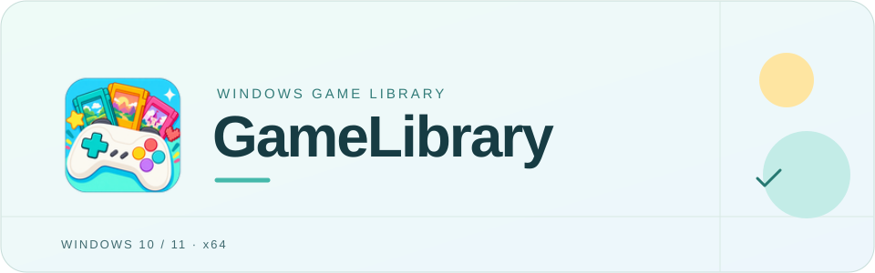
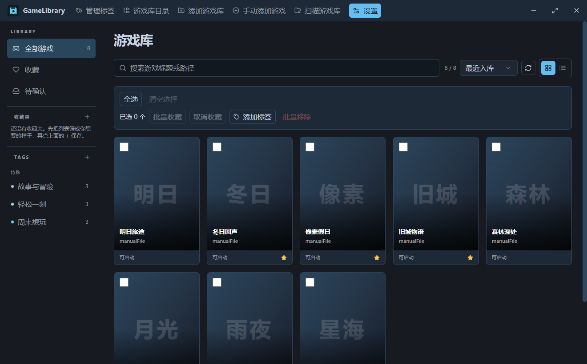
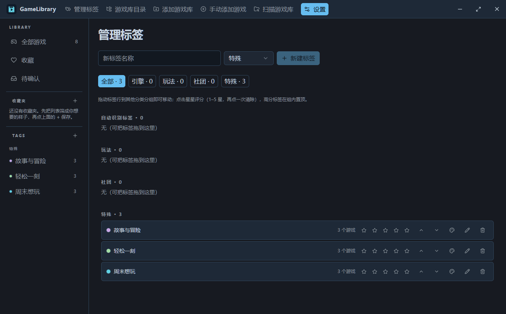

<p align="center">
  
</p>

<p align="center">
  <a href="README.md">简体中文</a> · <a href="README.zh-TW.md">繁體中文</a> · <a href="README.en.md">English</a> · <a href="README.ja.md">日本語</a>
</p>

# GameLibrary

Keep games scattered across your drives in one library. Choose a folder, check the launch entry, and open the game from your collection.

**[Download the Windows installer](https://github.com/sumingwang233/GameLibrary/releases/download/v1.7.5/GameLibrary-Setup-v1.7.5.exe)** · [All releases](https://github.com/sumingwang233/GameLibrary/releases) · [Report an issue](https://github.com/sumingwang233/GameLibrary/issues)

[Download](#download) · [Screenshots](#demo) · [Get started](#start) · [FAQ](#faq)

<a id="download"></a>
## Download

The current official release is **v1.7.5 (acceptance not run)**, targeting **Windows 10 / 11 x64**. The maintainer explicitly waived pre-release acceptance for this version. Only production compilation completed; tests, separate checks and manual acceptance were not run. See the [record](docs/releases/v1.7.5-validation.md).

| File | Use |
|---|---|
| [`GameLibrary-Setup-v1.7.5.exe`](https://github.com/sumingwang233/GameLibrary/releases/download/v1.7.5/GameLibrary-Setup-v1.7.5.exe) | Recommended. Current-user installer with a choice of installation folder. |
| [`GameLibrary-Portable-win-x64-v1.7.5.zip`](https://github.com/sumingwang233/GameLibrary/releases/download/v1.7.5/GameLibrary-Portable-win-x64-v1.7.5.zip) | Extract and run GameLibrary.Desktop.exe. |
| [`GameLibrary-Tools-win-x64-v1.7.5.zip`](https://github.com/sumingwang233/GameLibrary/releases/download/v1.7.5/GameLibrary-Tools-win-x64-v1.7.5.zip) | Host, CLI and MCP for command-line use and automation. |
| [`GameLibrary-v1.7.5-SHA256SUMS.txt`](https://github.com/sumingwang233/GameLibrary/releases/download/v1.7.5/GameLibrary-v1.7.5-SHA256SUMS.txt) | SHA-256 checksums for the three packages above. |

The executables and installer are not Authenticode-signed. Windows may show an unknown-publisher warning. Download from this repository and compare the hash with the same-version checksum file:

```powershell
Get-FileHash .\GameLibrary-Setup-v1.7.5.exe -Algorithm SHA256
```

<a id="demo"></a>
## Screenshots





Captured from v1.5.5 in an isolated sample library, with the application's default covers and no personal game directories. A full recording has not been produced yet; the [recording brief](docs/demo-recording.md) is ready.

<a id="start"></a>
## Get started

1. Open GameLibrary and add a folder containing your games.
2. After scanning, review the proposed names, folders and launch files before accepting them.
3. Select a game in the library and launch it. Add covers, favorites and tags as needed.

Scanning creates candidates; it does not treat every EXE as a game. You can add an unrecognized game manually.

## Everyday use

| Task | How |
|---|---|
| Find a game | Search by name, filter by tags, or mark favorites. |
| Organize the collection | Edit covers and tags; switch between the cover grid and list. |
| Configure launching | Keep the original EXE and set arguments, tools or translation steps as needed. |
| Use scripts | CLI and MCP connect to the same local Host and library. |

<a id="faq"></a>
## Data and FAQ

**v1.7.8 prerelease awaiting acceptance** adds Chinese font fallbacks for Unity translation, addresses square missing-glyph output, and upgrades previously managed installations. [Downloads and notes](https://github.com/sumingwang233/GameLibrary/releases/tag/v1.7.8) · [Validation record](docs/releases/v1.7.8-validation.md).

<details>
<summary><strong>Does scanning or removing a record delete game files?</strong></summary>

Adding, scanning and removing records preserve the original files. Explicit file cleanup asks for confirmation and uses the Windows Recycle Bin. Check the directory before confirming.
</details>

<details>
<summary><strong>Where is my library? Does uninstalling remove it?</strong></summary>

The default data folder is `%LOCALAPPDATA%\GameLibrary`. Records are stored in local SQLite. Uninstalling preserves library data and original game files. Back up your data before moving it; the application folder is not a library backup.
</details>

<details>
<summary><strong>Do I need an account, network access or developer tools?</strong></summary>

Organizing local games requires no account and sends no library telemetry. Update checks access GitHub Releases; launched games and configured tools may use the network. Packages include the .NET runtime, so users need no .NET SDK, Node.js or Rust.
</details>

<details>
<summary><strong>Which package should I use, and how do I update?</strong></summary>

The installer provides a wizard, Start menu entries and uninstallation registration. The portable package runs after extraction; the tools package is for CLI and MCP. Quit before updating, install the new version or replace the portable application files, and keep your data folder. Read that version's Release notes for changes and limitations.
</details>

<details>
<summary><strong>Current version: v1.7.5, official release / acceptance not run</strong></summary>

v1.7.5 addresses stale writes after restore, launch idempotency, cover consistency in backups and interrupted recycling. CLI/MCP parameters and schema discovery share their definitions; slow injection waits run as background jobs. Only packaging compilation was authorized; tests and manual acceptance were not run. See the [implementation](docs/development/v1.7.5-architecture-plan.md), [release notes](docs/releases/v1.7.5.md) and [acceptance record](docs/releases/v1.7.5-validation.md).

v1.7.4 fixes tag-triggered Unity translation setup and removes the untranslated tag when an existing enabled Chinese translator passes offline checks. It reduces repeated background discovery and candidate checks, stops the corresponding Host gracefully when the desktop exits, and applies tag colors only to text and dots. See the [release notes](docs/releases/v1.7.4.md) and [validation record](docs/releases/v1.7.4-validation.md) for publication readiness.

v1.7.3 fixes excessive pending counts caused by ungrouped legacy resource SWF candidates. The first startup immediately rescans affected library roots and replaces covered file candidates with complete directory reviews, preserving original game files, IDs and metadata. Schema27 is unchanged and ignore rules are not reset again. Cover paste, Flash review, tag colors and local Unity translation setup from v1.7.2 remain available. See the [validation record](docs/releases/v1.7.3-validation.md).

The historical features described here are included in the v1.7.5 package above. Earlier notes and prerelease links remain for traceability.

v1.7.1 fixes subtitle punctuation in translations: when the original contains `-`, repeated em dashes become `：` and surrounding dashes are removed. Retranslate existing titles in details to apply the fix; original and manually edited titles are preserved. See the [v1.7.1 pre-release packages](https://github.com/sumingwang233/GameLibrary/releases/tag/v1.7.1) and [validation record](docs/releases/v1.7.1-validation.md).
</details>

<details>
<summary><strong>Development and architecture</strong></summary>

Use Windows, .NET SDK 10.0.401 pinned by `global.json`, Node.js 22.12+ and Rust stable. Install the Windows MSVC Rust toolchain and corresponding C++ build tools.

```powershell
dotnet format --verify-no-changes
dotnet build GameLibrary.slnx -c Release
dotnet test GameLibrary.slnx -c Release --no-build
npm --prefix src/GameLibrary.Tauri ci
npm --prefix src/GameLibrary.Tauri test
npm --prefix src/GameLibrary.Tauri run typecheck
npm --prefix src/GameLibrary.Tauri run tauri dev
```

Tauri + React is the main desktop UI; WPF remains a migration fallback. Desktop, CLI and MCP use a shared contract to reach the .NET Host. Application owns use cases, Domain owns business rules, and Infrastructure owns SQLite, files and OS integration. [Architecture](docs/code-review-graph/architecture.md) · [Operation catalog](contracts/operations.v1.json) · [Release policy](docs/release-policy.md)

Packaging runs only when explicitly requested by the maintainer; ordinary code changes do not publish a release.
</details>

## Contributing and license

Report the version, error and reproduction steps in [Issues](https://github.com/sumingwang233/GameLibrary/issues); redact personal paths from screenshots. Run relevant checks before submitting code. Shared-operation changes must keep contracts, clients and tests in sync.

[MIT License](LICENSE)
