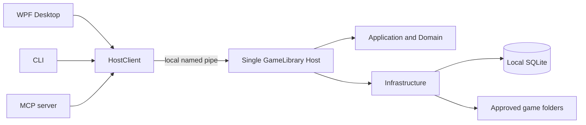

# GameLibrary

**A local-first Windows library for games scattered across folders.**

English · [简体中文](README.zh-CN.md)

[](https://github.com/sumingwang233/GameLibrary/releases/latest)
[](LICENSE)
[](https://github.com/sumingwang233/GameLibrary/releases/latest)
[](https://dotnet.microsoft.com/)

[Download](https://github.com/sumingwang233/GameLibrary/releases/latest) · [Report a bug](https://github.com/sumingwang233/GameLibrary/issues) · [Code signing policy](docs/code-signing-policy.md)

GameLibrary turns folders full of standalone Windows games into a searchable, reviewable library. It discovers likely games, shows the evidence in a review queue, and lets you organize and launch them without moving or deleting the original files.

It is designed for collections that do not fit neatly into a store client: unpacked games, older titles, visual novels, Flash games, shortcuts, and games spread across several drives.

## Why GameLibrary

Folder-based game collections have three recurring problems: finding the real entry file, avoiding false positives such as uninstallers, and keeping tools or launch settings consistent as the collection grows.

GameLibrary addresses those problems with three rules:

1. **Discovery is review-first.** A scan creates candidates. You decide what enters the library.
2. **Library actions are non-destructive.** Adding, scanning, and removing records do not modify or delete the game files.
3. **Every client uses the same state.** The desktop app, CLI, and MCP server all talk to one local Host instead of maintaining separate libraries.

## Highlights

| | Capability |
|---|---|
| **Discover** | Scan user-approved folders with detectors for Unity, RPG Maker MV/MZ, Ren'Py, Kirikiri, and Flash, plus conservative EXE/LNK fallback discovery. |
| **Review** | Inspect scan candidates before accepting, deferring, or ignoring them. Batch actions are available for both candidates and library games. |
| **Organize** | Search, sort, edit covers, create custom tags, filter by user or engine tags, and mark favorites. |
| **Launch** | Save launch profiles for EXE and SWF entries, track launch history, and choose an explicit translation policy. |
| **Automate** | Use the native CLI or MCP server against the same operations and local library used by the desktop app. |
| **Stay local** | Store the catalog in local SQLite, keep game folders untouched, and send no library telemetry. |

## What makes it different

### Evidence instead of blind EXE collection

GameLibrary recognizes engine structures and scores plausible entry files while excluding common installers, redistributables, crash handlers, and uninstallers. Unknown engines can still produce conservative candidates, but they remain in the review queue until you accept them.

### One library, three interfaces

The WPF desktop app, command-line client, and MCP server share a versioned operation catalog and connect to a single per-library Host over a local named pipe. An action performed through one interface is immediately visible to the others.

### Safe boundaries around your files

Only folders you explicitly add are scanned. Removing a game removes its library record and keeps the files on disk. Cover previews and application data are stored separately from the game collection.

## Download

GameLibrary supports **Windows 10/11 x64**. Release packages are self-contained and do not require a system-wide .NET installation. The current desktop interface is in Simplified Chinese.

| Package | Intended use |
|---|---|
| [GameLibrary-Setup-v1.1.0.exe](https://github.com/sumingwang233/GameLibrary/releases/download/v1.1.0/GameLibrary-Setup-v1.1.0.exe) | Recommended graphical installer. Lets you choose the install location and registers a standard Windows uninstall entry. |
| [GameLibrary-Portable-win-x64-v1.1.0.zip](https://github.com/sumingwang233/GameLibrary/releases/download/v1.1.0/GameLibrary-Portable-win-x64-v1.1.0.zip) | Portable desktop app and Host. Extract both EXE files into the same folder. |
| [GameLibrary-Tools-win-x64-v1.1.0.zip](https://github.com/sumingwang233/GameLibrary/releases/download/v1.1.0/GameLibrary-Tools-win-x64-v1.1.0.zip) | Host, CLI, and MCP server for automation and integrations. |
| [SHA-256 checksums](https://github.com/sumingwang233/GameLibrary/releases/download/v1.1.0/GameLibrary-v1.1.0-SHA256SUMS.txt) | Integrity hashes for all three release packages. |

> [!IMPORTANT]
> The v1.1.0 Windows binaries are currently unsigned while the SignPath Foundation application is under review. Windows SmartScreen may show an unknown publisher warning. Download releases from this repository and verify the SHA-256 checksum.

## Quick start

1. Install GameLibrary or extract the portable ZIP.
2. Open the desktop app and select **添加游戏库 (Add game library)**.
3. Choose one or more folders that contain games, then start a scan.
4. Open **待确认游戏 (Games to review)** and accept the candidates you recognize.
5. Select a game, confirm its launch profile, and start it from the detail panel.

You can also add an EXE, SWF, or Windows shortcut manually. SWF launch profiles use the player currently associated with `.swf` files in Windows.

Application data is stored under `%LOCALAPPDATA%\GameLibrary` by default. Closing or uninstalling the app does not remove the catalog or your game files.

## Privacy and network access

- The game catalog, settings, launch history, tags, and generated cover previews stay on the local computer.
- GameLibrary has no telemetry and does not upload scan results or usage data.
- The desktop app reads this repository's latest public GitHub Release metadata to notify you about updates. A failed or offline check does not affect the local library.
- Programs launched by GameLibrary may make their own network requests.

## Architecture



The Host owns writes, scanning jobs, launch coordination, and persistence. The clients remain thin, so desktop, CLI, and MCP behavior cannot silently drift apart.

## Build from source

### Requirements

- Windows 10 or Windows 11
- [.NET SDK 10.0.401](https://dotnet.microsoft.com/download/dotnet/10.0), pinned by `global.json`
- Git

### Build and test

```powershell
git clone https://github.com/sumingwang233/GameLibrary.git
cd GameLibrary
dotnet restore GameLibrary.slnx
dotnet build GameLibrary.slnx -c Release --no-restore
dotnet test GameLibrary.slnx -c Release --no-build --no-restore
```

Run the desktop app after building the solution:

```powershell
dotnet run --project src/GameLibrary.Desktop/GameLibrary.Desktop.csproj -c Release --no-build
```

## Repository layout

| Path | Purpose |
|---|---|
| `src/GameLibrary.Desktop` | WPF desktop application |
| `src/GameLibrary.Host` | Local single-writer Host, scanning, launching, and operations |
| `src/GameLibrary.Cli` | Native command-line client |
| `src/GameLibrary.Mcp` | Native MCP stdio server |
| `src/GameLibrary.Domain` | Detection, identity, path, and state rules |
| `src/GameLibrary.Infrastructure` | SQLite, file-system, shell, backup, and tool adapters |
| `contracts/operations.v1.json` | Machine-readable operation catalog shared by all interfaces |
| `tests` | Unit, contract, architecture, integration, UI automation, and end-to-end tests |

## Contributing

Bug reports and focused pull requests are welcome. Please open an issue before a large behavioral or contract change so the intended user flow and compatibility impact can be agreed first.

Before submitting code, run the Release build and full test suite shown above. Changes to a shared operation should keep the Desktop, CLI, MCP mapping, and contract tests in sync.

## License

GameLibrary is available under the [MIT License](LICENSE).
