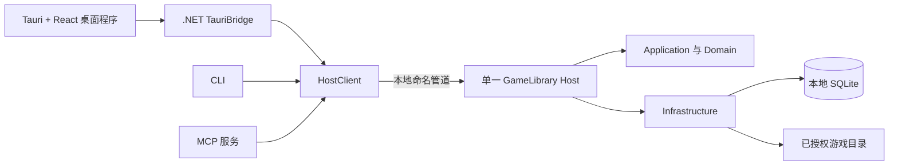

# GameLibrary

**为散落在各个文件夹中的 Windows 游戏建立一个本地游戏库。**

[English](README.md) · 简体中文

[](https://github.com/sumingwang233/GameLibrary/releases/latest)
[](LICENSE)
[](https://github.com/sumingwang233/GameLibrary/releases/latest)
[](https://dotnet.microsoft.com/)

[下载](https://github.com/sumingwang233/GameLibrary/releases/latest) · [报告问题](https://github.com/sumingwang233/GameLibrary/issues)

GameLibrary 可以把分散在不同文件夹里的 Windows 游戏整理成一个可搜索、可审核的本地游戏库。它会找出可能的游戏和启动文件，先放入待确认列表，再由你决定是否入库，全程不会移动或删除原始游戏文件。

它适合那些难以放进商店客户端统一管理的收藏：解压即玩的独立游戏、老游戏、视觉小说、Flash 游戏、Windows 快捷方式，以及分布在多个硬盘中的游戏目录。

## 为什么需要 GameLibrary

文件夹形式的游戏收藏通常会遇到三个问题：不容易判断哪个文件才是真正入口；安装器、卸载器等文件容易被误认成游戏；收藏变多后，启动方式和辅助工具越来越难统一维护。

GameLibrary 用三条原则解决这些问题：

1. **先发现，再审核。** 扫描只生成候选项，是否入库由你决定。
2. **所有库操作都不破坏原文件。** 添加、扫描和移出游戏库不会修改或删除游戏文件。
3. **三个入口共享同一份数据。** 桌面程序、CLI 和 MCP 都连接同一个本地 Host，不会各自维护一套游戏库。

## 主要功能

| | 功能 |
|---|---|
| **发现游戏** | 扫描用户授权的目录，识别 Unity、RPG Maker MV/MZ、Ren'Py、Kirikiri 和 Flash，并保守发现其他 EXE/LNK 游戏。 |
| **人工审核** | 入库前查看扫描候选，可加入、暂不处理或忽略；待确认项目和已入库游戏都支持批量操作。 |
| **整理收藏** | 搜索、排序、导入封面、自定义标签、按用户或引擎标签筛选，并可标记收藏。 |
| **统一启动** | 为 EXE 和 SWF 保存启动方式，记录启动历史，并明确选择翻译策略。 |
| **自动化** | CLI 和 MCP 使用与桌面程序完全相同的操作和本地游戏库。 |
| **本地优先** | 使用本地 SQLite 保存目录，不改动游戏文件夹，也不上传游戏库遥测。 |

## GameLibrary 的不同之处

### 根据证据找入口，而不是收集所有 EXE

GameLibrary 会识别引擎目录结构并给可能的启动文件评分，同时排除常见安装器、运行库、崩溃处理程序和卸载器。未识别的引擎也可以产生保守候选，但必须经过你的审核才会入库。

### 一份游戏库，三个操作入口

Tauri 桌面程序、命令行客户端和 MCP 服务共享同一个带版本的操作目录，并通过本地命名管道连接单一 Host。React 界面经由随应用打包的轻量 .NET bridge 复用现有 HostClient，因此从任何入口完成的操作，其他入口都能立即看到。

### 游戏文件有明确的安全边界

只有你主动添加的目录才会被扫描。从游戏库移除一款游戏只会删除库记录，磁盘文件会保留。封面预览和应用数据也与游戏目录分开存放。

## 下载

GameLibrary 支持 **Windows 10/11 x64**。发布包已包含运行环境，不要求系统预先安装 .NET。

| 文件 | 用途 |
|---|---|
| [GameLibrary-Setup-v1.5.1.exe](https://github.com/sumingwang233/GameLibrary/releases/download/v1.5.1/GameLibrary-Setup-v1.5.1.exe) | 推荐普通用户使用的图形安装程序，可修改安装位置，并登记到 Windows“已安装的应用”。 |
| [GameLibrary-Portable-win-x64-v1.5.1.zip](https://github.com/sumingwang233/GameLibrary/releases/download/v1.5.1/GameLibrary-Portable-win-x64-v1.5.1.zip) | 免安装 Tauri 桌面版、bridge 与 Host，解压后保持三个 EXE 位于同一目录。 |
| [GameLibrary-Tools-win-x64-v1.5.1.zip](https://github.com/sumingwang233/GameLibrary/releases/download/v1.5.1/GameLibrary-Tools-win-x64-v1.5.1.zip) | 面向自动化和集成的 Host、CLI 与 MCP 工具包。 |
| [SHA-256 校验值](https://github.com/sumingwang233/GameLibrary/releases/download/v1.5.1/GameLibrary-v1.5.1-SHA256SUMS.txt) | 三个发布包的完整性校验。 |

> [!IMPORTANT]
> v1.5.1 的 Windows 程序未签名。Windows SmartScreen 可能提示未知发布者。请从本仓库 Release 下载，并核对 SHA-256。

## 快速开始

1. 安装 GameLibrary，或解压免安装 ZIP。
2. 打开桌面程序，点击“添加游戏库”。
3. 选择一个或多个存放游戏的文件夹，然后开始扫描。
4. 打开“待确认游戏”，确认并加入你认识的候选项。
5. 选择游戏，核对启动方式，然后从详情页启动。

也可以手动添加 EXE、SWF 或 Windows 快捷方式。SWF 启动方式会使用 Windows 当前为 `.swf` 关联的播放器。

应用数据默认保存在 `%LOCALAPPDATA%\GameLibrary`。关闭或卸载程序都不会删除游戏库数据和原始游戏文件。

## 隐私与网络访问

- 游戏目录、设置、启动历史、标签和生成的封面预览都保存在本机。
- GameLibrary 不包含遥测，也不会上传扫描结果或使用数据。
- 桌面程序只读取本仓库最新公开 Release 的元数据，用于提示版本更新；离线或检查失败不会影响本地游戏库。
- 由 GameLibrary 启动的其他程序可能执行它们自己的网络请求。

## 架构



Host 统一负责写入、扫描任务、启动协调和持久化。三个客户端保持轻量，因此 Desktop、CLI 和 MCP 的行为不会各自分叉。

## 从源码构建

### 环境要求

- Windows 10 或 Windows 11
- [.NET SDK 10.0.401](https://dotnet.microsoft.com/download/dotnet/10.0)，版本由 `global.json` 固定
- Node.js 22 或更高版本
- Rust stable，并安装 `x86_64-pc-windows-msvc` target
- Git

### 构建与测试

```powershell
git clone https://github.com/sumingwang233/GameLibrary.git
cd GameLibrary
dotnet restore GameLibrary.slnx
dotnet build GameLibrary.slnx -c Release --no-restore
dotnet test GameLibrary.slnx -c Release --no-build --no-restore
npm --prefix src/GameLibrary.Tauri install
npm --prefix src/GameLibrary.Tauri run typecheck
npm --prefix src/GameLibrary.Tauri run build
```

构建整个解决方案后运行 Tauri 桌面程序：

```powershell
cd src/GameLibrary.Tauri
npm run tauri dev
```

## 仓库结构

| 路径 | 用途 |
|---|---|
| `src/GameLibrary.Tauri` | Tauri v2 + React 19 桌面程序 |
| `src/GameLibrary.TauriBridge` | 复用 HostClient 与现有操作契约的轻量 .NET sidecar |
| `src/GameLibrary.Desktop` | 迁移期间保留的 WPF 回退入口 |
| `src/GameLibrary.Host` | 本地单写 Host、扫描、启动和业务操作 |
| `src/GameLibrary.Cli` | 原生命令行客户端 |
| `src/GameLibrary.Mcp` | 原生 MCP stdio 服务 |
| `src/GameLibrary.Domain` | 检测、身份、路径和状态规则 |
| `src/GameLibrary.Infrastructure` | SQLite、文件系统、Shell、备份和工具适配器 |
| `contracts/operations.v1.json` | 三个入口共享的机器可读操作目录 |
| `tests` | 单元、契约、架构、集成、UI 自动化和端到端测试 |

## 参与贡献

欢迎提交错误报告和范围清晰的 Pull Request。较大的行为或契约改动，请先创建 Issue，说明用户场景和兼容性影响。

提交代码前请运行上面的 Release 构建和完整测试。修改共享操作时，应同时保持 Desktop、CLI、MCP 映射和契约测试一致。

## 许可证

GameLibrary 使用 [MIT License](LICENSE)。
