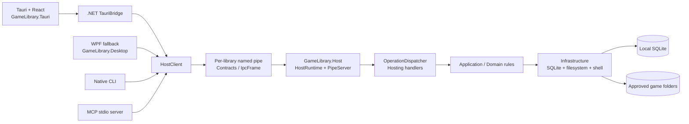

# GameLibrary 架构预览

## 1. 客户端到单一 Host

README 与图谱一致地显示了 Tauri、CLI、MCP 共用一个本地 Host；图谱进一步确认 `game-library-tauri-bridge-bridge`、`game-library-host-client-async`、`hosting-handler` 和两个 persistence 社区之间存在调用边。

## 2. 社区结构

| 社区 | 节点 | 语言 | 观察 |
|---|---:|---|---|
| `persistence-async` | 558 | C# | 最大社区，SQLite/持久化调用密集 |
| `persistence-try` | 404 | C# | 与 `persistence-async` 有 171 条调用边 |
| `hosting-handler` | 381 | C# | Host 操作入口；与 persistence 两侧均高耦合 |
| `components-game` | 243 | TSX | 前端游戏组件 |
| `tools-detector` | 166 | C# | 工具/检测器聚合点 |
| `game-library-desktop-async` | 135 | C# | WPF 客户端异步流程 |
| `identity-game` | 113 | C# | 游戏身份与路径相关逻辑 |
| `game-library-mcp-list` | 102 | C# | MCP 工具入口 |

其余社区包括 contracts、CLI、HostClient、Tauri bridge、E2E tests、workflow 和版本工具；完整成员列表在 `.code-review-graph/wiki/`。

## 3. 高耦合告警

图谱给出的前四项是：

1. `persistence-try` → `persistence-async`：171 条 `CALLS`。
2. `hosting-handler` → `persistence-async`：132 条 `CALLS`。
3. `tools-detector` → `identity-game`：126 条 `CALLS`。
4. `hosting-handler` → `persistence-try`：114 条 `CALLS`。

这些是重构时的优先观察边界，不等同于缺陷。建议先用 `query_graph_tool` 展开目标 handler 的 callers/callees，再决定是否抽取端口或收窄依赖。

## 4. 桥接节点

按 betweenness 排名前列的节点是 `DispatchCore`、`DispatchInternal`、`ConnectAsync`、`DispatchGated`、`Dispatch`、`SafeDispatch`、`ServeClientAsync`、`Resolve` 和 `AcceptLoopAsync`。它们位于多个社区之间的最短路径上，修改这些节点时应优先做影响半径和端到端验证。

## 5. 当前风险边界

- 图谱风险评分为 `0.90`（高），提示 33 个测试缺口。
- 1,895 个函数中只有 4,341 个调用被直接解析，11,800 个调用仍是未解析或裸名匹配。
- 因此本页用于导航和评审排序；接口契约、行为语义和安全边界仍以源码、测试和运行结果为准。
