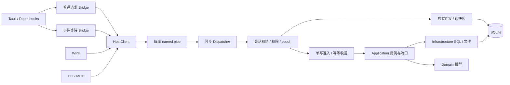

# GameLibrary 架构预览

v1.7.11：Unity 自动配置仍由 `UnityTranslationService` 串行协调；`UnityTranslationInspection` 核对活动加载器与非活动生成物，`UnityTranslationAssembly` 通过 .NET metadata 对受限的已核验 IL 做等长变更，`UnityTranslationFonts` 按真实 TMP 接口选择系统字体或既有字库。复用原有固定哈希 Payload 与加密文件事务，`RestoredBackupId`/恢复收据留在本机既有状态/备份边界，不新增表或 IPC。恢复保留缓存、安装拒绝未知文件，与原游戏文件修改、用户确认和密钥边界保持一致。详见 [实施记录](../development/v1.7.11-loader-compatibility-plan.md)。

## 宣传网站 — 2026-10-02 / 网站 v1.1.0

独立 Next.js 静态站沿用服务端 `MarketingPage` 与客户端 `GlassControls`；新增繁中/日文静态路径，四语言共用版本、素材与 metadata。页面主题和浮层使用浏览器本地状态，不涉及 Host、SQLite 游戏库或桌面 IPC。真实 logo/截图、组件和路由图、验证及回滚见 [网站实施记录](website.md)。

v1.7.0 新增名称翻译边界：React 共享作业 Hook → Host `TitlesHandler` / `JobManager` → `TitleTranslationClient` → `SqliteLibraryStore.Titles`。v1.7.1 在共享客户端成功路径收紧由连字符生成的副标题标点，手动编辑仍直接进入存储。schema 26 译名表与原文层分离；DTO 在 Host 统一解析显示名称，查询同时覆盖原文/译名；既有启动翻译工具策略不变。插件增量索引包含新增文件，快照见 [图谱入口](README.md)，具体文件、网络适配和 CAS 保护见 [名称翻译](../title-translation.md)。

2026-10-01：基于 `fedc7ac` 加 v1.6.0 工作区差异，图谱覆盖 321 个源码文件。验证和权限边界见 [优化实施记录](optimization-implementation.md)；本次发行构建结果见 [v1.6.0 构建记录](../releases/v1.6.0-validation.md)。

## 客户端与会话

```mermaid
flowchart LR
    UI[Tauri / React hooks] --> Normal[普通请求 Bridge]
    UI --> Events[事件等待 Bridge]
    WPF[WPF] --> Client[HostClient]
    CLI[CLI / MCP] --> Client
    Normal --> Client
    Events --> Client
    Client --> Pipe[每库 named pipe]
    Pipe --> Dispatch[异步 Dispatcher]
    Dispatch --> Gate[会话租约 / 权限 / epoch]
    Gate --> Read[独立连接 / 读快照]
    Gate --> Write[单写准入 / 幂等收据]
    Write --> App[Application 用例与端口]
    App --> Infra[Infrastructure SQL / 文件]
    App --> Domain[Domain 模型]
    Infra --> DB[(SQLite)]
    Read --> DB
```

列表计数、分页与附加字段共享同一读快照；只读连接不等待宿主写连接锁。启动状态查询会惰性更新进程状态，因此不放入纯只读事务。写事务提交后发布事件，定时核对和退出回调持有背景租约。

## 用例与持久化

Application 编排游戏创建/重关联、候选审核以及备份创建/恢复，Host 负责 IPC 转换、权限、作业和装配。Application 不引入 IPC/SQLite 类型；Infrastructure 实现用例实际需要的端口。

`SqliteLibraryStore` 是连接、快照和事务入口；`LibraryCatalogStore` 按 Candidates、Games、Fingerprints、Ignores 四个 partial 拆分。候选批量采用外层事务和逐项保存点；标签排序采用单事务整批冲突回滚。

## 前端与协议

Provider 消费接口保留，状态实现拆为六个 hooks。事件独立长轮询通道，按域合并 250ms 刷新；封面为 64 MiB 字符串占用 LRU，保持 data URL 接口。操作目录统一生成常量、可用目录、CLI 映射及简单 MCP 包装，特殊处理保持手写。

## 图谱使用边界

本次重建为 2,818 个节点、21,526 条边、175 个执行流，无解析错误。审查上下文报告 245 个受影响节点、79 个文件，风险等级 high 表示修改范围大。图谱识别候选批量的事务/保存点/Apply 调用，但 Store 重绑委托未解析为直接 callers，必须人工核对装配及事件回调。测试统计和实际运行证据优先于图谱的测试节点/知识缺口估计。
