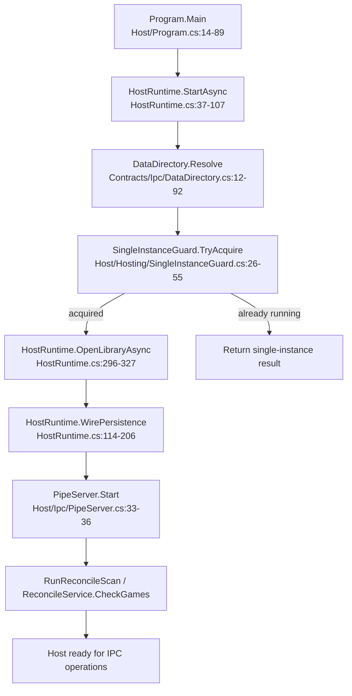
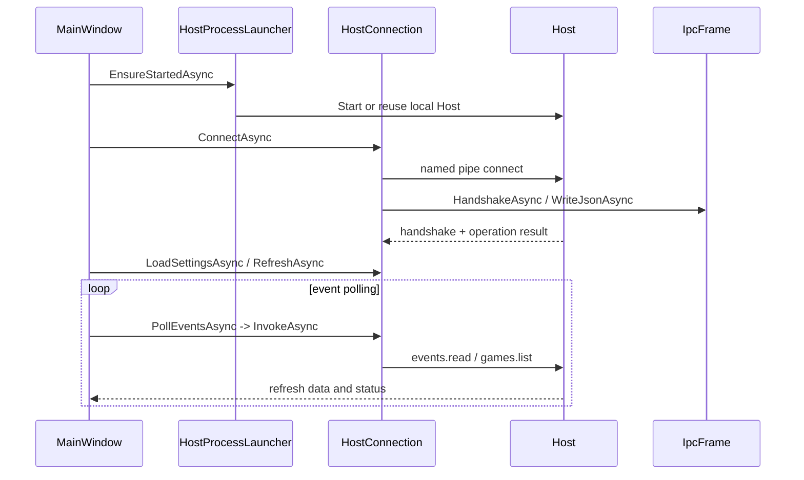
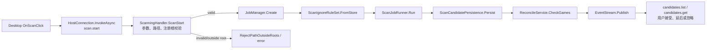
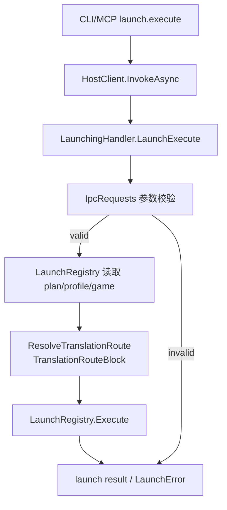

# GameLibrary 关键流程图

下面的流程图来自 `code-review-graph` 的执行流快照。完整路径可用 `get_flow_tool` 按入口名称展开。

## 1. Host 启动与库打开

证据入口：`GameLibrary.Host/Program.cs::Program.Main`、`HostRuntime.StartAsync`、`SingleInstanceGuard.TryAcquire`、`HostRuntime.OpenLibraryAsync`、`HostRuntime.WirePersistence`、`PipeServer.Start`。

`Main` 流图谱规模为 466 个节点、深度 15；上图只显示启动阶段的稳定边界。

## 2. 桌面连接与事件轮询

证据入口：`MainWindow.ConnectAsync`（`MainWindow.Connection.cs:23-58`）、`HostProcessLauncher.EnsureStartedAsync`、`HostConnection.ConnectAsync`、`HandshakeAsync`、`IpcFrame.WriteJsonAsync`、`MainWindow.PollEventsAsync`（`MainWindow.Connection.cs:188-226`）。

`ConnectAsync` 的图谱流为 28 个节点、深度 5、criticality `0.8339`；`PollEventsAsync` 为 21 个节点、深度 6、criticality `0.8529`。

## 3. 扫描与候选审查

证据入口：桌面 `MainWindow.OnScanClick`（`MainWindow.Scanning.cs:319-487`）和 Host `ScanningHandler.ScanStart`（`Host/Hosting/ScanningHandler.cs:52-167`）。图谱直接解析到 `JobManager.Create`、`ScanIgnoreRuleSet.FromStore`、`ScanJobRunner.Run`、`ScanCandidatePersistence.Persist`、`ReconcileService.CheckGames` 和 `EventStream.Publish`。

`OnScanClick` 流为 18 个节点、深度 5、criticality `0.7833`；`ScanStart` 流为 22 个节点、深度 4、criticality `0.7695`。

## 4. 启动游戏

证据入口：MCP `GameLibraryTools.LaunchExecute`（`GameLibraryTools.cs:645-657`）和 Host `LaunchingHandler.LaunchExecute`（`Host/Hosting/LaunchingHandler.cs:499-562`）。图谱解析到参数校验、`LaunchRegistry.GetPlanProfileId`、`GetProfile`、`GetPlanGameId`、`ResolveTranslationRoute`、`LaunchRegistry.Execute` 和错误映射。

`LaunchExecute` 流为 23 个节点、深度 5、criticality `0.7870`。启动相关并发、过期 plan、工具缺失和翻译策略行为已有图谱识别出的集成测试入口，可继续用 `query_graph_tool(pattern="tests_for", target="LaunchExecute")` 核对。
