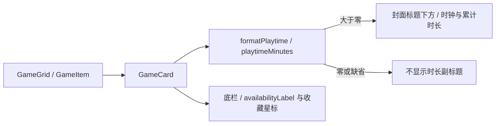

# GameLibrary 关键流程

2026-09-30 更新。以下流程结合当前源码、code-review-graph 和回归验证；详细检查见 [优化实施记录](optimization-implementation.md)。

## 请求与事件

```sequenceDiagram
    participant UI as React hooks
    participant B as 普通 Bridge
    participant E as 事件 Bridge
    participant H as Async Dispatcher
    participant S as SQLite
    UI->>E: events.wait(cursor, 25s)
    E->>H: 独立 pipe
    H->>S: 短租约读取事件快照
    Note over H: 等待期间释放租约和读连接
    UI->>B: games.list / 用户操作
    B->>H: 普通 pipe
    H->>S: 读快照或单写事务
    S-->>H: 提交
    H-->>E: 新序号事件 / 超时空批次
    E-->>UI: 按域合并 250ms 刷新
```

每条发布事件都有新序号；等待与读取共享游标结构，会话变化作废旧等待游标。旧 Host 使用 events.read 轮询，旧 epoch 错误重建基线。

## 候选批量

```flowchart TD
    Input[输入校验 / 最多1000项 / ID唯一] --> Prepare[事务外路径观察与指纹准备]
    Prepare --> Outer[单事务]
    Outer --> Save[逐项保存点]
    Save --> Recheck[重新校验修订 / 状态 / 路径 / 负载]
    Recheck -->|业务成功| Keep[保留该项]
    Recheck -->|业务失败| Undo[回滚该保存点 / 记录错误]
    Keep --> Next[处理下一项]
    Undo --> Next
    Next --> Commit[外层提交]
    Outer -->|数据库或准备阶段文件异常| Abort[整批失败 / 无部分提交]
    Commit --> Notify[发布事件 / 按输入顺序返回逐项结果]
```

标签排序使用一个事务，任一 Revision 冲突整批回滚。两种操作沿用收据重放，事件在提交后发布。

## 恢复提交与重启

```flowchart TD
    Request[restore_start 或兼容 restore] --> Busy{活动扫描 / 备份 / 核对 / 游戏?}
    Busy -->|有| Retry[可重试忙碌错误 / 保留活动]
    Busy -->|无| Drain[禁止新业务租约 / 排空已接收请求 / 再检查活动]
    Drain --> Stage[目标目录暂存 / 清单校验 / flush / 安全备份]
    Stage --> Prepared[原子控制记录 prepared]
    Prepared --> DB[File.Replace 数据库 / database-swapped]
    DB --> Assets[完整资产目录切换 / assets-swapped]
    Assets --> Validate[校验新库 / 新epoch / checkpoint与flush]
    Validate --> Commit[原子 committed / 唯一提交点]
    Commit --> Bind[重绑 Store / 回调 / 根与启动缓存 / 事件流]
    Bind --> Result[控制区最终收据与作业结果 / 恢复接收请求]
    Restart[启动 RecoverBeforeOpen] --> Decision{控制记录 committed?}
    Decision -->|是| Open[打开提交后的库 / 补全作业终态]
    Decision -->|否| Rollback[安全数据库和保留资产回滚 / 可重复执行]
    Rollback -->|证据缺失或回滚失败| Recovery[RecoveryRequired]
    Rollback -->|成功| Open
```

恢复作业在 control 保存，不依赖将被换掉的业务数据库；启动时补全提交后尚未写完的最终作业结果。会话重绑不会捕获旧 Store，宿主停机先排空作业/租约再释放连接。

## 游戏卡片游玩时长 — 2026-10-01

基于 `d7e2fb0` 源码和 `code-review-graph.get_review_context_tool` 审计，卡片布局调整风险为 low；实际调用由 `GameGrid.tsx` 导入并渲染 `GameCard` 确认。


```mermaid
flowchart LR
    Grid[GameGrid / GameItem] --> Card[GameCard]
    Card --> Format[formatPlaytime / playtimeMinutes]
    Format -->|大于零| Subtitle[封面标题下方 / 时钟与累计时长]
    Format -->|零或缺省| Hidden[不显示时长副标题]
    Card --> Footer[底栏 / availabilityLabel 与收藏星标]
```

`GameCard.tsx` 移除原 `engine ?? kind` 副标题与底栏重复时长，复用既有格式化和翻译。组件接口、路由、状态、后端与详情页不变；回滚只需恢复卡片 JSX。`GameCard.test.tsx` 覆盖分钟、小时、零及缺省时长，并核验引擎不显示、底栏保留收藏。

修改后 `build_or_update_graph_tool(postprocess="minimal")` 增量更新成功、解析错误为空，依赖复核包含 `GameGrid.tsx` 与 `App.tsx`。前端 typecheck、20 项测试及生产构建通过；Tauri 实机视觉待确认。
