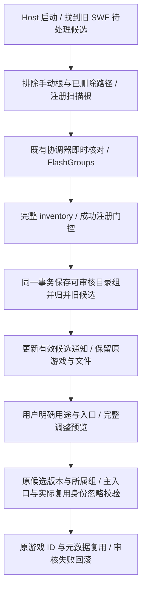
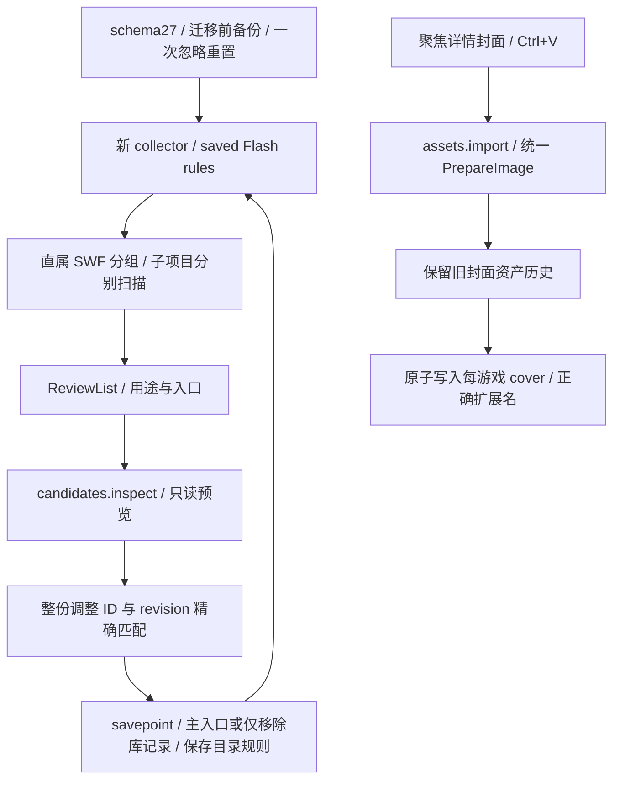
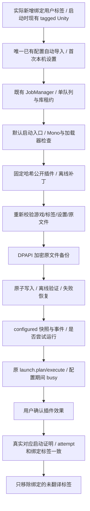
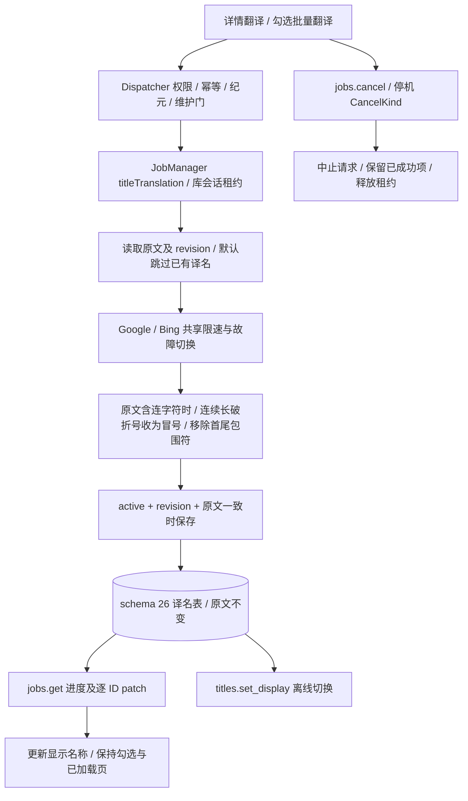
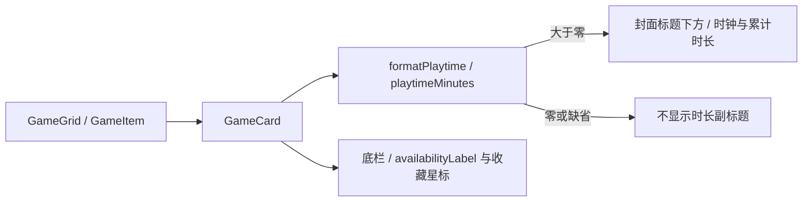
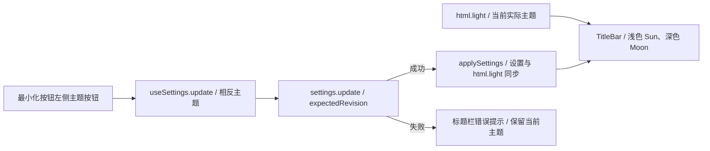
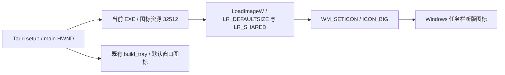
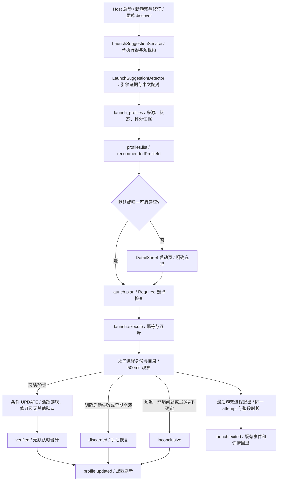

# GameLibrary 关键流程

## 宣传页 — 2026-10-02 / 网站 v1.1.0

四语言静态路由 → layout 绘制前应用已有主题偏好 → MarketingPage 输出本地素材和稳定版下载 → Header 的 details 菜单切换语言/主题；Screenshot 用原生 dialog 打开 PNG、Escape 关闭并恢复焦点。首屏和下载区共享安装版目标，预发布为独立入口。构建先生成 WebP，再静态导出并由四语言门禁检查。架构与实际验收见 [website.md](website.md)。

## Flash 历史候选归并 — v1.7.3


```mermaid
flowchart TD
    Start[Host 启动 / 找到旧 SWF 待处理候选] --> Roots[排除手动根与已删除路径 / 注册扫描根]
    Roots --> Rescan[既有协调器即时核对 / FlashGroups]
    Rescan --> Complete[完整 inventory / 成功注册门控]
    Complete --> Transaction[同一事务保存可审核目录组并归并旧候选]
    Transaction --> Queue[更新有效候选通知 / 保留原游戏与文件]
    Queue --> Review[用户明确用途与入口 / 完整调整预览]
    Review --> Check[原候选版本与所属组 / 主入口与实际复用身份忽略校验]
    Check --> Accept[原游戏 ID 与元数据复用 / 审核失败回滚]
```

归并标记 `flashSupersededBy` 区分算法归并与用户暂缓；仅同组显式选中入口可恢复，未选中的资源不复活。候选预载 lookup 使用 OrdinalIgnoreCase，避免 SQLite ASCII lower 与 Unicode 文件名不同步。不完整、离线、未注册和手动范围不自动退休旧候选；不重新执行 schema27 的过滤重置。

## Flash 与封面 — v1.7.2 待验收预发布


```mermaid
flowchart TD
    Upgrade[schema27 / 迁移前备份 / 一次忽略重置] --> Scan[新 collector / saved Flash rules]
    Scan --> Group[直属 SWF 分组 / 子项目分别扫描]
    Group --> Review[ReviewList / 用途与入口]
    Review --> Inspect[candidates.inspect / 只读预览]
    Inspect --> Confirm[整份调整 ID 与 revision 精确匹配]
    Confirm --> Save[savepoint / 主入口或仅移除库记录 / 保存目录规则]
    Save --> Scan
    Paste[聚焦详情封面 / Ctrl+V] --> Import[assets.import / 统一 PrepareImage]
    Import --> History[保留旧封面资产历史]
    History --> Atomic[原子写入每游戏 cover / 正确扩展名]
```

不完整目录拒绝确认；普通取消忽略保留原 observed 流程，不提前晋升。确认项目/资源时完整子树 inventory 用于下次规则匹配，默认直属合集不会移除独立子项目。审核一次预载游戏/候选 lookup，重新接受已移除入口用 SQL 查找并复用 ID。运行依赖/安装器分支早期硬排除；data/swf/f/s/m 不因名称被排除。

## Unity 翻译插件 — v1.7.2 待验收预发布


```mermaid
flowchart TD
    Tag[实际新增绑定用户标签 / 启动时现有 tagged Unity] --> Settings[唯一已有配置自动导入 / 首次本机设置]
    Settings --> Queue[既有 JobManager / 单队列与库租约]
    Queue --> Inspect[默认启动入口 / Mono与加载器检查]
    Inspect --> Files[固定哈希公开插件 / 离线补丁]
    Files --> Recheck[重新校验游戏/标签/设置/原文件]
    Recheck --> Backup[DPAPI 加密原文件备份]
    Backup --> Write[原子写入 / 离线验证 / 失败恢复]
    Write --> Prompt[configured 快照与事件 / 是否尝试运行]
    Prompt --> Launch[原 launch.plan/execute / 配置期间 busy]
    Launch --> Result[用户确认插件效果]
    Result --> Confirm[真实对应启动证明 / attempt和绑定标签一致]
    Confirm --> Untag[只移除绑定的未翻译标签]
```

设置元数据在 app_settings，CredentialId 引用工作区外当前用户 DPAPI 文件；换密钥先写新引用，旧引用供数据库失败/旧备份恢复使用。配置过程不调用翻译 API、不启动游戏。IL2CPP/未知或冲突加载器保留标签供人工处理。前端从 snapshot 恢复未处理提示，第一次「是」只启动，第二次「是」才提交 success；体验首次设置仅在组件内模拟，不保存主配置。

图谱基线 `47690cd` 加收尾工作区，2026-10-02 增量刷新，358文件/3,404节点/29,285边，解析错误0。动态操作登记通过生成器及契约测试验证，图谱的裸名匹配不能替代运行测试。

## 名称翻译 — v1.7.1 待验收预发布


```mermaid
flowchart TD
    UI[详情翻译 / 勾选批量翻译] --> Gate[Dispatcher 权限 / 幂等 / 纪元 / 维护门]
    Gate --> Job[JobManager titleTranslation / 库会话租约]
    Job --> Read[读取原文及 revision / 默认跳过已有译名]
    Read --> HTTP[Google / Bing 共享限速与故障切换]
    HTTP --> Normalize[原文含连字符时 / 连续长破折号收为冒号 / 移除首尾包围符]
    Normalize --> CAS[active + revision + 原文一致时保存]
    CAS --> Alias[(schema 26 译名表 / 原文不变)]
    Alias --> Progress[jobs.get 进度及逐 ID patch]
    Progress --> Cards[更新显示名称 / 保持勾选与已加载页]
    UI --> Cancel[jobs.cancel / 停机 CancelKind]
    Cancel --> Keep[中止请求 / 保留已成功项 / 释放租约]
    Alias --> Display[titles.set_display 离线切换]
```

新流程独立于启动工具 `translation.*`。详情未保存输入保持编辑目标；原文与译名同时可搜，按显示名称排序；HTTP 期间不持 SQLite 锁。实现边界、失败分类及回滚见 [名称翻译](../title-translation.md)。现有维护门仍拒绝活动作业，用户取消翻译完成后可恢复备份。

v1.7.1 在两个提供商共享的 `TitleTranslationClient.TranslateAsync` 成功路径处理标点，位于校验和保存之前；单个 / 批量作业、CLI / MCP 同时生效。手动 `titles.set_translated` 不经过此清理，原文不改，schema 仍为26。旧译名默认跳过，用户重新翻译时应用新规则。

2026-09-30 更新。以下流程结合当前源码、code-review-graph 和回归验证；详细检查见 [优化实施记录](optimization-implementation.md)。

## 请求与事件

```sequenceDiagram
    participant UI as React hooks
    participant B as 普通 Bridge
    participant E as 事件 Bridge
    participant H as Async Dispatcher
    participant S as SQLite
    UI->>E: events.wait(cursor, 25s)
    E->>H: 独立 pipe
    H->>S: 短租约读取事件快照
    Note over H: 等待期间释放租约和读连接
    UI->>B: games.list / 用户操作
    B->>H: 普通 pipe
    H->>S: 读快照或单写事务
    S-->>H: 提交
    H-->>E: 新序号事件 / 超时空批次
    E-->>UI: 按域合并 250ms 刷新
```

每条发布事件都有新序号；等待与读取共享游标结构，会话变化作废旧等待游标。旧 Host 使用 events.read 轮询，旧 epoch 错误重建基线。

## 候选批量

```flowchart TD
    Input[输入校验 / 最多1000项 / ID唯一] --> Prepare[事务外路径观察与指纹准备]
    Prepare --> Outer[单事务]
    Outer --> Save[逐项保存点]
    Save --> Recheck[重新校验修订 / 状态 / 路径 / 负载]
    Recheck -->|业务成功| Keep[保留该项]
    Recheck -->|业务失败| Undo[回滚该保存点 / 记录错误]
    Keep --> Next[处理下一项]
    Undo --> Next
    Next --> Commit[外层提交]
    Outer -->|数据库或准备阶段文件异常| Abort[整批失败 / 无部分提交]
    Commit --> Notify[发布事件 / 按输入顺序返回逐项结果]
```

标签排序使用一个事务，任一 Revision 冲突整批回滚。两种操作沿用收据重放，事件在提交后发布。

## 恢复提交与重启

```flowchart TD
    Request[restore_start 或兼容 restore] --> Busy{活动扫描 / 备份 / 核对 / 游戏?}
    Busy -->|有| Retry[可重试忙碌错误 / 保留活动]
    Busy -->|无| Drain[禁止新业务租约 / 排空已接收请求 / 再检查活动]
    Drain --> Stage[目标目录暂存 / 清单校验 / flush / 安全备份]
    Stage --> Prepared[原子控制记录 prepared]
    Prepared --> DB[File.Replace 数据库 / database-swapped]
    DB --> Assets[完整资产目录切换 / assets-swapped]
    Assets --> Validate[校验新库 / 新epoch / checkpoint与flush]
    Validate --> Commit[原子 committed / 唯一提交点]
    Commit --> Bind[重绑 Store / 回调 / 根与启动缓存 / 事件流]
    Bind --> Result[控制区最终收据与作业结果 / 恢复接收请求]
    Restart[启动 RecoverBeforeOpen] --> Decision{控制记录 committed?}
    Decision -->|是| Open[打开提交后的库 / 补全作业终态]
    Decision -->|否| Rollback[安全数据库和保留资产回滚 / 可重复执行]
    Rollback -->|证据缺失或回滚失败| Recovery[RecoveryRequired]
    Rollback -->|成功| Open
```

恢复作业在 control 保存，不依赖将被换掉的业务数据库；启动时补全提交后尚未写完的最终作业结果。会话重绑不会捕获旧 Store，宿主停机先排空作业/租约再释放连接。

## 游戏卡片游玩时长 — 2026-10-01

基于 `d7e2fb0` 源码和 `code-review-graph.get_review_context_tool` 审计，卡片布局调整风险为 low；实际调用由 `GameGrid.tsx` 导入并渲染 `GameCard` 确认。


```mermaid
flowchart LR
    Grid[GameGrid / GameItem] --> Card[GameCard]
    Card --> Format[formatPlaytime / playtimeMinutes]
    Format -->|大于零| Subtitle[封面标题下方 / 时钟与累计时长]
    Format -->|零或缺省| Hidden[不显示时长副标题]
    Card --> Footer[底栏 / availabilityLabel 与收藏星标]
```

`GameCard.tsx` 移除原 `engine ?? kind` 副标题与底栏重复时长，复用既有格式化和翻译。组件接口、路由、状态、后端与详情页不变；回滚只需恢复卡片 JSX。`GameCard.test.tsx` 覆盖分钟、小时、零及缺省时长，并核验引擎不显示、底栏保留收藏。

修改后 `build_or_update_graph_tool(postprocess="minimal")` 增量更新成功、解析错误为空，依赖复核包含 `GameGrid.tsx` 与 `App.tsx`。前端 typecheck、20 项测试及生产构建通过；Tauri 实机视觉待确认。

## 标题栏主题快捷切换 — 2026-10-01

基于 `97d6980` 源码和 `code-review-graph` 审计，`main.tsx` 的 `SettingsProvider` 包含 `App → TitleBar`，设置页与标题栏可直接共享主题。改动限于 `TitleBar.tsx`、对应回归测试及 `Localization/ui.json`；不新增设置状态源。


```mermaid
flowchart LR
    Root[html.light / 当前实际主题] --> Icon[TitleBar / 浅色 Sun、深色 Moon]
    Click[最小化按钮左侧主题按钮] --> Update[useSettings.update / 相反主题]
    Update --> Host[settings.update / expectedRevision]
    Host -->|成功| Apply[applySettings / 设置与 html.light 同步]
    Apply --> Icon
    Host -->|失败| Error[标题栏错误提示 / 保留当前主题]
```

图标复用 `lucide-react`，通过现有 `html.light` CSS 条件显示，系统主题变化也会同步；点击保存为明确的 light/dark。按钮位于拖动区域外，读取设置及保存期间禁用，复用既有按钮焦点样式；提示文字提供四语言翻译。回滚恢复标题栏 JSX 并移除新增翻译即可，路由、设置接口和后端不变。

修改后图谱增量更新成功、解析错误为空。`npm run typecheck`、`npm test`（25/25）与 `npm run build` 通过；新测试覆盖 light/dark、system 的两种实际主题、保存后重载、重复点击禁用及保存失败。编译 CSS 确认浅色显示太阳并隐藏月亮。构建保留 JS 分包超过 500 kB 提示；Tauri/WebView2 实机视觉待确认。

## Windows 任务栏图标 — 2026-10-01

基于 `ae3d9b6` 审计：运行中的 `D:/1/GameLibrary/GameLibrary.Desktop.exe` 已内嵌新版 ICO 的 6 个尺寸，旧版帧均未出现；`WM_GETICON(ICON_SMALL)` 为新版 32×32，像素差为 0，但 `ICON_BIG` 和窗口类大图标为空。已安装的 Tao 0.35.3 将窗口图标与任务栏图标分别设置为 Small/Big；Tauri 2.11.4 的 runtime 仅调用窗口图标设置。任务栏因没有显式大图标而沿用 Shell 图标，是依据这些事实作出的推断。


```mermaid
flowchart LR
    Setup[Tauri setup / main HWND] --> Resource[当前 EXE / 图标资源 32512]
    Resource --> Load[LoadImageW / LR_DEFAULTSIZE 与 LR_SHARED]
    Load --> Set[WM_SETICON / ICON_BIG]
    Set --> Taskbar[Windows 任务栏新版图标]
    Setup --> Tray[既有 build_tray / 默认窗口图标]
```

`taskbar_icon.rs` 在 Windows 启动时从当前 EXE 读取共享图标并绑定 ICON_BIG，`lib.rs` 在 setup 调用；不新增依赖，不改图标素材。LR_SHARED 句柄由系统管理，避免窗口生命周期中的图标悬空。API 依据：[LoadImageW](https://learn.microsoft.com/en-us/windows/win32/api/winuser/nf-winuser-loadimagew)。回滚删除模块和 setup 调用即可。

当前运行实例已通过 WM_SETICON 补上新版 ICON_BIG，读回与小图标句柄一致，并发送定向 SHChangeNotify；未关闭程序或重启 Explorer。源码验证：cargo fmt --check、cargo check --locked、cargo test --locked --lib（2/2）、cargo build --locked 通过；新 EXE 的资源 32512 与认可 32×32 图片逐像素相同。单元测试使用隐藏 STATIC 窗口和 Windows 系统图标测试大图标绑定，因 Cargo 测试 EXE 不含应用资源；实际应用资源由构建后检查覆盖。任务栏最终视觉、不同 DPI 和正式包验收待确认，未打包或发布。

## 自动建议启动方式 — v1.6.1 / 2026-10-01

审计基于 `7f6b57d`。修改前调用 code-review-graph 获取上下文，确认 Host 的 LaunchRegistry、运行态持久化与前端 state/DetailSheet 为主要影响边界。新增功能细节与回测证据见 [launch-suggestions.md](../launch-suggestions.md)。


```mermaid
flowchart TD
    Startup[Host 启动 / 新游戏与修订 / 显式 discover] --> Queue[LaunchSuggestionService / 单执行器与短租约]
    Queue --> Rules[LaunchSuggestionDetector / 引擎证据与中文配对]
    Rules --> Profiles[launch_profiles / 来源、状态、评分证据]
    Profiles --> List[profiles.list / recommendedProfileId]
    List --> Choose{默认或唯一可靠建议?}
    Choose -->|是| Plan[launch.plan / Required 翻译检查]
    Choose -->|否| Detail[DetailSheet 启动页 / 明确选择]
    Detail --> Plan
    Plan --> Execute[launch.execute / 幂等与互斥]
    Execute --> Watch[父子进程身份与目录 / 500ms 观察]
    Watch -->|持续30秒| Commit[条件 UPDATE / 活跃游戏、修订及无其他默认]
    Commit --> Verified[verified / 无默认时晋升]
    Watch -->|明确启动失败或早期崩溃| Discard[discarded / 手动恢复]
    Watch -->|短退、环境问题或120秒不确定| Pending[inconclusive]
    Verified --> Event[profile.updated / 配置刷新]
    Discard --> Event
    Pending --> Event
    Watch --> Exit[最后游戏进程退出 / 同一 attempt 与整段时长]
    Exit --> LaunchEvent[launch.exited / 既有事件和详情回显]
```

Schema 25 添加可选元数据，旧手动配置不晋升也不重排默认。删除入口在同表保留不可见抑制行，避免重扫重新添加；get/list 的删除语义保持兼容。CLI/MCP 操作由契约目录同步；没有新增依赖。库切换/停机取消观察，人工修改修订使验证失效，单条条件 UPDATE 保护自动默认晋升。

规则单测、生命周期（含真实30秒）与生产 Host 的发现作业/删除后重启测试通过；最终源码 .NET全量592项、前端31项和typecheck通过，Rust原生2项及四语言/Release文档检查通过。完整发布验证以最终 `release-validation.json` 为准，Win10/11/DPI人工验收未完成。打包使用隔离 `--dist`，保留已有分发包。

最终复核补充父进程生命周期边界：子进程创建时间必须介于原父进程启动与退出之间，避免父 PID 在退出后被复用且新父也已退出时误认子进程。持有进程句柄防止 PID 消失后失去退出身份。新增该负向测试，连同真实启动器转交回归通过；图谱增量更新无解析错误。锁定依赖经独立工作区 npm 缓存恢复，前端31项及typecheck再次通过。首次包因安装依赖与锁文件不一致而失败的日志保留在 `artifacts/dist/v1.6.1-attempt1`，不计作最终成功包。

同路径自动配置转为手动配置时，`AddProfile` 同时保留该项已有的默认标记；不能把 `profiles.create` 的可选 false 默认值当作用户主动取消默认。新增隔离注册表回归覆盖此情况。前一候选包保留在 `artifacts/dist/v1.6.1-attempt2`，最终交付以重新构建的 `artifacts/dist/v1.6.1` 为准。

最终打包回归发现既有 `JobManager` 先发布终态再落盘，导致恢复作业查询成功后立即重启管理器偶尔找不到结果。终态改为先持久化完整快照、再发布 volatile State；所有 Get/进度/活动作业计数共享该发布顺序。确定性阻塞落盘回归验证落盘完成前仍为 running，原恢复重启测试继续覆盖真实控制区文件。

## v1.6.1 任务栏旧图标复核 — 2026-10-01

用户升级到 v1.6.1 后仍见旧任务栏图标。修改前刷新 code-review-graph 并审计 `taskbar_icon.rs`、Tauri setup、NSIS 快捷方式；当前运行 EXE 版本为1.6.1，开始菜单指向同一文件，无匹配的固定/隐式任务栏快捷方式。直接提取 EXE 图标、读取当前窗口 ICON_BIG/ICON_SMALL、调用 SHGetFileInfo 查询 Shell 图标，图像均为新版。因此不能把旧显示直接认定为 EXE 资源或窗口设置失败。

针对 EXE 和开始菜单快捷方式发送 SHCNE_UPDATEITEM，随后发送 SHCNE_ASSOCCHANGED 刷新 Shell 图标缓存，并重新发送当前已有的窗口图标句柄。未删除缓存文件、未重启 Explorer 或应用。用户随后明确确认「已经变成新版」，本次为本地 Shell/任务栏缓存显示问题；未新增产品代码、未修改版本或已发布资产。诊断脚本与提取图片仅保留在本机 artifacts，未提交个人安装路径。Windows 通知语义见 [SHChangeNotify](https://learn.microsoft.com/en-us/windows/win32/api/shlobj_core/nf-shlobj_core-shchangenotify)。

## 游玩时长位置遗漏补修 — 2026-10-01 / 未发布

核对运行程序与 v1.6.1 最终暂存 EXE 的 SHA-256 完全一致，标签源码和生产 JS 也包含卡片时长逻辑。遗漏来自显示条件：`formatPlaytime` 对0/缺省返回空串，`GameCard` 原先据此隐藏整行；`GameGrid` 紧凑布局仍展示 engine/kind。只读统计确认多数活跃游戏不足1分钟或没有完成记录，卡片因而看不到时长，并非旧程序或图标缓存问题。

补修 `GameCard` 与 `GameGrid`：复用既有 formatter，卡片/列表局部回退为已翻译的「0 分钟」，两种布局均在标题下方显示时长，紧凑布局移除引擎。详情的「尚未游玩」及后台整分钟聚合语义不变。回归覆盖0、缺省、分钟、小时、两种布局与数据刷新；前端33项、typecheck、生产构建和四语言检查通过。未重建安装包、未改写已发布 v1.6.1 资产，当前安装程序不会自动获得本次源码修改。
