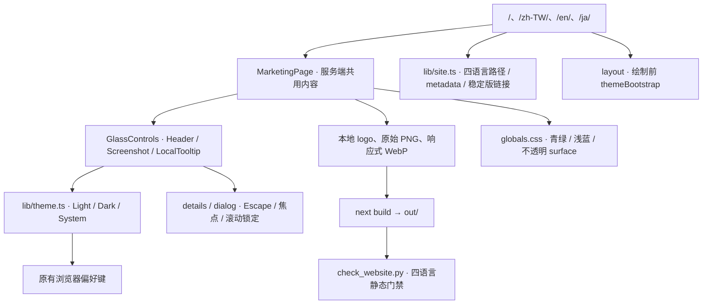

# 宣传页重构 — 网站 v1.1.0

日期：2026-10-02。源码输入基线 `7d6c119`。本次仅改宣传站与对应门禁/文档，产品仍为 1.7.3；没有推送、部署、打包或创建 Release。

## 审计与事实

- [package.json](../../website/package.json)、[next.config.mjs](../../website/next.config.mjs)：独立 Next.js 16.3.7 / React 19.2.4 / Tailwind 4 静态站，正式前缀 `/GameLibrary`，已有中英两语言。
- [原有页面](../../website/components/MarketingPage.tsx)、[控件](../../website/components/GlassControls.tsx)：共用页面，原生语言/主题菜单、截图 dialog、手机导航 dialog；无需路由库或全局状态库。
- 用户提供的 `FrontEnd_Design/gamelibrary_1/code.html`、`gamelibrary_2/code.html` 与 `screen.png` 是原型输入。它们引用占位截图、远程 logo；部署代码不能直接复制这些素材链接。
- 真实素材为 `website/public/assets/icon.png`、`library.png`、`tags.png`。主 README 确认截图来自 v1.5.5 简体中文隔离示例库，1320×820、默认封面，无个人游戏路径。用户进一步确认所需图标是 GameLibrary 应用 logo。
- [发布原则](../release-policy.md) 与[公开稳定版](https://github.com/sumingwang233/GameLibrary/releases/tag/v1.5.5)：主下载仍为 v1.5.5，v1.7.3 属于待验收预发布。

原有技术债：深色渐变/玻璃与新原型不一致；页面只支持中英；首屏文字和大图分开，主下载与便携/工具三卡同权重；门禁强制旧玻璃样式。原型“五星评分”也不能直接宣称为游戏评分：真实截图显示该星级是标签排序。

## 架构与运行图

静态路径和版本由 `lib/site.ts` 共享，繁中/日文用新增动态段的 `generateStaticParams` 固定导出；未知 locale 在页面和布局边界返回 notFound。保留既有 `/`、`/en/` 路由及锚点，新增 `#launch`、`#preview`。状态只包含主题、菜单、截图窗口及图片失败状态。

## 文件与迁移

| 文件 | 实际变化 |
|---|---|
| `website/components/MarketingPage.tsx` | 按原型重排首屏、扫描、分类、启动、隐私、下载、FAQ；接入两张真实截图；修正星级文案；四语言共用内容；稳定版主按钮与独立预发布入口 |
| `website/components/GlassControls.tsx` | 导航与浮层四语言；40px 真实 logo；复用已有 details/dialog；截图失败说明与响应式 sizes |
| `website/app/globals.css`、`website/lib/glass.ts` | 移除光球、渐变和玻璃模糊；加入浅蓝/青绿 tokens、平面 surface 和手机断点；保留旧文件/调用名避免无意义迁移 |
| `website/lib/theme.ts`、原有两份 layout | 新用户浅色；保留显式 Light / Dark / System 选择；同步首次绘制与 theme-color |
| `website/lib/site.ts`、`website/app/(localized)/[locale]/{page,layout}.tsx` | 四语言选择、路径、metadata、静态参数和 locale 检查；不增加客户端路由状态 |
| `website/public/sitemap.xml`、`scripts/check_website.py` | 四语言 canonical/hreflang、锚点、素材、下载一致性、静态前缀与减弱动画检查；禁止远程占位图片 |
| `website/scripts/theme.test.mjs` | 既有主题测试改为验证默认浅色，以及显式 System 两种系统偏好 |
| `website/package.json`、`package-lock.json` | 网站小版本 1.1.0；依赖版本不变 |
| `website/README.md`、`DESIGN.md`、本目录图文 | 记录素材来源、实际实现、验收结果及尚未执行项目 |

迁移顺序：核对原型和已发布功能 → 接入现有 logo/实机图 → 替换页面及样式 → 更新共享主题与四语言路由 → 同步 metadata/门禁 → 构建、浏览器检查 → 本地 commit。重复职责沿用 Header、Screenshot、LocalTooltip；页面没有额外的通用区块框架。

回滚：revert 本次网站 v1.1.0 实现 commit，恢复原 CSS、主题默认、两语言页面和门禁，移除新增 locale 路由；原始图片和主题存储键保持兼容。回滚不触碰桌面游戏库、数据库或游戏文件。

## 验收证据

| 检查 | 结果 |
|---|---|
| `npm --prefix website run build` | passed；四个页面成功静态导出 |
| `npm --prefix website run typecheck` | passed |
| `npm --prefix website test` | passed；2 项原生 Node 主题测试 |
| `check_website.py --self-test` | passed；坏锚点、缺图/尺寸、路径前缀、无名 dialog、远程占位图、缺少减弱动画规则等负例 |
| `check_website.py` | passed；四语言、链接、图片、metadata、sitemap |
| 四语言 × 320/375/768/1440px | passed；无横向页面溢出，无已加载图片损坏 |
| `/GameLibrary/` 四语言正式导出预览 | passed；图片与前缀链接正常，canonical 正确，浏览器错误日志为空 |
| 查看器与菜单 | passed；放大、Escape、关闭后恢复焦点、滚动锁定、手机导航、键盘语言选择 |
| FAQ 与主题 | passed；键盘展开；深浅切换与刷新持久化；减弱动画时 scroll-behavior=auto |
| 414px、200% 缩放、无脚本、图片故障注入、语言人工审校、Lighthouse | not-run；不沿用旧版测试结果 |
| 线上部署、桌面构建和产品发布 | not-run；本次范围为本地网页重构 |

本机 `python` 命令解析到 WindowsApps 执行别名并返回 1，无有效解释器输出；门禁使用 Codex 提供的现有 Python 完整路径执行，没有修改 PATH 或用户环境变量。构建首次遇到新增 Next.js 路由的参数类型限制，已将参数改为 string 并在边界核对 locale，随后构建通过。

视觉证据保存在未跟踪的 `artifacts/website-prototype-v1.1.0/desktop-full.jpg`、`desktop-hero.jpg`、`mobile-full.jpg`，来自本地正式静态导出。原型的两处占位图均已替换；扫描示意明确标识，不生成冒充实机的审核/启动 UI。

## 图谱与优先级

修改前调用 code-review-graph 增量构建，发现原数据库节点统计为空；随后 full build 成功解析 362 个文件，生成 3,500 节点、30,508 边，错误 0。收尾增量刷新后，list_graph_stats 返回 361 个 File 节点、3,444 节点、29,893 边，错误仍为 0；这些为对应调用的实际统计。最小变更审查覆盖 13 个跟踪文件，24 个变更函数/类；`validate`、`Screenshot`、`FeatureIcon` 为优先复核入口。其 20 项静态测试缺口包含 JSX 内部符号与浏览器交互，不能替代实际构建、门禁及浏览器验收。五个核心文件的最终 focused review 为 medium，影响 7 个文件 / 13 个节点；已人工复核语言/路径、主题默认与原生浮层调用。

P0 素材与下载真实性已完成；P1 原型布局、主题与四语言已完成；P2 本地响应式和交互已完成。下一步按需要补充对应稳定版审核/启动实录、语言人工审校和发布授权；未授权前不推送、不部署。
