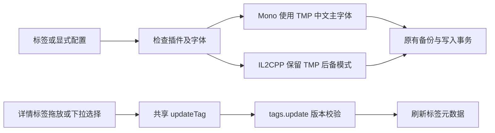

# v1.7.10 Mono 字体兼容与详情标签分类

## 审计与证据

基线 801ef1f。用户报告 Mono 翻译后存在方框及缺字，但忘记游戏名称，未提供实际目录；本次无法确定截图所用 Unity/TMP 版本、缺字组件或日志。以下是源码可确认的通用缺口，不能作为该游戏画面已通过验收的证明。未读取真实凭据、修改原游戏或启动游戏。

UnityTranslationPayload 固定 Mono ReiPatcher 5.0.0 与 IL2CPP 5.6.2。UnityTranslationFonts 之前只写 TMP 后备项；[5.0.0 上游 LoadFallbackFont](https://github.com/bbepis/XUnity.AutoTranslator/blob/v5.0.0/src/XUnity.AutoTranslator.Plugin.Core/AutoTranslationPlugin.cs#L166) 在缺少 TMP 全局后备属性时直接返回。[上游文档](https://github.com/bbepis/XUnity.AutoTranslator/blob/v5.0.0/README.md#font-overriding) 区分 UGUI OverrideFont、TMP OverrideFontTextMeshPro 和后备项；Mono 同样支持这些键，问题不是配置键不存在。后备模式仍依赖原字体正确报告缺字；其适用范围不同于主字体替换。

UnityTranslationService 在发现已启用中文插件时直接 CompleteExisting；ConfigureOne 的无备份中文插件分支同样提前结束。因此已有插件即使缺少字体，也可能直接标记完成，重试不能进入字体合并。

TagsPanel 已通过 useTagActions.updateTag → tags.update 保存全局分类，后端使用 tagId / expectedRevision 校验，不改变 kind/name 或游戏归属。DetailSheet 只有 assign/unassign 按钮，而且隐藏空分类，没有拖放目标。四类契约为 engine/gameplay/social/special，复用 lib/tags.ts；无需 DDL 或新 operation。

## 链路与文件方案

1. UnityTranslationFonts.cs：Mono 在空/本程序后备项上配置同代 Xiaolai TMP 主字体，清除相同受管后备项以避免重复加载；UGUI 继续使用已安装中文字体，IL2CPP 保持后备模式。已有自定义主字体或后备项保留。检查受管主字体文件丢失；未知 Unity 代际不猜资源包。沿用固定 SHA-256 下载、边界检查与许可，不添加外部加载器或新依赖。
2. UnityTranslationService.cs：中文插件仍检查 NeedsRepair；只有无需修复才提前确认。旧受管安装无标签也可修复，有标签或 Required 的已有安装同样检查。显式配置不受标签限制；未托管项目仍在写入前复核标签/Required，保留禁用、拒绝、运行中与文件哈希保护。第一次修改已有插件建立加密备份，等待真实运行确认，不因离线字体配置成功就删除未翻译标签。
3. DetailSheet.tsx 与 App.tsx：从现有库状态传入 updateTag，增加原生拖放和空分类目标；提供可键盘操作的分类下拉入口。只更新全库共享分类，不切换该游戏的标签分配。保留修订号、忙时禁用与错误提示；沿用现有元数据刷新，无新路由或状态库。
4. ui.json 与版本文件：补齐四语言文案，版本统一为 1.7.10；schema 保持 28、global.json 保持 10.0.401。

## 验收与回滚

授权仅运行隔离 Mono 字体和标签回归，不执行真实游戏或翻译 API。覆盖旧后备迁移、受管字体丢失、自定义保留、IL2CPP 不变、中文插件重试不提前完成、备份/原插件保留和原有事务回归；前端覆盖空分类、engine/user 分类修改、非法/同分类丢弃、键盘替代与版本冲突反馈。

最终画面需确认中文字符、符号和布局；Mono TMP 主字体替换可能改变原字体风格，未知/不兼容 Unity 字库、NGUI 或特殊 UI 仍需针对实际游戏排查。缺字修复沿原有“恢复安装前状态”回滚；游戏资源和 Windows 字体不修改。标签可拖回或下拉改回原分类。schema 未变，可回退旧程序；先备份本地数据。构建与发布证据见验证记录。
