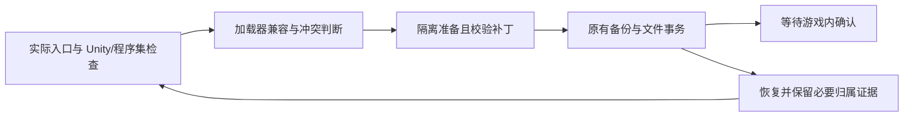

# Unity 加载器兼容与恢复重试实施记录

2026-10-11；审计基线 `a5fc3ae`。用户调用 grill-me，在审计后明确确认实施并登记 v1.7.11，授权脱敏日志/配置检查、隔离诊断和针对性回归。本次没有打包或远端发布授权。未启动真实游戏、调用翻译 API、修改原游戏文件或读取用户凭据 vault。

## 当前事实与技术债

1. 本地 IL2CPP 样例使用 Unity `6000.0.59f2`、metadata 31、BepInEx `6.0.0-be.704+6b38cee`。错误日志是 `System.AccessViolationException`，栈位于 `GenericMethod_GetMethod_Hook.Hook`，经 IL2CPPUnityLogSource 初始化触发。根目录当前已没有 Doorstop 启动文件，仍留有 BepInEx/config、interop 等运行产物。这里需要修正加载器兼容，不能用字体设置解释原生内存访问错误。
2. 两个 Mono 样例分别使用 Unity `2023.2.0a11`、`2022.3.33f1`，均有 Rei 翻译程序集、带时间戳的 bootstrap 备份、已启用并指向 BepInEx Mono Preloader 的 Doorstop，以及 BepInEx 翻译插件。`.bak` 文件名不能证明文件是原版或可安全覆盖；其具体身份和其他 MOD 依赖需进一步隔离核验。
3. UnityTranslationTransaction.cs:95 仅恢复事务清单内文件，保留运行生成的配置、interop 和缓存，随后清空清单。UnityTranslationService.cs:678 写入 restored 并解除 BackupId。UnityTranslationInspection.cs:124–127 却将 IL2CPP 的 BepInEx/dotnet 内任意文件都视为不完整加载器；重试在 Service.cs:518 被提前阻断。恢复范围与检查标准不一致，且旧归属证据已解除。
4. 现有 UnityTranslationTests 覆盖干净安装→恢复→重试，以及恢复后保留缓存，但没有串联“运行残留→恢复→服务重启→重试”。这解释了现有回归没有捕获真实目录状态。
5. DetailSheet.tsx:520–553 显示 30 秒说明、识别按钮及建议理由；这是前端展示，不应改变后端入口证据或验证时长。

## 上游依据与待确认项

- [BepInEx 704 的实际依赖](https://github.com/BepInEx/BepInEx/blob/6b38cee1277f4e3da5f2f685aee8b503a14d4054/Runtimes/Unity/BepInEx.Unity.IL2CPP/BepInEx.Unity.IL2CPP.csproj)：Il2CppInterop 1.4.6-ci.426，不能假定最新上游修复已包含。
- [Il2CppInterop #235](https://github.com/BepInEx/Il2CppInterop/issues/235)：存在 Unity 6000.0.5x、metadata 31 的类似问题与函数定位讨论。
- [MelonLoader 的针对性修复](https://github.com/LavaGang/MelonLoader/commit/11bdcbfa93a8cdd5482272e8bb24c031e624ffe8)：在特定 Unity 范围修正 GenericMethod::GetMethod 的 xref 选择；参考其原理，不能将 MelonLoader 安装到现有 BepInEx 上来叠加解决。

已核验固定包的方法体：四个 `Enumerable.Last<IntPtr>` 调用中的第二个，位于 IL offset 238，对应上游修复的 shim 选择。将其引用改为同程序集已有的 `Enumerable.First<IntPtr>` MethodSpec，只改变一个字节。输入和输出均固定 SHA-256，其他版本不自动修改。原生目标及游戏内不闪退仍需真实运行确认。

## 实施与追加问题

- `UnityTranslationAssembly.cs` 复用 .NET PE/metadata 工具，只编辑已验证的 IL。Unity 6 的原版 Interop SHA-256 为 `E4BADD01DA4A5E6251A040F683F96EB3635E6E4783F761946436AD04471F81F0`，修正后为 `1B2969A2FC0132FA44CC18BD880910C9BE5AEBBDE393879DCA27613D7E95DAB2`。新安装、显式重试和已托管安装的启动修复共用检查。
- 对完整 BepInEx Mono 布局，仅将 `UnityEngine.Input/Display` 静态构造器中已验证的 Rei `static void LoadThroughBootstrapper()` 调用改为等长 NOP；保留其余 IL、Rei 文件、BepInEx 和其他 MOD，不使用 `.bak` 覆盖。两个真实样例的只读程序集检查均匹配，各仅需改变四个非零字节。未知/不完整布局继续阻断。
- 恢复清单保留 `Restored` 收据，游戏状态记录 `RestoredBackupId`，再次安装复用该备份 ID，重新捕获当次安装前状态。恢复不会删除运行缓存。检查器仅接受非活动的指定 INI/日志/文本缓存、引用 Interop 的同名生成程序集，以及受限的 Unity 引擎库；发现未知核心、插件、dotnet 文件或链接仍拒绝。
- batheGirl：Unity `6000.1.6f1`、Rei XUnity `5.4.5`；配置把旧 AssetBundle 文件名同时填入 UGUI 字体和 TMP 字体。文件头实际为 `2019.1.0f2`，不能依文件名中的“2020”判断。没有取得运行日志，贴图消失的完整因果仍待游戏内复验。
- たのしい! 監獄経営（PrisonManager）：Unity `2023.2.3f1`、Rei XUnity `5.0.0`。日志显示 TMP 字体版本 `1.1.0` 与运行时 `1.4.0` 不匹配，随后 `TMP_MaterialManager.GetFallbackMaterial` 重复空引用异常，导致文本无法绘制。不能继续仅按 Unity 主版本选旧回退字库。
- 两款游戏都实际包含 `TMP_FontAsset.CreateFontAsset(string,string,int)`。采用 [XUnity v5.6.2](https://github.com/bbepis/XUnity.AutoTranslator/releases/tag/v5.6.2) / [上游 #854](https://github.com/bbepis/XUnity.AutoTranslator/pull/854) 的原生系统字体路径，由游戏自身 TMP 构建字体、图集和材质。对已知 Rei 5.0.0/5.4.5，逐文件比对官方固定包后通过既有事务升级为 5.6.2；两款实际目录的旧运行依赖均匹配官方包。新安装也按实际接口选择 5.6.2。保留兼容的自定义字体与未知模组，不改贴图、存档或游戏资源。
- 两款字体样例均为用户拒绝确认状态；尊重该状态，不在后台反复安装。用户明确点击“配置或重试翻译插件”时执行修复，仍需实际启动后确认效果。

## 最小链路

## 文件级实施清单与优先级

| 优先级 | 文件 | 改动 |
|---|---|---|
| P0 | UnityTranslationPayload.cs、UnityTranslationInspection.cs | 核验固定 IL2CPP 包的实际方法体及版本范围，优先复用现有离线补丁工具实现最小兼容修正；匹配不明确时停止。下载及原文件哈希保护保留，不安装第二种加载器。按实际 Unity/程序集证据触发，禁止按游戏名硬编码。 |
| P0 | UnityTranslationTransaction.cs、UnityTranslationService.cs、UnityTranslationSettings.cs | 恢复与重试使用一致的残留标准，并保留与游戏根绑定的必要安装/恢复归属摘要。旧残留也需核验；来源不明的加载器、插件或冲突文件仍保护，不能按目录名递归删除或把全部 interop DLL 无条件放行。重复恢复、失败回滚、状态重启仍幂等。 |
| P1 | UnityTranslationInspection.cs、UnityTranslationPayload.cs、UnityTranslationService.cs | 对双加载器先分别完整检查。优先保留完整 BepInEx 及现有 MOD；仅撤销可证明属于 Rei 翻译器的启动补丁，备份并校验，不凭 `.bak` 名称覆盖整个 bootstrap。若无法证明安全性，保留原文件并给出具体缺失证据。配置、重试、标签自动触发复用同一路径。 |
| P2 | DetailSheet.tsx、Localization/ui.json | 删除 30 秒说明；按钮改为“自动识别启动方式”；隐藏“引擎目录证据”“目录中唯一游戏入口”两项展示，保留其他有效理由与状态。四语言同步，不改建议识别/试运行逻辑。 |
| 配套 | UnityTranslationTests.cs、DetailSheet.test.tsx、docs/code-review-graph | 扩展既有隔离回归并更新图谱及真实验证记录；不增加依赖、路由或数据库 DDL。版本文件在方案确认后同步。 |

涉及文件均位于现有 Hosting 和详情展示边界。复用 FIFO 队列、现有状态、当前密钥配置及事务；不新建另一套安装框架。前端无路由、全局状态或 API 变更。

## 验收、迁移与回滚

- 首先用固定真实包和复制的相关程序集，在隔离目录验证补丁前后方法形态、身份、幂等与拒绝未知版本；不启动真实游戏或请求翻译 API。游戏内不闪退与实际译文仍需用户体验确认。
- 通过公共 ContractJson.Options 生成真实 `unity` 输入，覆盖运行产物→恢复→重启→重试，检查配置/缓存/其他 MOD 字节不丢失，且不会因残留误阻断；覆盖旧已恢复状态、缺失证据、未知 DLL、同名异哈希与链接路径。
- 双加载器回归覆盖两种真实目录形态，检查只保留一个翻译启动链；未知补丁、无法验证的备份、其他 MOD 必须保护。协调失败整批回滚，不能留下半个加载器。
- 前端覆盖按钮新文案、三处冗余文案不再展示、入口操作和其他理由保留；按本次明确授权运行专项，不扩大到全量验收。
- 原库不做标识符迁移。版本以 Directory.Build.props 为真源，global.json 不改。凭据留在本机，私人路径、游戏二进制、配置和密钥不提交。
- 改动沿现有安装事务备份回滚；恢复后需保留足够归属信息支撑再次配置。UI 可随代码回退；未经确认的游戏内效果不得记为通过。
