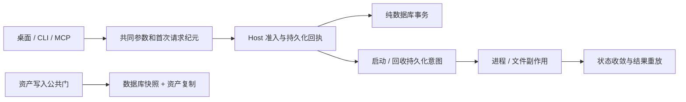

# v1.7.5 架构修复计划

依据：2026-10-06 审查报告，基线 `9bc0082577966036629864dceb38dc660d89304d`。保留现有 Host、Contracts、SQLite、JobManager 和库会话租约，不引入新框架。

| 优先级 | 审查项 | 文件级范围与完成条件 |
|---|---|---|
| 1 | F1 | HostConnection 首次发送固定实例和纪元；WPF 不自动重发跨纪元写意图。 |
| 1 | F2 | OperationDispatcher、LaunchRegistry、持久化回执：副作用前关联尝试，未知结果不重启，统一 actor 作用域；纯数据库变更与回执共同提交。 |
| 1 | F4 | GamesHandler 和现有存储：回收前记录意图，重启/重试收敛；保留原有路径与 revision 保护。 |
| 1 | F3 | 备份创建与所有资产写入共用互斥门；验证快照引用的资产完整性。 |
| 2 | F5/F6 | canonical 参数驱动 MCP；修复 reset/crop/tag 三态；Host/CLI/MCP 共用发现响应和真实信封 schema。 |
| 2 | F7 | 复用 JobManager 将慢启动步骤移出公共写锁，保留每游戏互斥、租约与取消。 |
| 2 | 进程观察 | 保留有效断言，补充 PID/路径/状态诊断；未运行时不声称确认 CI 超时根因。 |

迁移以兼容现有数据为先。新增持久化字段/表如不可避免，应带迁移与回滚说明；不重写既有引擎标识，不改变用户游戏文件路径。前端只适配异步启动状态，不变更路由或新建状态管理框架。保留上一版本安装包，回退前备份数据并核对 schema 兼容性。

验证约束：维护者明确选择「仅允许打包所需编译，暂不运行测试」。本次可编译和生成安装包；回归源码可以补充，但不得运行测试、烟测、format、lint、typecheck 或发布验证命令。报告中所有未执行检查标为 `not-run`，不能沿用 v1.7.4 结果作为 v1.7.5 证据。`docs/release-policy.md` 要求关键验收完成才能稳定发布；应先完成代码、构建、资产与草稿，再由维护者确认验收安排。

## 已落盘的实现与边界

- F1：`HostConnection.cs` 在首次发送前固定实例与 epoch；内部重连保留原请求，外部重连共用连接发送锁。WPF 仅允许读操作跨纪元重试。
- F2：`LaunchRegistry.cs` 分离 Prepare/RunPrepared，副作用前持久化 attempt 引用；重启按 PID、启动时间和路径核对，未关联或无法证明的结果保留 UnknownOutcome。内存键使用与 SQLite 一致的实例、actor、operation、key 作用域。纯数据库白名单操作与完成回执共用事务；Profile 内存变更和活动视图在异常回滚时恢复。涉及作业、文件或系统回调的操作仍使用持久化意图与已有作业协议。
- F3：`LibraryBackupStorage.cs` 与 `CatalogingHandler.cs`/`GameCoverService.cs` 共用存储写入锁，SQLite 快照及应用资产复制同一边界完成；`BackupArchive.cs` 额外核对快照内应用管理的资产引用。外部历史图片路径不纳入管理资产核查。
- F4：`GamesHandler.cs` 回收前记录 moving 意图，完成后记录 moved；入库移除与完成回执共同提交。启动恢复只在路径缺失可证明、父目录在线、epoch/revision/归属未改变时收敛数据库，不再次操作原文件；模糊状态交用户处理。
- F5/F6：`operations.v1.json` 的 parameters 是公共 schema 和 MCP 参数的唯一来源，删除 MCP 的重复参数表；CLI 支持 `--parameters-json` 保留复杂参数。省略字段与显式 JSON null 分开处理；crop/reset 执行修订保护。`OperationSchemas.Describe` 由三个入口复用，信封 schema 包含 warnings/nextActions。结果 data 保留现有逐操作自由结构，本次未扩大为完整结果 DTO 生成框架。
- F7：仅带 WaitForExit 注入步骤的启动转入现有 JobManager，持有库租约与游戏级活动尝试；桌面轮询 jobs.get 或恢复后的 launch.status，取消中止本次已启动的注入进程。已完成启动的游戏不随 Host 退出被结束。

数据库仍为 schema 27，无新增依赖、迁移或 UI 路由。前端只改 `state.ts` 的启动等待与共同四语言文案；WPF 使用相同状态语义。新增 `ArchitectureBoundariesTests.cs` 与公共 schema 回归源码，未编译/执行测试程序集。既有建议启动超时断言保持原时限，只补状态/PID/路径诊断；不能声称已复现或排除历史 CI 超时。

## 迁移、回退与待验收标准

升级前退出程序并备份数据，保留 v1.7.4 安装包。回退不需要 schema 降级；新回执中的未决意图只能由 v1.7.5 的恢复协议解释，回退前应完成或人工处理这些操作。无需移动个人游戏或翻译凭据。

待获测试授权后重点验收：断线与恢复后旧写请求被拒；同键/不同 actor 不错配尝试；副作用前后崩溃不重复启动；封面并发替换的备份完整；回收中断、离线和 revision 变化不误删；标签省略/显式清空与 crop/reset 修订；CLI/MCP/Host 发现一致；慢注入期间读写、取消、恢复与正常退出可用。再完成发布原则中的自动检查、干净 Windows 10/11 与 DPI 人工验收。
