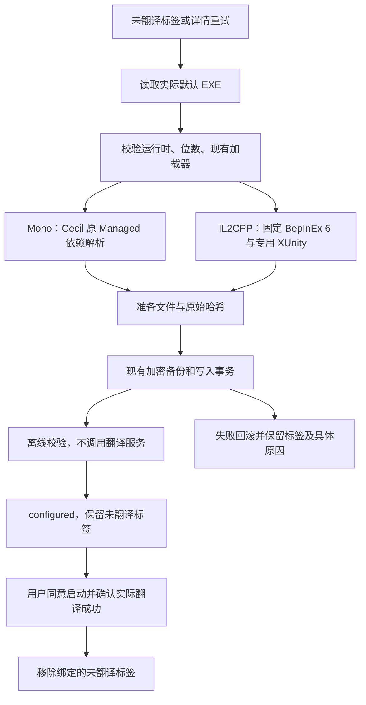

# v1.7.6 Unity 翻译安装修复

日期：2026-10-09。基线：`ee715f2`。先只读审计，再在隔离副本复现；未修改或启动真实游戏，未请求翻译 API。

## 事实与原因

- `UnityTranslationPayload.PatchAsync` 原先仅复制主加载程序集到 staging，没有把原 Managed 目录交给 Cecil 解析器。真实模块化 Unity Mono 的枚举属性引用 `UnityEngine.SharedInternalsModule`，在 `AssemblyDefinition.Write` 阶段抛 `AssemblyResolutionException`；原脚本捕获后只返回统一 exit=1。失败发生在创建游戏文件备份、写入游戏目录之前，因此启动路由仍没有安装好的插件。
- 原合成程序集没有跨模块的枚举属性依赖，遗漏了此边界。本次新增同类生产结构输入，并在用户授权下对实际程序集副本离线重现：修改前 exit=1，修改后补丁生成 exit=0、端点加载 exit=0。
- `UnityTranslationInspection.Inspect` 发现 IL2CPP 标记便直接拒绝，Mono 安装器也不能用于 IL2CPP。官方 XUnity IL2CPP 项目使用 .NET 6 与 BepInEx BE-704 接口；故固定该对应版本，而不下载未知的 latest 构建。

## 执行流程

## 改动与优先级

1. P0：`UnityTranslationPayload.cs` 修复 Cecil resolver；为模块依赖失败提供可识别原因，既不回传助手异常全文，也不泄露配置。
2. P1：`UnityTranslationInspection.cs` 区分 Mono/IL2CPP 与 x86/x64；检查 Doorstop 目标、CoreCLR、代理位数及专用插件元数据。完整的既有 IL2CPP BepInEx 可以只补装翻译插件；未知、混用、残缺加载器保留待人工处理。
3. P1：`UnityTranslationService.cs` 沿用队列、库租约、凭据和事务；下载固定 SHA-256 包，保护链接、ZIP 路径、大小预算、既有文件和准备期间的并发变更。首次安装状态不会被标签重试提前当作实际运行成功。
4. P1：`TranslationLaunchRoute.cs` 保留已配置外部工具和可用配方优先级；没有可用 Unity 插件时说明配置未就绪。`UnityTranslationDialog.tsx` 在既有确认框显示 IL2CPP 首次联网准备提示；无新增 props、路由或状态容器。

## 升级、回滚与验收

- 版本真源及 Tauri/npm/Cargo 产品版本同步为 1.7.6；数据库仍为 schema27，无新 DDL、operation 或用户密钥迁移。
- 恢复沿用 `unity_translation.restore`，按备份哈希还原；第三方修改后拒绝覆盖。仅剩空目录时允许重新配置；卸载不会回收游戏原文件。
- 回归覆盖跨模块补丁、两个 IL2CPP 位数的固定包完整配置、内置启动路由、保留首次确认、恢复重试、恶意 ZIP 路径及现有翻译行为。测试使用临时库、随机测试密钥与固定公开组件。
- 真实 IL2CPP 游戏首次启动会生成 interop 程序集，可能联网且耗时；此步骤不能由静态校验代替。真实游戏内翻译、干净系统安装、全量回归及 DPI 人工验收未执行；当前仅交付待验收预发布。

## 上游依据

- [BepInEx IL2CPP 官方安装说明](https://docs.bepinex.dev/master/articles/user_guide/installation/unity_il2cpp.html)：按游戏 EXE 位数选择包，首次运行生成必要文件。
- [XUnity 官方说明](https://github.com/bbepis/XUnity.AutoTranslator)：IL2CPP 使用专用 BepInEx 6 与 BepInEx-IL2CPP 插件。
- [XUnity v5.6.2 的 IL2CPP 项目](https://github.com/bbepis/XUnity.AutoTranslator/blob/v5.6.2/src/XUnity.AutoTranslator.Plugin.BepInEx-IL2CPP/XUnity.AutoTranslator.Plugin.BepInEx-IL2CPP.csproj)：net6.0、BE-704 引用。
- [固定 BepInEx BE-704 来源](https://builds.bepinex.dev/projects/bepinex_be)：`6.0.0-be.704+6b38cee`，两种位数 SHA-256 已在源码固定。
