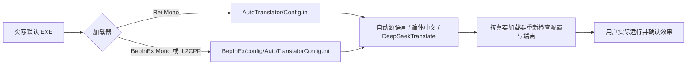

# v1.7.7 Unity 翻译配置路径修复

日期：2026-10-09。维护者已实际跑通 v1.7.6 的 Mono 与 IL2CPP 自动安装，报告 IL2CPP 把日语译成英语；本次授权兼容修复、打包和推送 GitHub，沿用翻译专项回归授权。

## 审计与原因

`UnityTranslationInspection.Inspect` 原先把所有加载器的 Config 指向游戏根 `AutoTranslator/Config.ini`。`UnityTranslationService.ConfigureOne` 在此文件写入 zh/auto，随后 `IsConfiguredChineseTranslator` 又检查同一错误路径，因此离线验证没有覆盖真实消费者。

XUnity v5.6.2 的 [IL2CPP 插件](https://github.com/bbepis/XUnity.AutoTranslator/blob/v5.6.2/src/XUnity.AutoTranslator.Plugin.BepInEx-IL2CPP/AutoTranslatorPlugin.cs#L29-L32) 与 [Mono BepInEx 插件](https://github.com/bbepis/XUnity.AutoTranslator/blob/v5.6.2/src/XUnity.AutoTranslator.Plugin.BepInEx/AutoTranslatorPlugin.cs#L22-L25) 都从 BepInEx ConfigPath 下读取 `AutoTranslatorConfig.ini`；[Settings](https://github.com/bbepis/XUnity.AutoTranslator/blob/v5.6.2/src/XUnity.AutoTranslator.Plugin.Core/Configuration/Settings.cs#L28-L29) 缺省为 en/ja。Rei 才使用游戏根 AutoTranslator/Config.ini。事实支持这是配置文件位置错误，不能靠更换 zh 别名解决。

## 最小改动与顺序

1. P0：Inspection 统一提供加载器实际配置路径；Service 写入、导入发现、启动路由检查和安装后验证复用此路径。
2. P0：对有本地备份的 configured/confirmed 安装，检测旧路径存在而实际配置未启用中文时，在启动队列修复。允许这类已移除绑定标签的安装修复；用户 declined、未托管安装、外部工具与运行中的游戏不自动修改。正常标签配置仍要求标签存在，并在文件写入前复核。
3. P1：固定包测试显式断言真实 BepInEx 路径、zh/auto 和端点；错误路径即使写有 zh 也不得满足翻译启动路由。旧安装覆盖无标签修复、拒绝/未托管不变、未知 INI 值和英文缓存保留、原备份复用、重启幂等和恢复。

改动文件：UnityTranslationInspection.cs、UnityTranslationService.cs、UnityTranslationTests.cs；版本文件及 Payload User-Agent 同步 1.7.7。无新 operation、schema、组件、状态字段或全局存储。

## 回滚与验收

沿用加密原文件备份与文件哈希事务，正确路径配置先捕获再写入；恢复时还原其原英文配置，保留缓存和未知文件。旧错误路径不主动删除，恢复旧安装时按原备份处理。不读取或公开个人密钥，不直接修改用户游戏，不启动游戏或翻译 API。真实游戏内简体中文显示仍需安装新版后确认；测试和打包证据见 [交付记录](../releases/v1.7.7-validation.md)。
