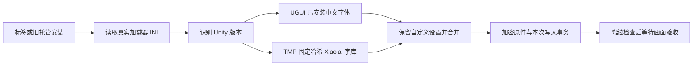

# v1.7.8 Unity 中文缺字修复

## 审计与原因

UnityTranslationService 从标签、详情和启动迁移进入统一安装流程，UnityTranslationInspection 决定实际配置路径，UnityTranslationIni 合并设置，UnityTranslationTransaction 保存加密原件。此前只配置中文翻译端点，没有中文字体后备项。只读检查报告环境为 IL2CPP / Unity 2020.2.1；未执行游戏、读取真实密钥或修改原游戏。

上游 OverrideFont 供 Unity UI 使用系统字体，FallbackFontTextMeshPro 供 TMP 使用缺字后备；旧 TMP 不能直接用 Windows 字体名代替 AssetBundle。截图与缺少中文字体配置一致，最终游戏内效果待验收。

## 文件方案与优先级

1. UnityTranslationFonts.cs：最多读 256 字节版本头，或 UnityPlayer 文件版本；固定包提供 2018—2023/6000 代际。空 UGUI 字体项使用本机已有中文字体，空 TMP 后备使用游戏内 GameLibraryFonts/xiaolai-{generation}.bundle。保留自定义字体与 TMP 覆盖项；未知版本不猜包，不安装系统字体。
2. UnityTranslationPayload.cs、Resources/UnityFonts/NOTICE.txt：复用下载缓存与固定 SHA-256，限制 ZIP 路径、大小、唯一字库及 UnityFS 版本头，只部署 Xiaolai 并附带 OFL/打包许可。首次下载原始 ZIP 约 85—113 MiB，单个字库约 29 MiB，后续复用已校验缓存。
3. UnityTranslationService.cs：首次配置与旧 configured/confirmed 托管安装统一补字体，去除标签仍可迁移。保留 declined、非托管和运行中的游戏；中文端点可用不再提前跳过字体修复。
4. UnityTranslationTransaction.cs：插件启动会补写 INI 默认值，仅翻译 INI 用合并前精确快照 CAS；二进制继续检查原清单哈希。升级失败仅撤回本次写入，保留原安装及最初加密备份；手动恢复继续严格检查所有受管文件。

不改变前端组件、路由、状态协议、数据库 schema 或凭据格式。回滚沿用详情页恢复，保留用户缓存与游戏资源。针对性回归覆盖版本、真实固定包、危险路径、自定义字体、旧安装迁移、重启幂等与单次回滚。验收标准包括“对比度”“饱和度”正常显示和原布局保持；特殊 UI、同代 TMP 资源兼容及 Unity 6 各补丁版本仍需游戏内验收，不宣称支持所有游戏。

## 上游依据

- [XUnity v5.6.2 文档](https://github.com/bbepis/XUnity.AutoTranslator/blob/v5.6.2/README.md)、[FontHelper](https://github.com/bbepis/XUnity.AutoTranslator/blob/v5.6.2/src/XUnity.AutoTranslator.Plugin.Core/Fonts/FontHelper.cs)：字体设置的真实消费者及 TMP 动态字体版本限制。
- [官方 TMP 字库指南](https://github.com/bbepis/XUnity.AutoTranslator/wiki/TextMeshPro-Font-Asset-Creation-%26-Packaging-Guide)：字符覆盖与资源版本兼容。
- [Moe 固定发布](https://github.com/sorrowmoil/sorrowmoil-MoeFont-for-XUnity.AutoTranslator/releases/tag/Moe)、[打包许可](https://github.com/sorrowmoil/sorrowmoil-MoeFont-for-XUnity.AutoTranslator/blob/35921b06f86588920856a707d969bf00e1089bce/LICENSE.txt)、[Xiaolai OFL](https://github.com/lxgw/kose-font/blob/master/OFL.txt)。仅部署 Xiaolai，不分发许可不明的 Arial 包。
