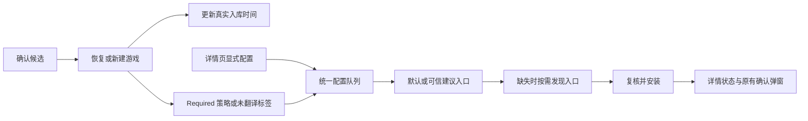

# v1.7.9 入库排序与 Unity 自动配置

## 审计：事实与原因

基线 eb9451b，前版 v1.7.8。只读核对实际库：本批 64 项在同一天明确确认，但 AcceptedUtc 仍是旧日期；两项 Unity 配置记录的失败原因为没有默认 Profile，而它们已有评分 80、Unity Data 配对的 automatic/suggested Profile。未读取私人密钥、未启动游戏、未修改真实游戏配置。公开记录不包含私人路径和游戏名。

排序查询 accepted-desc 正确使用 accepted_utc；根因在 LibraryCatalogStore.AcceptCandidate：removed 记录重新接受时只恢复 membership 和 updated_utc。与此不同，UnityTranslationService.NewState 和安装前复核只读 GetDefaultProfile，和正常启动所用 RecommendedProfileId 不一致。建议入口尚未验证为默认就被拒绝，因此已有默认 Profile 的案例成功，不能证明新入库自动链路成功。

其他断点：自动触发只看用户标签，没有复用 [toolNeed] 的 Required 策略；入库后没有触发翻译队列；显式按钮也受标签限制；状态卡在详情 Sheet 之外，失败原因不在当前按钮旁显示。

## 现有流程与修复

优先级与文件清单：

1. LibraryCatalogStore.Candidates.cs：removed → active 的明确接受同步更新 accepted_utc。ID、收藏、译名、标签及原文件保留；已接受请求重放和普通扫描不更新时间。
2. DatabaseMigrations.cs 追加 schema 28：复用自动迁移前快照，以当前 dataEpoch 的 game.created/fromCandidate 持久化确认事件恢复已受影响的时间。只更新 active 且证据时间更晚的记录；不使用 candidates.updated_utc 或 games.updated_utc，它们会被扫描或编辑刷新。事件已裁剪的记录不猜测时间。修正 AcceptedUtc 时增加 Revision，保留 UpdatedUtc；不改旧迁移、不清除忽略规则或重置 epoch。
3. UnityTranslationService.cs 与 TranslationLaunchRoute.cs：复用 RecommendedProfileId 和同一 Required 判断；准备前后检查当前推荐 Profile，拒绝相近候选、废弃入口、外部工具绑定、运行中游戏和越界路径。缺少 Profile 时复用 LaunchSuggestionService 按需发现；不提前设为默认。显式配置不要求标签；首次设置等待状态保留显式意图，设置完成后恢复执行。
4. CandidateReviewHandler.cs、OperationDispatcher.cs：成功接受后触发同一个自动配置入口，覆盖单项和批量；自动触发仍尊重禁用、拒绝和 NotRequired。首次设置或启动也覆盖既有 Required 游戏。
5. UnityTranslationDialog.tsx → App.tsx → DetailSheet.tsx：复用原有状态轮询，在详情页同步显示排队/检查/安装/失败原因；提交即显示等待，配置中禁止重复操作。删除要求添加标签的静态长说明。没有新增路由、全局状态库或第二个轮询器。四语言文本写入共享 ui.json。

## 验证与回滚

专项覆盖真实文件系统建议入口、无默认/无标签、按需发现、Required/NotRequired、相近/废弃入口、首次设置续跑、单项/批量接受、旧数据修正、重放不重排和前端反馈。原有 Mono/IL2CPP、字体、备份及 Flash 相关回归一并验证。结果见 [验证记录](../releases/v1.7.9-validation.md)。真实游戏在线翻译与最终安装包人工验收独立登记。

升级自动保存迁移前 SQLite 快照。回滚到旧程序时不能直接让旧版读取 schema 28；应通过受支持恢复流程使用迁移前快照，并保留升级后的完整备份。配置文件继续沿用原有加密备份和文件哈希保护；本次没有手动给某款游戏安装插件。
