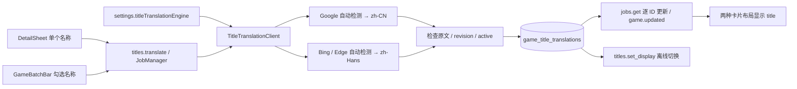

# 游戏名称翻译 — v1.7.0 / 未发布

2026-10-01。依据已确认方案实施，原游戏文件和目录不变。本次只交付源码与本地提交；公开下载继续对应稳定版，既有 v1.6.1 安装器未重建。

## 使用方式

- 详情 → 概览 → **翻译为简体中文**；有译名时为 **重新翻译名称**。
- 勾选游戏 → **翻译选中名称**。每条成功即显示译名，默认跳过已有译名，保留其显示偏好。
- 详情可 **显示原文 / 显示中文译名**，偏好落库并支持离线切换。编辑框标明当前编辑的是原文还是中文译名，两者分别保存。
- 设置 → 游戏库 → **名称翻译**：负载均衡（默认）、Google 优先、Bing 优先。优先模式仍有故障切换。
- 作业提供进度、失败原因、取消、重试失败和未处理项。取消保留已提交结果。恢复备份前先取消正在运行的翻译，现有维护门会拒绝活动后台作业。

只在用户操作时翻译。空标题或超过 1000 字符会跳过；响应为空、格式错误不落库；译文与原文一致记为「未变化」。首次翻译读取当前原文（包含用户改名），重新翻译仍读取原文而非已有中文译名。

## 数据与执行链

Schema **26** 新增 `game_title_translations`，以 game_id 为唯一键并级联外键，保存译文、翻译时原文、实际引擎、时间、手动编辑标记和显示偏好。`games.title` / `game_fields` 保留原文；DTO 的 `title` 是显示名称，新增 originalTitle、translatedTitle、titleDisplayMode、titleTranslation。旧字段编辑与清空/恢复原文会原子切回原文显示，保留译名。

列表批量充实新增一次分块查询，无逐游戏读取译名；搜索同时匹配原文、译名和路径，排序采用显示名称。标题查询和 total/page 使用相同条件。HTTP 不持有 SQLite 锁或读事务；响应写入前 CAS 检查游戏仍 active、revision 和原文一致，避免覆盖后台等待期间的手动编辑或移除。

共享 HTTP 路由限制 **全局最多 2 请求、每引擎最多 1 请求、每引擎起始间隔至少 1 秒**。每项每引擎最多尝试一次，超时 12 秒；429 遵循 Retry-After，未提供则冷却 60 秒，其他故障冷却 60 秒。两个引擎都不可用时停止余下队列。Host 退出先取消名称翻译作业再等待库会话结束。

前端复用现有路由和设置状态，新增共享作业 Hook；批量翻译时暂停自动列表刷新，通过 ID/revision 合并成功结果，保留已加载页和勾选，结束后刷新排序。详情保留未保存输入及其编辑目标；冲突时保留输入、刷新版本并等待用户再次保存，不自动重试写入。旧 Host 能力缺失时隐藏新增入口。

## 文件边界

| 层 | 改动 |
|---|---|
| Domain / Infrastructure | CatalogModels、DatabaseMigrations、SqliteLibraryStore.Titles、LibraryCatalogStore.Games、SettingsStore |
| Host | TitleTranslationClient、TitlesHandler；Dispatcher 注册、Jobs 进度/取消、Host 停机、Games DTO、Settings 参数 |
| 契约 / 工具 | operations.v1.json、生成文件、CLI 参数转发、MCP 转发；新增 titles.* 与仅取消名称翻译的 jobs.cancel |
| React | App 共享作业、DetailSheet、GameBatchBar/GameGrid、SettingsDialog、useTitleTranslation、useGamesQuery 局部更新、四语言词表 |
| 验证 | TitleTranslationTests、详情/列表/作业 Hook 测试、操作命名矩阵；既有迁移备份断言跟随当前目标 schema |

不新增依赖、业务路由或自动扫描翻译流程。与启动翻译工具的 `translation.*` 策略分离。

## 三入口

- `titles.translate`：gameIds 数组、engine 可选、force 可选、idempotencyKey；返回 JobId。使用 `jobs.get` 读进度，`jobs.cancel` 取消该名称翻译作业。
- `titles.set_display`：gameId、mode original/translated、expectedRevision、idempotencyKey。
- `titles.set_translated`：gameId、title、expectedRevision、idempotencyKey。
- 三个修改操作都需 library.write；settings.update 的 titleTranslationEngine 需 settings.write。全部继承纪元、权限、维护门和幂等收据。

CLI：`titles translate --game-id <id>`；批量用 `--items '["id1","id2"]'`；可选 `--engine bing` 和 `--force`。切换用 `titles set-display --game-id <id> --mode original --expected-revision <rev>`，改译名用 `titles set-translated --game-id <id> --name <title> --expected-revision <rev>`。全局需 `--data-dir`。MCP 同名下划线形式。

## 网络调研与限制

独立实现 HTTP 协议，没有复制 AGPL 插件代码或更改项目许可证。参考 [Translate for Zotero Google 适配器](https://github.com/windingwind/zotero-pdf-translate/blob/main/src/modules/services/google.ts) 和 [Bing 适配器](https://github.com/windingwind/zotero-pdf-translate/blob/main/src/modules/services/bing.ts)。Magic 公开仓库没有可复核的适配器源文件，其文档不足以证明具体负载均衡算法。

Google 使用 `translate.googleapis.com/translate_a/single?client=gtx&sl=auto&tl=zh-CN&dt=t`；Bing 使用 Edge 的 translate/translatetext，目标 zh-Hans，省略 from 做自动检测。仅发送标题文本；复用系统代理，无账户、密钥、路径、启动参数或文件内容上传。

调研时 Bing 用中性标题得到 HTTP 200；Google 在当前网络返回 429，未规避限流。免费公开端点可能变动、封禁或不可达；假 HTTP 测试证明本程序处理行为，不能保证各网络服务可用性。未操作用户真实游戏库。

## 迁移与回滚

启动时按现有迁移流程先生成升级前备份，再事务迁移到 schema 26。升级后原文、译名和偏好跨重启保留，备份包含译名表。回滚显示可随时切原文，无需删除译名；回滚到旧程序须恢复升级前备份，不允许旧程序写 schema 26。

验收记录在 [v1.7.0 源码验证](releases/v1.7.0-validation.md)。最终安装器、真实 WebView 与 Windows/DPI 人工验收未执行，本次不作稳定发布声明。
