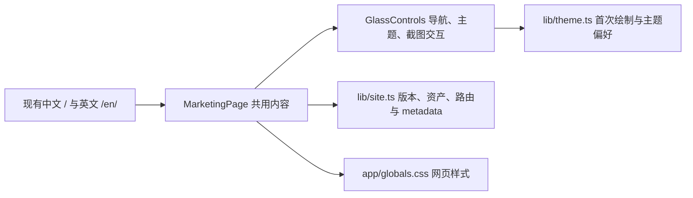

# GameLibrary 宣传网页设计规范

## Overview

这是宣传网页的设计系统，用于在 Google Stitch 中重组页面。目标是让拥有散落在多个硬盘中的独立游戏、视觉小说、老游戏和 Flash 游戏的收藏者，理解 GameLibrary、看到真实界面，并下载 Windows 版本开始使用。

**视觉气质：明亮、亲和、有秩序的私人收藏空间。** 像整理好的收藏架：内容清楚，留白足够，彩色品牌有辨识度，真正的游戏库界面是视觉中心。密度 `4/10`、布局变化 `6/10`、动效 `4/10`。以 Workbench 式实机导览为主，沿使用流程展开；语气友好、具体，不采用企业 SaaS、电竞霓虹或艺术展览的表达。

首屏主张为 **“你的游戏，值得好好收藏。”** 副标题说明实际用途：**“扫描、审核、整理并启动硬盘里的游戏。无需账号，游戏文件保持原位。”** “保持原位”针对扫描、入库和常规移出记录；明确清理文件的操作仍按软件实际行为单独确认。

保留已认可的明亮彩色平面 logo；多色仅来自原始品牌资产和真实截图。网页中的功能强调色只有青绿。新访客默认浅色，保留深色及跟随系统，并尊重已有主题偏好。

YAML tokens 是颜色、字阶、间距、圆角的真源；`version: alpha` 是 DESIGN.md 格式版本，不是软件发行版本。以下文字规定用途、响应式和主题映射。前端落地时映射为语义 CSS 变量，组件通过变量引用；不另造互相矛盾的调色板。本规范按用户已确认的方向取舍：使用真实截图与局部讲解、少量微动效，不套用行内标题图片、无限循环或强弹簧动效。

## Colors

| 语义与用途 | 浅色 token / 色值 | 深色 token / 色值 |
|---|---|---|
| Canvas：页面底色，略带冷灰 | `background` / `#F7F9FA` | `background-dark` / `#151C21` |
| Surface：菜单、截图容器和重点下载区域 | `surface` / `#FFFFFF` | `surface-dark` / `#202A30` |
| Ink：标题与正文 | `on-surface` / `#18242A` | `on-surface-dark` / `#F2F6F7` |
| Muted：说明、截图注释、版本元信息 | `muted` / `#586971` | `muted-dark` / `#B2C0C6` |
| Outline：非交互分隔线与容器边界 | `outline` / `#D8E2E5` | `outline-dark` / `#3E4D55` |
| Collection Teal：主要下载、选中态、焦点环 | `primary` / `#287E86` | `primary-dark` / `#83C9CB` |
| On Teal：主要按钮文字 | `on-primary` / `#FFFFFF` | `on-primary-dark` / `#151C21` |

同一主题内保持一套冷灰中性色；青绿只落在有功能意义的位置，不铺满整块页面。正文链接保留下划线，选中项增加勾选或文字说明，不能只靠颜色表达。焦点环使用强调色，`2px` 实线、`3px` 外偏移，获得焦点时立即显示。Outline 不作为交互控件唯一可辨识的边界。

按 WCAG 相对亮度公式计算：浅色主要按钮白字约 `4.75:1`，浅色次要文字对 Canvas 约 `5.41:1`，深色主要按钮文字约 `9.17:1`。这些是指定色对的计算值，不能替代最终页面验收；普通文字要求至少 `4.5:1`，大字号及必要的交互视觉标记至少 `3:1`。

## Typography

中文使用 `Noto Sans SC`，繁体使用 `Noto Sans TC`，日文使用 `Noto Sans JP`；各语言的标题、正文和按钮均采用对应字体，不把 SC、TC、JP 串成一个会跨语言误选的统一栈。Latin 标题、正文与 `GameLibrary` 字标使用 `Outfit`。统一使用无衬线、常规正体；系统字体是加载失败时的回退。

- 桌面首屏标题约 `56px`、手机约 `36px`，可用 `clamp(2.25rem, 4vw, 3.5rem)` 平滑缩放；CJK 行高 `1.2–1.25`，Latin `1.15`。长标题允许自然换行，不强行锁定英文断行。
- 区块标题桌面 `32px`，手机 `28px`，字重 `600`、行高 `1.35`；正文 `16px / 1.7`、字重 `400`；辅助说明 `14px / 1.5`。
- TC、JP 标题沿用对应 h1/h2 的尺寸、字重和行高，只替换字体。CJK 字距保持 `0em`；Latin display 字距 `-0.025em`，正文不压缩。
- 英文正文最大 `65ch`，CJK 说明约 `32em`；控制段落长度，每个功能说明两到三句。版本号与哈希可用 `ui-monospace`，不新增装饰性代码字体。
- 不使用 `Inter`、衬线标题、斜体强调、全大写章节眉标或大段渐变文字。字体实现优先自托管，控制语言字重与子集；回退字体下也应保持布局可读。

## Layout

### 页面骨架与响应式

容器最大 `1280px`、居中；桌面侧留白至少 `32px`，手机 `16px`。桌面使用 12 列 CSS Grid、列间距 `24px`，带图片的轨道允许收缩，例如 `minmax(0, 1fr)`。主要区块间距桌面 `96px`、手机 `56px`；内容内部优先使用 `8 / 16 / 24 / 32 / 48px` 间距。

`≥1024px` 首屏文字占 4 列、实机截图占 8 列，标题和截图分别位于清晰空间；`768–1023px` 首屏改为文字在上、大图在下；`<768px` 所有内容多列布局收为单列，按标题、说明、下载、截图顺序阅读。无需强制首屏满高；确有满高需求时使用 `min-height: 100dvh`。

导航桌面采用同一容器内的品牌、体验/收藏/下载/FAQ 锚点及语言、主题入口；不添加登录入口。`<1024px` 使用品牌与菜单按钮，语言、主题和页面链接移入可关闭的菜单，避免四语言与图标挤占 `320px` 页头。语言以自称显示：简体中文、繁體中文、English、日本語。

### 内容顺序

| 顺序 | 区块与任务 | 呈现与行动 |
|---|---|---|
| 1 | 首屏：建立收藏情感并说明用途 | 已确认标题、具体副标题、一枚“下载 Windows 版”主要按钮、真实完整游戏库截图；附 Windows 10/11 x64 和稳定版标识 |
| 2 | 扫描与审核：解释如何发现游戏 | “添加目录 → 扫描候选 → 核对入库”，配真实待确认界面；说明不是将每个 EXE 自动入库 |
| 3 | 整理收藏：展示日常整理 | 搜索、筛选、收藏、封面和标签，用游戏库局部与标签管理截图讲解；图文宽窄变化，避免每段机械交换左右 |
| 4 | 启动游戏：说明如何继续使用 | 真实详情或启动设置界面，说明入口与参数；SWF 需配置 Windows 关联播放器，不暗示内置播放器 |
| 5 | 本地数据：消除使用顾虑 | 用两段短说明与清晰分隔呈现：数据保存在本机、常规入库不搬动文件；说明更新检查会访问 GitHub |
| 6 | 下载：帮助选择发行包 | 安装版为主要下载；便携版、Tools、SHA-256 为次级列表，不做三张同权重价格卡 |
| 7 | 预发布与进阶入口：提供可选探索 | 独立文字区域标注预发布/待验收；CLI/MCP 属于进阶用途，不与日常收藏流程争夺首屏 |
| 8 | FAQ 与页脚：回答剩余问题 | 原生折叠问答；页脚为 logo、短用途说明、GitHub、反馈、MIT 许可及语言入口 |

保留现有 `#experience`、`#collection`、`#safety`、`#download`、`#questions` 锚点语义；新增启动说明可使用 `#launch`，预发布使用 `#preview`。预发布相关链接的文字始终带“预发布”或对应译文。

### 四语言

| locale | 开发路径 | 首屏标题建议 | 主要按钮 |
|---|---|---|---|
| `zh-CN` | `/` | 你的游戏，值得好好收藏。 | 下载 Windows 版 |
| `zh-TW` | `/zh-TW/` | 你的遊戲，值得好好收藏。 | 下載 Windows 版 |
| `en` | `/en/` | Your games deserve a great collection. | Download for Windows |
| `ja` | `/ja/` | あなたのゲームを、大切なコレクションに。 | Windows 版をダウンロード |

中文主张已确认，其他标题是同一含义的初稿，发布前需要语言审校。四语言共享内容顺序、组件和下载事实；允许自然断句、不同文本高度，不逐字对应版面。按钮标签保持一行，通过足够宽度及合理的译文实现，不能靠裁切省略。英文副标题初稿：`Scan, review, organize and launch the games on your drives. No account required. Your files stay in place.`

生产路径统一添加 `/GameLibrary`，例如 `/GameLibrary/ja/`；既有 `/` 与 `/en/` 路由不改名。`lang`、canonical、四语言 hreflang、`x-default` 和 sitemap 随实际页面同步。网页提供四种语言不代表稳定版桌面包已提供四种界面语言；截图和下载附近说明实际软件语言。

## Elevation & Depth

以不透明平面表面和留白为主，不沿用大面积玻璃与彩色光球。普通功能说明不用卡片；下载重点区域与截图可使用 `1px` Outline 边框。真实截图保留自身标题栏，但不额外绘制假浏览器、设备、IDE 或桌面外壳。

仅浮层菜单和截图查看器使用轻柔阴影：浅色 `0 8px 24px rgb(24 36 42 / 0.08)`，深色 `0 8px 24px rgb(21 28 33 / 0.24)`。查看器遮罩分别为 `rgb(24 36 42 / 0.60)`、`rgb(21 28 33 / 0.78)`；它们是中性色深度处理，不是第二强调色。文案、标注和截图不重叠，局部讲解放在图片外侧或下方。

## Shapes

按钮圆角 `10px`，菜单与 FAQ 容器 `12px`，截图 `16px`，主要下载区域最多 `20px`。圆角表达友好，但不将所有元素变成胶囊；不新增圆形装饰和套娃面板。官网 logo 显示约 `40px`，保持原始比例、透明度和颜色；现有 `128×128` 图片足够用于小尺寸页头，大幅品牌图需提供高清原稿，不能模糊放大。

## Components

### 导航、语言与主题

导航不透明或接近不透明，不依靠模糊背景维持文字可读性。语言和主题菜单各项至少 `44px` 高，当前项显示勾选；可通过键盘打开，Escape 关闭并恢复焦点。手机菜单遮罩不覆盖无法关闭的控制区域；关闭菜单后锚点导航仍准确。

主题语义为 Light、Dark、System：新访客 Light；已有选择保留；显式选择 System 时响应系统变化。首次绘制与切换使用同一逻辑，避免先闪深色再变浅色；改变的是网页，不能修改截图中的软件主题。

### 下载按钮与次级入口

主要按钮为强调色实心、对应 On Teal 文字、高度 `48px`、左右内边距取 `spacing.lg`（`24px`）、内容垂直居中、字重 `600`。每个行动区域最多一个主要按钮；首屏与下载区重复同一安装版目标，导航只使用文字锚点。次级入口为文字链接或清晰描边按钮，不与主按钮同权重。

默认、hover、focus-visible、active 均需可辨识；hover 可上移 `1px`，active 下移 `1px`，焦点环立即出现。仅在目标确实不可用时使用 disabled；异步操作确有 loading/error/success 时才设计对应状态。发行包链接使用真实下载目标，不伪造下载进度、成功提示或浏览器弹窗。

### 截图与局部讲解

完整实机截图使用原始比例；现有图片为 `1320×820`。缩略图保留主流程，点击放大原图，并有文字标注“查看大图”和描述性 alt。手机可读的局部截图必须由真实截图裁切，标注“局部截图”，不能重绘控件。全图模式允许在查看器内部查看原始大图，页面本身不横向溢出。

每张截图标注实际软件版本、界面语言、示例库性质；版本未知时在设计阶段标注“截图版本待核实”，发布前替换为核实值。浅色网页可使用真实深色软件截图，两者以留白和边界区分，不修改图片颜色以冒充软件浅色界面。

放大查看器优先复用现有原生 `dialog` 行为：清晰名称、关闭按钮、Escape、焦点管理及页面滚动锁定。加载失败时显示明确说明与可用的文字功能介绍；尚未加载的图片保留同尺寸静态占位，不无限闪烁。

### FAQ 与可访问性

FAQ 使用 `details / summary` 或等效可访问行为，回答置于问题下方；不在侧栏堆放章节编号。链接、按钮及菜单命名需在各语言中准确，触控目标至少 `44×44px`，图标旁有文字或可访问名称。保留跳到主要内容入口，查看器关闭后恢复触发元素焦点。

## Do's and Don'ts

- **Do** 用真实产品界面证明功能，用短文说明“扫描、审核、整理、启动”；强调私人收藏的秩序感与归属感。
- **Do** 保留实际 logo 与截图；原始图片内部颜色和控件属于事实，不受网页单强调色限制。
- **Do** 将版本、平台、软件界面语言和功能发布状态写清楚；真实图不足时标记待补图，不替用户造图。
- **Don't** 使用霓虹、外发光、紫蓝背景光球、渐变大标题、纯黑 `#000000` 或高饱和装饰控件。
- **Don't** 使用三等分功能卡、假客户墙、假评价、虚构下载量、速度倍数或自动更新的假指标。
- **Don't** 插入 stock photo、emoji、自定义鼠标、标题中的行内图片或遮盖软件控件的装饰；不重新设计宣传截图里的桌面应用。
- **Don't** 添加登录、订阅、付费方案和无实际用途的表单；不把本地游戏库呈现为游戏商店或在线服务。
- **Don't** 用“无任何网络行为”“完全自动识别所有游戏”“内置 Flash 播放器”等未经证实或不准确的承诺。
- **Don't** 使用“下一代”“释放潜能”、滚动提示箭头、章节眉标或为纯审美添加复杂交互。

## Motion & Interaction

轻量活泼通过短促、可控的反馈表达，最多使用两类动效：**一次性内容出现**和**直接交互反馈**。没有持续漂浮、光泽扫过、打字机、自动轮播、视差、滚动接管或反复触发的列表入场。

- 非首屏区块首次出现时，最多 `4px` 上移配合透明度，`240ms`，同区块错开最多 `40ms`；主要文字与首屏截图不等待动画才能阅读。无脚本时内容仍可见。
- 按钮、可点击截图和浮层反馈 `160–200ms`；截图 hover 最多放大 `1.01`，只在精细指针设备启用，不遮挡周边内容；浮层以短透明度过渡为主。
- 使用 `cubic-bezier(0.16, 1, 0.3, 1)` 收尾，仅动画化 `transform`、`opacity`；不动画化布局尺寸、模糊、阴影或背景颜色，不新增动效依赖。
- `prefers-reduced-motion: reduce` 时取消空间位移、缩放与错开，过渡改为至多 `150ms` 透明度变化；焦点环始终立即显示。

## Release & Asset Rules

### 版本边界

2026-10-02 审计基线：GitHub 公开稳定版为 **v1.5.5**，Windows 10/11 x64，桌面界面为简体中文；仓库产品版本为 **1.7.3**，对应待验收预发布。两者不是同一发布状态。首屏能力、主下载和快速开始对应稳定版；后续每次更新以真实公开状态为准，不将仓库版本自动等同于稳定版。

当前下载区保持以下已核实的资产名称，链接指向 `https://github.com/sumingwang233/GameLibrary/releases/download/v1.5.5/`：

| 层级 | 名称 | 资产 |
|---|---|---|
| 主要 | 安装版：适合日常使用 | `GameLibrary-Setup-v1.5.5.exe` |
| 次级 | 便携版：解压使用 | `GameLibrary-Portable-win-x64-v1.5.5.zip` |
| 进阶 | CLI & MCP 工具包 | `GameLibrary-Tools-win-x64-v1.5.5.zip` |
| 辅助 | SHA-256 校验清单 | `GameLibrary-v1.5.5-SHA256SUMS.txt` |

预发布入口指向 [v1.7.3 Release](https://github.com/sumingwang233/GameLibrary/releases/tag/v1.7.3)，显示“预发布 · 待验收”；游戏名称翻译等新功能不混入稳定版流程。进阶功能若联网，按实际行为解释，不能将“游戏库数据本地保存”扩大成第三方服务永不接收任何请求。详情以对应版本说明为准。

### 素材清单

以下文件路径相对本文件所在的 `website/`；在 Stitch 中需要上传实际图片，本地路径文本不能代替图片上传。

| 文件或槽位 | 现状 | 用途与规则 |
|---|---|---|
| `public/assets/icon.png` | 已查看，`128×128`，认可的彩色 logo | 页头、页脚；不重画、调色或添加光效 |
| `public/assets/library.png` | 已查看，`1320×820`，中文示例游戏库，标题栏为旧图标；捕获版本待核实 | 首屏和收藏局部的候选素材；不能因旧图标而改图冒充新版 |
| `public/assets/tags.png` | 已查看，`1320×820`，中文示例标签管理；捕获版本待核实 | 标签说明；保留实际控件与默认示例封面 |
| 扫描/待确认真实截图 | 待补 | 需与所述发行版本对应、操作完成，能看见候选审核流程 |
| 游戏详情/启动配置真实截图 | 待补 | 核实启动入口与参数；不展示私人目录 |
| 预发布功能真实截图 | 待补，只有展示该功能时才需要 | 与稳定版素材分开，明确软件版本与预发布状态 |

`../artifacts/build-reports/v1.7.3-release-webview.png` 是加载中的验证截图，不作为宣传主图。补图使用隔离示例库、默认封面和非私人路径，等待界面加载完成；不借用第三方游戏封面制造虚假产品效果。缺图时在设计稿留明确占位，发布前补齐或移除该图文区块。

## Stitch Prompts

先导入本文件并上传已核实的素材，再生成中文浅色桌面基准。只在确有对应素材时要求生成截图区域；缺失素材留标注槽位，不能生成近似桌面 UI。确认基准后派生手机、深色与其余语言，避免四套视觉系统独立生成。

### 1. 中文浅色桌面基准

```text
Use the imported DESIGN.md as the design-system source of truth. Design a 1440px-wide Simplified Chinese marketing homepage for GameLibrary, a Windows local game library for collectors. Use a bright, friendly collection-space mood, cool neutral surfaces, and the specified single teal accent. Keep the supplied colorful logo unchanged. Use the headline “你的游戏，值得好好收藏。” and the exact supporting copy from the document. Compose an asymmetric 4:8 text-to-screenshot hero inside a 1280px container with one primary Windows installer CTA. Use supplied real screenshots without redrawing or recoloring the desktop app. Preserve capture language and verified version captions; clearly label unknown capture versions and missing images. Follow the specified section order: hero, scan and review, organize, launch, local data, stable downloads, separate prerelease area, FAQ, footer. Primary downloads target stable v1.5.5; v1.7.3 is explicitly prerelease. Do not add invented metrics, testimonials, store features, account forms, fake device chrome, glass orbs, or equal three-card feature rows. Describe the two permitted motion families; do not animate screenshots as if they were live software.
```

### 2. 手机派生

```text
Adapt the approved desktop screen to 375px, then check 320px and 414px. Keep the same tokens, content order, factual copy, assets, and download targets. Use one column, a roughly 36px hero title, 16px body copy, 16px side gutters, and at least 44px touch targets. Move navigation, language, and appearance options into a closable mobile menu. Keep download labels on one line and real screenshots proportional. Use labeled real crops only when supplied. No horizontal page overflow, hidden content, autoplay, fixed bottom CTA, or newly invented sections.
```

### 3. 深色派生

```text
Create the dark-theme variant of the approved screen. Change only web surfaces and text using the exact dark token mapping in DESIGN.md. Use dark teal buttons with the specified dark button text, not white text. Preserve layout, spacing, typography hierarchy, content, language, original logo, and screenshot pixels. Include Light, Dark, and System choices. Keep light as the default for new visitors and preserve existing preferences. Do not introduce neon, new accent hues, stronger shadows, or glassmorphism.
```

### 4. 四语言适配

```text
Derive Traditional Chinese, English, and Japanese variants from the approved Simplified Chinese layout. Keep the same design system, section order, assets, release facts, and actions. Use Noto Sans TC for Traditional Chinese, Outfit for Latin, and Noto Sans JP for Japanese. Translate surrounding page copy, not screenshot pixels. Do not imply the stable desktop package supports these page languages. Allow natural title wrapping and paragraph height, keep interactive labels on one line, and label screenshots with their actual UI language. Desktop and mobile routes use the document's locale mapping. Treat non-Chinese headline drafts as copy for language review.
```

### 5. 局部迭代

```text
Revise only [TARGET SECTION] to achieve [SPECIFIC CHANGE]. Use the approved screen as the fixed reference and DESIGN.md as the token source. Preserve all other sections, component shapes, typography, color roles, spacing, original images, factual copy, and download URLs. Do not run a global restyle, add unsupported product features, or replace missing screenshots with generated software UI. Return the revised target and identify any unresolved asset or language-review needs.
```

## Implementation Notes

### 审计事实与结构

2026-10-02 源码基线 `e5b2d0d`：宣传站是独立 Next.js 16 / React 19 / Tailwind 4 静态站点，当前为中英两条路由；桌面应用是 C# / Tauri，网页重组不改变桌面软件界面。现有网页使用系统字体、浅深渐变背景与玻璃控件，默认跟随系统。本文件定义的是重组后的目标，四语言路由与浅色默认尚未实现。



事实证据：[当前内容](components/MarketingPage.tsx)、[控件](components/GlassControls.tsx)、[网站配置](lib/site.ts)、[主题逻辑](lib/theme.ts)、[样式](app/globals.css)、[静态导出](next.config.mjs)、[素材说明](README.md)、[公开稳定版](https://github.com/sumingwang233/GameLibrary/releases/tag/v1.5.5)、[发布原则](../docs/release-policy.md)、[预发布验证记录](../docs/releases/v1.7.3-validation.md)。待确认项是截图捕获版本、缺失流程截图、派生语言审校和实际部署状态。

### 后续网页落地清单

以下是设计获认可后的代码迁移映射，不代表本次已修改这些文件。保留现有框架、静态导出与行为，无需替换站点或引入全局状态库。

| 文件或职责 | 后续改动 |
|---|---|
| `components/MarketingPage.tsx` | 采用新内容顺序；扫描、收藏、启动为清晰区块，按实际重复需要拆出 `FeatureSection`；下载可拆 `DownloadSection`，不预建一套组件框架 |
| `components/GlassControls.tsx` | 保留 `Header`、`Screenshot`、`LocalTooltip` 的行为职责，更新外观与语言文案；复用原生菜单、dialog 和焦点管理，名称不强制改动 |
| `app/globals.css`、`lib/glass.ts` | 将语义 tokens 接入现有样式；保留 `@import "tailwindcss"`，逐步替换玻璃及光球处理；先移除调用，再清理无引用样式，不直接删除生产文件 |
| `lib/theme.ts` 与使用它的布局 | 统一首次绘制、切换和偏好读取；新访客浅色，已有偏好不重置；按新调色板同步 theme-color |
| `lib/site.ts` 与四语言页面/layout | `Language` 扩展为 `zh-CN / zh-TW / en / ja`；统一路径与文案映射，避免现有 `en ? ... : ...` 将新语言误当中文；保留原路由，增补 `zh-TW/`、`ja/` 入口和 metadata |
| `public/sitemap.xml`、`scripts/check_website.py`、`scripts/theme.test.mjs` | 同步四语言离线检查与新的主题默认测试；保持资产尺寸、前缀、锚点及真实下载链接检查 |

先确认截图与功能边界，再接入 tokens 和中文浅色基准；随后迁移菜单、查看器和主题，补齐三种语言、metadata 与门禁，最后验证静态导出。页面状态仍限于菜单、查看器和主题；不新增登录态、云端游戏库或后端 API。代码改动前调用 `code-review-graph`，完成后同步 `docs/code-review-graph/` 中受影响的图。

以本次文档 commit 作为设计输入锚点，后续重组单独提交可回退的网页变更。回滚时撤回对应实现 commit 和新增路由/元数据，恢复改动前主题默认与样式；保留原截图资产和已有主题存储键。代码推送、Pages 发布、打包与 Release 依照项目授权规则另行执行。

## Acceptance & Priorities

- **P0 内容真实性**：主要按钮、下载区、快速开始、功能和截图指向同一稳定版本；预发布独立标注；补齐截图版本及必需素材，不冒充已发布能力。
- **P1 设计一致性**：tokens、配色角色、字阶、组件形状、四语言与浅深主题一致；文案清楚解释用途，不出现虚构背书。
- **P2 可用性**：在 `320 / 375 / 414 / 768 / 1440px` 检查中、繁、英、日的标题、按钮及菜单；无横向页面溢出，原图可放大，键盘和 Escape 行为正确，主题刷新不闪烁，已有偏好保留。
- 验证指定色对及最终控件状态的 AA 对比；检查 reduced-motion、字体失败、图片失败和无脚本阅读；各语言的菜单、截图及 FAQ 有正确可访问名称。
- 本文件校验使用 `npx --yes --package=@google/design.md@0.4.0 designmd lint website/DESIGN.md`，检查 YAML、结构与 token 引用。后续网页实现再运行 typecheck、主题测试、构建及离线导出门禁；不把文档校验成功当作渲染或发布验收通过。

文档完成时的状态：网页重组、Stitch 画布生成、浏览器尺寸检查、截图版本核实、补图和派生语言审校均 **未执行或待完成**；它们是后续设计与实现的验收项。实际执行结果写入对应验证记录，不在本规范中提前声称通过。

2026-10-02 本次文档验证：官方 `@google/design.md@0.4.0` lint 为 `0 errors / 0 warnings`；六组指定文字色对均达到 `4.5:1`，九个本地 Markdown 链接全部存在，章节名无重复且代码围栏配对；GitHub 已核实 `v1.5.5` 为稳定版、`v1.7.3` 为预发布。以上结果仅覆盖文档与所列色对。

格式参考：[Google DESIGN.md alpha 规范](https://github.com/google-labs-code/design.md/blob/main/docs/spec.md)、[Stitch DESIGN.md 官方说明](https://blog.google/innovation-and-ai/models-and-research/google-labs/stitch-design-md/)。采用 YAML 精确值与语义描述组合，额外章节用于产品事实、Stitch 提示和迁移约束。
