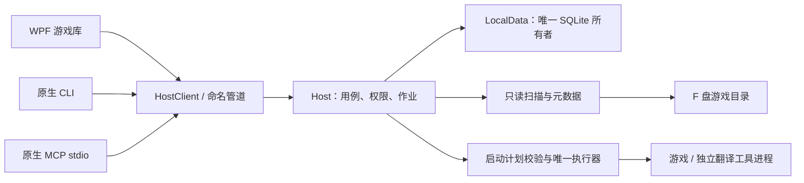

正式项目名称为 **GameLibrary**，工程位置为 `D:\Official\GameLibrary`。

开发入口：[任务书](<D:/Official/GameLibrary/开发Agent任务书.md>)；专项契约：[原生接口](<D:/Official/GameLibrary/MCP与CLI原生接口契约.md>)、[领域与可靠性](<D:/Official/GameLibrary/领域与可靠性补充规格.md>)。领域对象、正交状态、规则优先级、测量口径以补充规格为准；跨入口、作业、授权与协议以接口契约为准；其余产品行为按本文。
本文交付的是可执行的产品与工程规格，不是已经实现的应用。磁盘信息来自本次只读检查；软件启动协议区分“本地脚本证据”“公开说明”“运行验证”。

## 1. 项目决策与完成标准

开发一个 **面向人和 AI agent 的 Windows 本地游戏库 GameLibrary**。使用 **C#、.NET 10 LTS、WPF/XAML、SQLite**。只面向当前 Windows 11 x64 电脑。采用一个本地应用宿主 GameLibrary.Host，图形界面、CLI 与原生 MCP Server 作为同级客户端；业务逻辑保持模块化单体。游戏和翻译工具保持独立进程。不引入远程服务或微服务部署。

核心闭环：选择 F 盘 → 只读识别游戏 → 用户审核入库 → 自动填充有依据的资料 → 卡片展示 → 用户编辑 → 按保存的启动方式打开 → 后台发现新游戏 → 合并提示是否加入。

“所有游戏可以接入”：自动识别常见格式，同时任何未识别游戏都可以手动指定文件、目录、启动参数和外部工具入库。**不承诺所有目录都能准确自动识别，也不把任何 EXE 都当成游戏。**

完整 v1 必须具备：

1. 游戏卡片、名称、简介、图片、标签、搜索筛选、收藏、最近启动记录。
2. 首次批量入库审核；新增游戏提示；忽略后持久记忆；盘离线和目录移动时保留用户资料。
3. 普通 EXE、可配置外部播放器的 SWF、已验证翻译启动方式；自定义入口弥补自动识别空缺。
4. `[toolNeed]` 子树继承“需要翻译”策略，默认启动不能悄悄退回原文直启。
5. 扫描不写游戏目录；用户修改资料不改文件夹名；从库中移除不卸载游戏。
6. 翻译接入明确区分“一键启动已验证”“需要工具内操作”“配置无效”；不能用假成功状态完成验收。
7. 自带完整原生 CLI 与 MCP Server，agent 可以发现、查询、修改和调用本程序全部产品能力。原先只读 Probe 的设计由完整 CLI 取代；禁止依赖界面点击、直接改数据库或调用 Shell 才能完成正常业务。
8. 三入口共用用例、校验、权限、事务和状态。每新增一个产品操作，必须同步登记三入口覆盖与契约测试；没有 MCP/CLI 对应能力的产品功能不得验收完成。
9. 无图形界面时也可以完成扫描、审核、入库、编辑、封面与标签管理、启动配置、已验证启动、任务查询、通知处理、设置、备份与恢复。用户既有授权可供 agent 持续执行，不对每次常规操作重复弹框。

详细接口规格见 [MCP 与 CLI 原生接口契约](<D:/Official/GameLibrary/MCP与CLI原生接口契约.md>)，与本文同等有效。本程序的完整接口不等于替第三方翻译工具发明协议：外部工具需要人工处理的部分应结构化返回 NeedsUserAction 与后续步骤。

本期不做：游戏下载/更新/卸载、自动搬移游戏、资源包解密、自动汉化文件管理、账号系统、云同步、商店、聊天、插件市场、自动联网补全资料、全量剧情分析、自动修改注册表或语言环境。在线元数据与本地模型均可后续单独立项。

## 2. F 盘现状与直接影响

### 2.1 本次检查的范围

检查了根目录、全部根级方括号目录的直属内容、工具目录、已有整理脚本及测试、部分游戏根目录、161 个 LNK 的目标信息，以及特定启动脚本。没有逐个启动全部游戏，也没有完成全盘精确游戏数量统计。以下目录数量不是游戏数量。

| 事实 | 开发影响 |
|---|---|
| 首次调研：Windows 11 专业版、64 位；F 为 exFAT；C 为 NTFS；本次修订另确认 D 为 NTFS | 不依赖 F 盘的 NTFS USN Journal、NTFS 稳定文件 ID、硬链接或目录联接；本机数据库放 D 盘 LocalData |
| F 根级可见目录 65 个，其中完整匹配方括号的 11 个 | 方括号是分类线索，不是完整目录语义；根目录还有散放游戏 |
| 根目录有独立 `BloodRush V.100.exe` | 必须识别散落文件，不能只扫描文件夹 |
| `[26.7.27]` 下有 `[Clockup]`，`[Unity]` 下有 `[Uncomplicated]` | 分类必须递归继承；日期批次、厂商、引擎需要不同类型 |
| `[FLASH]` 包含子合集、独立 SWF、EXE、LNK | 支持文件型游戏、包装器和重复入口消歧 |
| `[LunaSoft]` 中有 `LunaTranslator`，`[NTRMAN]` 中有 `存档` | 游戏分类目录内部也会混入工具和存档 |
| `F:\Game` 当前主要是 `TOOLS` 工具容器 | 不能因目录名叫 Game 就将整个目录作为一款游戏 |
| `[toolNeed]` 有直属游戏、`[Unity]`、`[KRKR]`、`[MTool_Android]` | 翻译需求属于祖先策略；不能只检查游戏直接父目录 |
| `[toolNeed]\[Unity]` 当前有 16 个直属目录；`[KRKR]` 为空；`[MTool_Android]\[AAA 已验证]` 为空 | 空分类不要入库；历史分类名不能当兼容性证明 |
| `SteamLibrary\steamapps\common` 有 `BlackMythWukong`，本次没有发现 `appmanifest_*.acf` | Steam 文件夹不等于完整 Steam 安装；必须保留“缺清单、待确认”的入口 |
| 部分 LNK 指向不存在的 `F:\Game\222\…` | LNK 仅作为入口线索；不能直接批量导入后宣称可启动 |
| 本地存在 .NET 主机，但 `dotnet --list-sdks` 未列出 SDK | 开发前需检查并配置 .NET 10 SDK；不要把运行时当开发环境 |

本次存储查询还返回 F 盘 `HealthStatus=Warning`；仅记录原始状态，不据此诊断原因或进行修复。扫描遇到 I/O 错误应保留已有库并报告局部失败。

### 2.2 分类语义表

默认规则应由版本化 JSON 配置驱动，用户可在“分类规则”中修改，不能将所有方括号都硬编码成厂商。

| 目录片段 | 默认语义 | 保存方式 |
|---|---|---|
| `[ANIM]` | 用户明确的厂商分类 | `publisher:ANIM`，来源为该祖先路径 |
| `[LunaSoft]`、`[NTRMAN]`、`[Clockup]`、`[Uncomplicated]` | 厂商/作者分类建议 | 标注“来自文件夹”，允许更改类型，不声称独立核验过厂商 |
| `[Unity]`、`[KRKR]`、`[FLASH]` | 引擎或格式分类线索 | 保存 FolderHint；引擎事实仍需文件证据 |
| `[RPG]` | 类型/个人分类 | `category:RPG`；不能直接判成 RPG Maker |
| `[13个时停小游戏]`、`[对魔忍]`、`[催眠校园]` | 合集分类 | `collection:<原名称>`，不要依名称数字推断游戏数 |
| `[26.7.27]` | 收集批次 | `batch:26.7.27`，不推断游戏发行日期 |
| `[toolNeed]` | 特殊启动策略 | `translationRequirement=Required`，同时显示“需要翻译”标签 |
| `[MTool_Android]` | 既有整理用途 | `collection:MTool_Android`；不是 PC MTool 启动已验证 |
| `[AAA 已验证]` | 用户历史标记 | `collection:AAA 已验证`；不生成本程序的 Verified 状态 |
| 未知 `[xxx]` | 自定义分类 | `category:xxx`，保留完整路径来源 |

匹配单个路径片段的完整正则 `^\[(.+)\]$`。`[LunaSoft] 某游戏 V1.0` 不属于完整方括号容器；最多将前缀作为名称/标签建议。不要删除路径中的 `[]`，也不要对实际路径做全角半角替换。

### 2.3 旧脚本复用边界

- `F:\Organize-GameLibraries.ps1`：可移植 `Get-GameClassification` 的引擎文件特征，重写成无副作用的检测器。其分类服务于 Android/Unity/Kirikiri 的搬移决策，与本项目的 PC 启动配置分开。
- 它只对根级目录及合集直属子目录做有限识别，主动排除 toolNeed/FLASH/Unity 等，且默认预演仍写 CSV。因此不能直接作为后台扫描库调用。
- `F:\Organize-GameLibraries.Tests.ps1`：可借鉴临时目录夹具和引擎特征样本；不执行原测试作为新应用测试，因为它测试的是目录移动且含删除清理。
- `F:\game-organization-report.csv`：仅作历史线索。当前实际目录与记录已有差异，不能恢复成现状数据库。
- `F:\xp3_tool.py`：薄封装，引用根级 `[KRKR]` 内的维护脚本；该根级路径目前不存在。新应用不执行此入口，也不修复/移植 XP3 解包逻辑。

## 3. 技术选型与隔离边界

| 层 | 选择 | 约束 |
|---|---|---|
| 语言/平台 | C#，.NET 10 LTS，`net10.0-windows`，win-x64 | 不用预览 SDK；确切 SDK 版本写入 `global.json` |
| 桌面界面 | WPF + XAML，MVVM，CommunityToolkit.Mvvm | 通过 HostClient 操作业务，不直接访问数据库或启动游戏 |
| 原生 CLI | C# 控制台 `gamelibrary.exe`，类型化命令与 JSON 输出 | 全量操作能力；默认非交互；不调用桌面菜单 |
| 原生 MCP | 官方 ModelContextProtocol C# SDK，stdio transport | 原生 Tools/Resources；不包装 CLI 文本输出 |
| 本地宿主 | .NET Generic Host + Windows 命名管道 IPC | 每数据目录单宿主；仅当前 Windows 用户；不监听公网 |
| 本地存储 | Microsoft.Data.Sqlite；显式 SQL 与版本迁移 | 仅宿主访问 SQLite；不引入远程数据库或第二套 ORM |
| 任务调度 | `Channel<T>`、CancellationToken、定时器 | 有界队列；一个磁盘枚举工作者起步 |
| 目录变化 | FileSystemWatcher + 周期性核对 | 事件只是“需要复查”的线索 |
| 进程启动 | ProcessStartInfo + 类型化 LaunchPlan | 普通 EXE 不经过 cmd/PowerShell |
| 缩略图 | WPF/WIC 解码与 Windows 图标读取 | 图片缓存与原文件隔离；只读资源，不加载游戏代码执行 |
| 日志 | Microsoft.Extensions.Logging + 本地滚动文件实现 | 结构化错误码，默认不上传日志 |
| 测试 | xUnit；测试用进程桩；临时文件夹 | 测试不能遍历真实 F 盘来决定是否通过 |

.NET 10 为当前 LTS，WPF 是 Windows 桌面框架，符合当前机器而无需额外 WebView/Node 服务。[.NET 支持策略](https://dotnet.microsoft.com/en-us/platform/support/policy/dotnet-core)、[WPF 官方说明](https://learn.microsoft.com/en-us/dotnet/desktop/wpf/overview/)。补丁和 NuGet 具体版本由开工时验证后锁定，不使用浮动版本。

### 3.1 物理隔离

工程目录固定为 `D:\Official\GameLibrary`，已存在策划文档与 `.obsidian`；在此增量开发，不覆盖用户文档和笔记配置，不另建旧名称工程。

运行数据统一为 `D:\Official\GameLibrary\LocalData`，保留任务书中用户已采用的随项目存放方案。包含 `library.db`、`cache\`、`images\user\`、`logs\`、`backups\`。LocalData 与 `.obsidian` 默认不提交 Git；开发/CI 使用独立 `artifacts\test-runs\<guid>\data`，不能连接日常库。发布到其他位置时显式配置数据目录；三入口必须连接同一规范化 DataDirectory，不依赖调用方当前工作目录。未明确配置时返回错误，不悄悄创建另一份库。不把数据库放 F 盘或游戏目录。

本策划文件位于 `D:\Official\GameLibrary`。以后若把工程或数据目录加入扫描根，必须精确排除工程、LocalData、测试产物和工具目录。

开发进程可写工程与测试目录；日常应用由宿主写 LocalData，显式导入/导出只操作用户授权的具体路径；扫描层只有读取接口；真实游戏目录视为外部数据。**这是工程权限边界，不是操作系统级沙箱。** 用户或获授权 agent 发起启动后，游戏和翻译工具本身可能写存档、缓存、补丁，并不受本应用的只读接口约束。

翻译工具首次接入要展示其可能写入游戏目录的说明和已知范围；应用不自制注入器、不自动复制补丁、不负责猜测如何卸载第三方补丁。

### 3.2 工程结构

```text
GameLibrary/
  AGENTS.md                         # 任务边界和可写目录
  global.json / Directory.Packages.props / .editorconfig
  src/
    GameLibrary.Domain/        # 实体、规则结果、状态、值对象；无 WPF/SQLite
    GameLibrary.Application/   # 入库、扫描编排、编辑、启动用例和端口接口
    GameLibrary.Infrastructure/# Filesystem、SQLite、Windows、工具适配器
    GameLibrary.Contracts/     # 版本化 DTO、operation catalog、JSON Schema
    GameLibrary.Host/          # 唯一业务装配、DB 所有者、作业与事件、IPC
    GameLibrary.HostClient/    # 三入口共用的类型化 IPC 客户端
    GameLibrary.Desktop/       # Views、ViewModels、样式；只经 HostClient 操作业务
    GameLibrary.Cli/           # 完整 CLI；输出 gamelibrary.exe
    GameLibrary.Mcp/           # 原生 stdio MCP Server；直接调用 HostClient
  tests/
    Unit/ Integration/ Architecture/ Contract/ HeadlessE2E/ TestProcessStub/
  fixtures/                         # 人工生成的小文件结构，不放真实游戏
  docs/                             # ADR、测试记录、工具适配证据、开发交接
  contracts/                        # operation catalog、JSON Schema、三入口覆盖表
  LocalData/                        # 本机日常运行数据，Git 忽略
  artifacts/                        # 报告/构建/临时样本，Git 忽略
```

依赖方向：Domain ← Application ← Infrastructure，Host 负责装配；Contracts 定义边界，HostClient 被 Desktop/Cli/Mcp 引用。三入口不得引用 SQLite 实现、直接运行游戏或各自启动扫描器。MCP 不启动 CLI 子进程，CLI 不调用 MCP 模拟业务。原 Probe 的能力并入完整 CLI，不再维护第二套诊断命令。首版不拆微服务、不做通用插件加载框架；多进程只服务于稳定的本地多客户端接入。

下面表示运行时的数据流；不是程序集的引用方向：



## 4. 核心数据模型与持久化

基本单位是“一个本地安装实例”。同一游戏两个版本先保留两张卡片，可共享合集标签；不按标题自动合并。后续需要作品级聚合再增加上层实体。

| 表/实体 | 关键字段与用途 |
|---|---|
| `LibraryRoot` | Id、当前挂载路径、卷指纹提示、FileSystem、Enabled、上次完整扫描；盘符不是唯一身份 |
| `Game` | 安装级 LibraryItem；GUID Id、RootId、相对根路径、Folder/File/Steam 类型、Membership、Availability、首次入库、最近启动、收藏、Revision |
| `GameField` | GameId、FieldName、AutoValue、SourceKind、SourcePath、Evidence、Confidence、DetectorVersion、UserMode、UserValue |
| `Tag` / `GameTagSource` | Tag 的类型/规范值；每条路径或检测器各自保存来源；可多来源共存 |
| `TagOverride` | GameId、TagId、ForceAdd/Suppress；阻止下次扫描恢复用户删除的自动标签 |
| `LaunchProfile` | Id、GameId、AdapterId、可执行文件相对路径、WorkingDirectory、Arguments JSON 数组、ToolId、Version、默认标志 |
| `TranslationPolicy` | GameId、继承结果、用户覆盖 Auto/Required/NotRequired、来源、默认翻译 ProfileId |
| `ToolInstallation` | Id、名称、可执行文件绝对路径、工具工作目录、版本文本、关键文件指纹、能力等级 |
| `AdapterVerification` | ToolId、指纹、AdapterVersion、Engine、Game/ProfileId、测试方法、结果、时间、用户确认 |
| `DiscoveryCandidate` | Id、RootId、CanonicalKey、资料建议、状态、首次/末次发现、稳定观察、DetectorVersion、GameId 可空 |
| `IgnoreRule` | ItemKey 或明确的子树路径、忽略类型、时间、可撤销；与库删除记忆共用规则引擎 |
| `ScanRun` / `ScanCoverage` | 扫描类型、开始结束、Success/Partial/Cancelled、逐分支完成状态、错误码、目录计数 |
| `NotificationBatch` | 稳定的候选 ID 集合、已通知/已处理状态，避免重启重复弹窗 |
| `LaunchAttempt` | Id、ProfileRevision、Requested/Delegated/Observed/Failed/Unknown、时间、PID 与启动时间、错误 |
| `OperationReceipt` / `Job` | actor、operationId、idempotencyKey、请求摘要、结果/JobId；持久作业状态、进度与恢复策略 |
| `EventRecord` / `AuditEntry` | eventSequence、dataEpoch、实体 Revision、调用入口、操作者、变更摘要与结果 |
| `AccessPolicy` / `ActionPlan` | 主机维护的授权；预览操作的目标、版本、影响摘要；不接受客户端自报授权 |
| `AppSettings` / `LibraryViewState` | 扫描、通知、主题、筛选、排序等设置及 Revision，三入口统一读写 |

用户字段 `UserMode` 明确区分 `Auto`、`Set`、`Clear`。不能用 null 同时表达“继承自动值”和“用户主动清空”。实际展示为用户 Set/Clear 优先，否则显示自动值。自动元数据更新只改 AutoValue，不覆盖用户编辑。

SQLite 实施要求：

- 每连接启用外键；数据库在 D 盘 NTFS 的 LocalData，采用 WAL；`busy_timeout` 建议 5 秒；只有 Host 拥有连接，UI/CLI/MCP 查询均通过宿主。生产与 CI 数据目录不可混用。
- 单写入队列；事务中不做文件枚举、解码、进程启动、联网。每批候选提交上限 100 条，数值可调。
- 唯一约束：同一 RootId 下的活动安装 CanonicalKey、候选 CanonicalKey、标签类型+规范值；每 Game 只有一个默认启动配置。
- CanonicalKey 在应用层按 Windows 路径语义生成并用 OrdinalIgnoreCase 比较。SQLite 内置 NOCASE 不能代替完整 Unicode 路径比较；关键键用统一生成的稳定编码/哈希并保存原值供碰撞核对。
- `Revision` 做乐观并发检查，扫描更新与用户编辑冲突时重新读取并合并；用户覆盖永不被后台事务抹掉。
- “加入候选”单事务创建 Game、字段、标签来源、启动配置，关联候选并标记 Accepted；重试同候选返回已有 GameId。
- migration 按连续整数版本；升级前通过 SQLite 备份 API 生成一致快照，不能只复制正在 WAL 模式运行的主 db 文件。备份包含用户图片清单；缓存可重建。[SQLite 在线备份](https://learn.microsoft.com/en-us/dotnet/standard/data/sqlite/backup)。
- 迁移失败不继续写旧结构；恢复也需关闭连接并验证备份。旧程序遇到更高数据库版本应停止写入，不盲目降级。

## 5. 扫描、识别和游戏边界

### 5.1 扫描完整链路

```text
根目录在线与身份检查
  → 枚举目录/直属文件（只读、可取消）
  → 排除系统/工具/缓存/已忽略子树
  → 收集路径分类上下文
  → 判断容器、安装根、文件游戏、资源目录、未知目录
  → 引擎证据与入口候选分别提取
  → 归并同一安装的多个入口
  → 与数据库对账（现有/新候选/疑似移动/不可访问）
  → 稳定观察
  → 保存待审核候选
  → 合并提示；用户确认后才成为游戏卡片
```

文件解析失败只影响当前文件；目录异常只影响该分支。报告必须区分“查过但无游戏”和“尚未扫描/访问失败/达到预算”，不能静默吞错后说全盘扫描完成。

### 5.2 枚举规则

1. F 根级文件也检查 `.exe`、`.swf` 和手工入口；ZIP/7Z/RAR、ISO、安装包归“未安装资源”或忽略，不自动解压/挂载/安装。
2. 精确排除 `$RECYCLE.BIN`、`System Volume Information`、本应用文件目录、`F:\Game\TOOLS`；工具签名命中的 `LunaTranslator`、RenpyThief、MTool、运行库修复目录排除为工具。
3. `node_modules`、`MonoBleedingEdge`、引擎已确认的 `*_Data`、缓存、存档、`BepInEx` 等是上下文相关资源目录；不能仅因任意目录叫 Data/Game 就全局跳过。检测器仍可按固定相对路径只读读取特征。
4. 尚未识别安装根的目录继续递归；初始自动探索深度建议 12，单次最多 20,000 目录或 120 秒后保存续扫游标，让后续任务继续。深度限制处明确列为“未深入”；可手动选择该目录继续扫描。
5. 文件读取在枚举之后按需进行，禁止对全 F 盘递归读取所有 EXE、图片和文本。普通探测最多读取每目录前 256 个相关直属条目，超限标记并安排后续分批补齐，不能当作无游戏。
6. 重解析点默认不跟随；未来支持其他卷时防循环、验证最终路径是否在授权根下。UNC 和新增磁盘不会随 LNK 自动扩展扫描范围。
7. 不对整个盘计算总大小；不全量哈希游戏资源。扫描可暂停、取消、继续，必须显示已检查目录数和未完成数。

### 5.3 安装根与合集判定

不能采用“遇到一个 EXE 就停止向下扫描”。先看本层是否拥有引擎和入口的配对证据：

- `Foo.exe + Foo_Data/ + UnityPlayer.dll`：Foo 所在目录是安装根。其 Foo_Data 等不再作为独立游戏。
- 只有 `UnityCrashHandler64.exe` 或运行时文件不能形成高置信入口。
- 一层包装目录只有说明/快捷方式，下一层有完整游戏：下一层才是安装根，名称建议可以来自包装层。
- 合集目录包含两个独立引擎根：生成两个候选。父目录已有启动器时，给出“合集启动器+独立子游戏”待确认，不默认重复入库。
- 本体内的 `Games/Game1` 等嵌套内容不能一律忽略。继续检查非资源白名单子目录；发现独立安装证据时记录 `NestedCandidate`，让用户选择独立游戏、DLC、附属内容。
- 同一根有 x86/x64、多语言启动器：一个游戏、多 LaunchProfile。架构只是推荐因素，不用位数决定覆盖用户原选择。
- 一个目录有多个独立 SWF：每个 SWF 可以是一个 Game，不能把父目录当唯一主键。
- 对 `.lnk` 解析目标、参数、工作目录，只有目标存在、属于允许范围且可验证时才作为入口；目录链接只当导航线索。不修改 LNK，不按相似路径静默修复。

### 5.4 引擎检测器 v1

检测器输出：`EngineId、RuleId、Evidence[]、Confidence、LikelyRoots[]、EntryCandidates[]`，允许多条结果冲突。引擎识别成功不等于工具兼容或可启动。

| 引擎/格式 | 只读特征 | 启动入口处理 |
|---|---|---|
| Unity | `UnityPlayer.dll`、成对 `Foo_Data`、`globalgamemanagers`/assets；`GameAssembly.dll` 为补充 | 优先同名 Foo.exe；排除 CrashHandler；Mono/IL2CPP 单独记证据 |
| RPG Maker MV/MZ | `www/js/rpg_core.js`、`js/rpg_core.js`；或 `rmmz_core.js` | 在根找游戏 EXE；有 package.json 不代表可以执行其 scripts |
| RPG Maker XP/VX/VX Ace | Data 中 `.rxdata/.rvdata/.rvdata2`，以及 `.rgssad/.rgss2a/.rgss3a` + Game.ini 等组合 | 区分原入口、MTool_Game 和配置器；不能选择 MTool_Config |
| RPG Maker 2000/2003 | RPG_RT.ldb、RPG_RT.ini 等组合 | 对 RPG_RT.exe 做入口核实 |
| Ren'Py | `renpy/` + `game/` + 脚本/归档证据 | 支持明文 `.rpy`，不要求必须有 `.rpa`；只选择顶层发行入口 |
| Kirikiri | 根级 `.xp3` + EXE/版本线索 | XP3 只能支持引擎判断，不能由此选 krkr2/z 的注入 DLL |
| Wolf RPG | Data 的专属目录/数据组合 | 引擎强证据与可执行入口分开；不只靠文件名 Game.exe |
| Tyrano | `tyrano/` 与 `data/system/Config.tjs` 等 | NW.js/Electron 壳的命名按实际文件核实 |
| SRPG Studio | data.dts 等特征 + EXE/已有 MTool 启动脚本旁证 | 数据文件单独出现时降低置信度 |
| Flash | SWF 文件头 FWS/CWS/ZWS；或已确认 projector EXE | SWF 走配置的播放器；projector EXE 可作为普通入口 |
| Unreal/其他 | 根级入口、Binaries/Win64、Content/Paks 等组合线索 | 优先发行根启动器，内部 Shipping EXE 作为次选；未知引擎允许手工接入 |

引擎冲突时保留原证据并提示；目录标签 `[Unity]` 不得强行覆盖非 Unity 的实际结构。缺少稳定特征的引擎首版输出 Unknown，避免伪造识别能力。

### 5.5 入口评分与确认

建议初始分数（是可测试规则，不是统计概率）：与引擎数据同名 +50；有对应引擎结构 +30；有效本地快捷方式指向 +15；明显卸载器/安装器/崩溃处理器/运行库工具直接排除。`Game.exe` 名称本身最多 +5。

得分 ≥80 且比第二候选高 ≥25 才预选；其余展示入口选择。新入库审核页始终可改；扫描绝不为了验证候选而运行它。用户选定后保存为 Profile，后续出现新 EXE 只提出建议，不替换默认入口。

## 6. 新游戏发现、对账与提示

### 6.1 通知与扫描不是一件事

首次扫描生成“导入向导”，汇总全部候选一次审核；不对每款已有游戏弹窗。之后新稳定候选合成一条通知：“发现 N 个新游戏，是否加入？”点击打开审核页，可批量加入、逐项修改、稍后、忽略。

候选状态：`Observed → Stabilizing → PendingReview → Accepted/Deferred/Ignored`。文件在审核前消失则标记 Unavailable；Deferred 留在待处理页，默认不再次主动通知。Ignored 跨重启有效；手动撤销忽略才恢复提示。

稳定策略：新目录或关键文件变化后至少静默 10 秒，间隔 5 秒采样两次入口/关键文件大小和时间；后续变化重置观察。`.part/.tmp/.crdownload`、Steam downloading/temp 不入候选。稳定仅表示暂时不变，不能证明整个游戏复制完毕；点击加入与启动前再次校验。超大复制在未观测到关键文件变化时仍可能早到，审核页允许“稍后”。

### 6.2 调度策略

- 程序启动：先显示已有库，再后台完整目录核对；每个根同一时刻只能一个扫描任务。
- 常驻：首版对 F 根建立递归 FileSystemWatcher，过滤 DirectoryName/FileName/LastWrite/Size；回调只将路径放入有界队列，不执行数据库或目录遍历。
- 事件映射到最近已知安装根/容器；2 秒合并抖动。保存游戏进度只使该安装根变脏，不产生新游戏候选。
- Watcher 的过滤发生在回调时，不能据此声称源事件不会溢出。队列满或 watcher Error 都标记根 NeedsReconcile，安排完整核对；必要时降低为轮询模式。
- 每 15 分钟做一次受预算控制的目录核对；超过预算分段继续；watcher 不可用时每 60 秒核对根及已知容器、每 15 分钟执行完整目录任务。后续实测再调频率。
- 正常保持运行时，受监控且已稳定的新增游戏目标 30 秒内提示；漏事件情况下由下一次核对补齐。不是绝对延迟 SLA，首次大盘扫描单独测量。
- 关闭桌面窗口默认缩到托盘；菜单区分“退出界面”和“停止后台并退出”。前者只结束 Desktop，Host 继续扫描并供 CLI/MCP 使用；后者执行 host.stop，停止作业调度、排空写队列、持久化状态后退出。退出 CLI/MCP 会话不终止共享宿主。Host 完全退出时无法监测。开机启动仍为可选，三入口均可在授权范围内配置；不安装 Windows 服务。
- 前台使用应用时显示一次非重复提示；在游戏全屏/专注模式时只记待处理和托盘徽标，恢复后提醒。通知不抢焦点、默认不暴露游戏标题/封面；Windows 气泡没显示也不能丢待处理项。

FileSystemWatcher 可能重复/丢失事件，尤其缓冲区溢出时需要重新核对，不能把事件流当数据库真相。[Microsoft FileSystemWatcher 文档](https://learn.microsoft.com/en-us/dotnet/api/system.io.filesystemwatcher?view=net-10.0)。

### 6.3 移动、删除、离线与 exFAT

GameId 永远是独立 GUID。已知路径对账优先；同卷实时重命名事件可以提出路径迁移并复查。关机期间移动、复制后删除、跨盘移动都不可仅按名字自动认定同一游戏。

候选指纹用引擎、入口相对名、大小、少量关键文件摘要；必要时按需读取入口首尾各 64 KiB 和小文件全量 SHA-256。这是匹配线索，不是全安装身份。仅在旧路径缺失、候选唯一时提供“是否重新关联原游戏”；多结果或旧路径仍存在时绝不自动合并。

F 为 exFAT，因此方案不得依赖 NTFS FileId/USN 保持身份。卷序列号/设备信息可作挂载提示，但不独自证明同一库。盘符变化或同盘符换盘时先核对卷提示和标记文件集合，必要时让用户重新绑定根；原库保留。

只有分支连续两次成功完整核对、间隔至少 60 秒仍缺失，才把安装标记 Missing；Root Offline、AccessDenied、I/O Error、取消或扫描未完成都不能批量标记缺失。Missing 不删除 Game、图片和自定义资料。用户“从库中移除”同时写忽略记录，避免下一轮自动推荐回来；“删除磁盘文件”不属于 v1。

## 7. 名称、简介、图片与标签

### 7.1 自动资料必须保留依据

字段更新流程：确定安装根 → 按固定候选位置读取 → 解析为建议值 → 写来源和规则版本 → 应用用户覆盖 → 更新卡片。引擎识别与元数据读取共用文件探测缓存，不能各自重复全盘遍历。

名称优先：用户指定/明确确认锁定的建议 > 已核验的本地清单/引擎标题字段 > 游戏目录名 > 可执行文件产品名称 > 文件名。用户明确接受并锁定建议时写入 UserMode=Set，另存 AcceptedSuggestion 来源；单纯审核入库不自动锁定全部字段。标题清理只删除已识别的发布包装前缀/版本片段，另存原名与版本；显示“建议名称”供修改。不要用游戏名搜索网络后自动覆盖本地身份。

可实现的本地读取：

- RPG Maker MV/MZ 的 `data/System.json` 或 `www/data/System.json` 中 `gameTitle`；Game.ini 的标题；NW.js package.json 的窗口标题作为低级候选。
- Ren'Py 明文 options.rpy 中简单字面量 `config.name`；只做受限文本提取，绝不执行 Python/Ren'Py 代码；表达式、调用、拼接不求值。
- Unity EXE 的版本产品名只能作低置信候选，缺少名称时使用目录名，不解析大型 assets 文件求标题。
- 每个文本文件上限 1 MiB，单游戏累计读取上限 5 MiB；优先 UTF-8/BOM，之后受控尝试 GB18030/CP932；乱码不能当成有效简介。

### 7.2 简介

自动优先读取根级 readme/说明中的明确介绍段，去掉安装步骤、下载广告、链接列表，不执行其中命令。保留 300–500 字和来源路径；没有介绍就生成事实摘要，例如“本地游戏；检测到 Unity；来自 Unity 分类；名称和介绍可编辑”。

**不能从引擎、文件夹名或零散图片推断具体剧情、角色和玩法后当成事实。** v1 的“自动生成”是规则提取与事实模板，允许显示“暂无剧情简介”。以后若增加 LLM，必须是单独开关、用户选择内容、预览输入、独立预算和可拒绝的建议，默认不能上传盘内清单或剧本文本。

### 7.3 缩略图

顺序：用户图片 > 根级明确的 cover/poster/banner > 引擎已知标题图候选 > EXE 图标 > 根据名称首字生成占位卡片。

- 每游戏最多考察 20 个候选图片，只查根级及明确路径，如 `www/img/titles1`、`img/titles1`、`game/gui`；不遍历所有 CG、不解包 XP3/RPA/Unity 资源。
- 标题图仅是“候选封面”，可在编辑窗口切换。自动使用封面前可以在入库审核页看预览。
- 输入先限制文件大小（建议 20 MiB）和像素总量（建议 24 MP），拒绝异常格式；解码限制长边并捕获损坏文件异常。
- 生成统一 460×215 的卡片图，等比适配、允许留边；用户可选择裁切位置。原用户图片保留在应用目录，不反写游戏目录。
- 缓存键含文件相对路径、大小、修改时间、缩略规则版本；用户更换封面后立即失效。内存 LRU 建议 128 MiB；磁盘缓存建议上限 1 GiB，不清理用户原图。
- WPF 使用按目标尺寸解码、OnLoad 后释放文件流，防止锁住游戏文件；图标通过只读资源接口提取，不运行 EXE，也不通过普通 LoadLibrary 装入游戏 DLL。

### 7.4 标签与启动策略分离

标签按类型、规范值去重；多个祖先提供同一标签时保留每条来源。自动重新扫描只替换本检测器的来源记录，用户标签和 Suppress 不动。

`translationRequirement` 是独立字段，显示用标签不直接控制启动。用户删除“需要翻译”标签不应意外绕过翻译工具；要在启动设置中显式更改策略。移动出 `[toolNeed]` 后更新继承结果，保留显式用户覆盖与原翻译 Profile；变更默认启动方式应提示确认。

## 8. 统一启动链路

### 8.1 可审查的 LaunchPlan

所有启动统一经过：

```text
用户点击打开 / 获授权 agent 调用 CLI 或 MCP
  → 读取默认 LaunchProfile 和 Revision
  → 检查卷、入口、工具、工作目录、翻译策略
  → Adapter 生成纯数据 LaunchPlan
  → 校验参数、所需文件、调用权限和 Revision；需要预览时三入口提供同一结构化计划
  → 同一游戏启动互斥，写 LaunchAttempt(Requested)
  → LaunchExecutor 执行经过校验的步骤
  → 记录 Delegated/Observed/Failed/Unknown
  → 更新最近启动；只有可靠观察才能显示正在运行
```

最小端口设计：

```csharp
public interface IGameDetector {
    DetectionResult Detect(DirectorySnapshot snapshot, DetectionContext context);
}
public interface ILaunchAdapter {
    CapabilityResult Check(LaunchContext context);
    LaunchPlan BuildPlan(LaunchContext context); // 不启动进程、不注入、不写游戏文件
}
public interface ILaunchExecutor {
    Task<LaunchResult> ExecuteAsync(ValidatedLaunchPlan plan, CancellationToken ct);
}
```

文件枚举由只读端口提供快照；SQLite Repository 不得反向调用启动适配器。计划包含 `Executable、Arguments[]、WorkingDirectory、StepRole、WaitPolicy、Timeout、VerificationKey`。参数支持有限的 `{gameExe}`、`{gameDir}`、`{toolDir}` 替换，禁止表达式、脚本插值或拼接命令文本。

### 8.2 普通游戏

`ProcessStartInfo.FileName` 使用核实后的 EXE 绝对路径；工作目录默认 EXE 所在目录，可逐游戏修改。`UseShellExecute=false`，每个参数单独放入 ArgumentList，不手工再包引号。ArgumentList 处理进程参数转义，但不保证任意被调用程序都使用同样的解析习惯；需用进程桩与实际工具分别测试。[ArgumentList 官方说明](https://learn.microsoft.com/en-us/dotnet/api/system.diagnostics.processstartinfo.argumentlist?view=net-10.0)。

只允许用户或获授权 agent 明确选择的普通游戏/工具入口启动。`.bat/.cmd/.ps1/.vbs`、带 Shell 命令的 LNK 不自动执行；首版优先转为可核对的 EXE 配置。无法转化的特殊脚本返回 NeedsUserAction，不能默默交给 cmd。用户以后明确要求脚本执行再增加独立受审功能；CLI/MCP 不另开任意 Shell 执行后门。

不能为解决路径问题自动移动游戏、改系统区域、改环境变量、提升为管理员。当前库中有 `%`、方括号、日文、中文等路径，应原样传递；若工具本身不支持，则报告其限制，并由用户决定处理方式。

### 8.3 状态与错误

进程创建成功只意味着“已发出启动请求”。普通游戏返回的进程若很快退出，可能是启动器转交，应显示“运行状态未知”，不能判定已退出或启动成功。翻译工具常驻时不能用其 PID 算游戏时长。

首版记录最近启动和启动结果，不承诺精确游玩时长。可靠观察需核对游戏 EXE 路径、PID 和进程启动时间；权限不足或进程交接丢失时降级 Unknown。双击去抖和每游戏互斥建议 5 秒；发现已运行时询问是否另开，不自动关闭旧进程。

超时或取消仅停止后续启动步骤，不自动杀死用户已有游戏/工具。对于纯测试桩可按会话 PID 清理，真实工具不使用按进程名批量结束。

错误码至少包括：`RootOffline、RootIdentityChanged、EntryMissing、AmbiguousEntry、ToolMissing、ToolChanged、ToolNeedsSetup、TranslationRouteUnavailable、AccessDenied、ProcessStartFailed、LaunchObservationTimeout、ScanPartial、DatabaseBusy、MigrationFailed`。界面显示原因和可执行修复入口，例如“重新选择程序”“打开翻译工具”“重新扫描”，日志保存技术细节。

## 9. MTool：可依据本地文件实施的接入

### 9.1 已核实内容

当前中央工具路径：`F:\Game\TOOLS\MTool\Tool\MTool.exe`。外层 `点我打开工具.bat` 会做写权限探测、进入 Tool 目录后启动 MTool；它**没有转发调用参数**，所以不能假设给外层 BAT 附加游戏路径就能启动游戏。

MTool.exe 的文件版本是 `0.67.1`、产品名为 nwjs，这是底层运行时版本，**不是 MTool 业务版本**。记录适配兼容性应同时保存 EXE、实际入口 loader、相关 hook 等关键文件指纹；不能只按 0.67.1 判断兼容。

官方论坛回复说明存在游戏 EXE 参数与 `--dp=` 的入口，同时帖内有参数未拉起游戏的反馈。因此将其作为候选协议，必须逐本地版本验证，不作稳定公共 SDK 承诺。[MTool 官方论坛的启动参数讨论](https://bbs.mtool.app/topic/850/mtool%E5%90%AF%E5%8A%A8%E5%91%BD%E4%BB%A4%E6%98%AF%E5%90%A6%E6%9C%89%E5%8F%82%E6%95%B0/3)。

### 9.2 本地生成脚本的真实结构

在 `F:\[toolNeed]\ウォーターエンブレム_解放の\与工具一同启动.bat` 中核实到以下流程，目标是同目录 `game.exe`：

```text
工作目录 = 该游戏目录
步骤 1：Tool/loaders/inject.exe
        参数 1 = 游戏 game.exe 的绝对路径
        参数 2 = Tool/loaders/SRPGHook.dll 的绝对路径
步骤 2：Tool/MTool.exe
        参数 1 = Tool 目录的绝对路径
```

这个文件说明该游戏已有一份“先注入启动游戏，再打开工具”的配方。**本次只确认文件内容，没有运行验证成功。** 另外两个抽样脚本使用 `mzHook.dll` 和 `nw.exe`，路径分别指向旧 D/E 盘；这说明脚本格式和工具版本会变化，不能把 SRPG 配方泛化到所有游戏。

### 9.3 三种适配能力

**A. 已验证的本地生成配方（优先用于已有配置）**

1. 只读取用户选定游戏根的 `与工具一同启动.bat`，计算脚本摘要。
2. 识别极小的支持语法：可选 chcp、`cd /d "%~dp0"`、带引号的 inject.exe+游戏+hook、可选 `start ""` 启动 MTool.exe/nw.exe、尾部 echo。`%~dp0` 只解释为脚本目录。
3. 任何其他变量、CALL、FOR、管道、重定向、复合命令、下载、文件写入都使解析返回 Unsupported；不试图实现 BAT 解释器，也不直接执行原文件。
4. 提取的注入器、hook、工具路径必须属于选定 ToolInstallation，或用户明确绑定的该游戏内工具副本；验证存在、角色与文件指纹。目标游戏必须匹配已选入口。
5. 旧路径缺失时标记 BrokenRecipe；允许界面映射到选定工具安装，但重映射后必须重新验证，不能静默替换并继承 Verified。
6. 转为两个类型化 ProcessStep。工作目录与顺序保留原脚本语义。注入器等待退出的行为和超时由样本测试确定，不能凭空假设其保持到游戏结束。若进程长期驻留而原流程不能复现，配方保持未验证，不将它放入日常一键启动；第二步失败时报告“游戏可能已启动，工具未就绪”，不得自动重跑第一步。
7. 保存配方来源、摘要、相关文件指纹、验证记录。原脚本或工具变化则使验证失效并提示复查。

**B. MTool CLI 候选路径**

测试程序直接启动 `Tool\MTool.exe`，工作目录为 Tool；分别验证 Arguments 数组 `[gameExe]` 与 `["--dp=" + gameExe]`，不把带引号的字符串再套入数组。测试时覆盖工具未运行/已运行、中文空格路径、RPG Maker 与其他引擎。

只有看到目标游戏正确启动、工具正确关联该游戏、翻译流程符合预期后，才对这个本地工具指纹和适用引擎开放 `VerifiedAutomatic`。一种写法失败时不在日常启动中连续尝试另一种，以免重复拉起游戏。

**C. 引导式接入**

没有有效配方或 CLI 未验证时：打开 MTool 主界面，展示目标 EXE，并提供“打开所在目录”和“拖入工具”按钮。WPF 拖拽通过 FileDrop 传递真实文件路径，用户手动拖入并在工具中启动。随后可读取工具新生成的配方，并进入 A 的验证流程。

必须标为 `Guided`，按钮文案“用 MTool 打开并选择游戏”；完成工具配置后才能标“一键启动”。

## 10. RenpyThief：已知机制与验证闸门

### 10.1 已核实内容

- 主程序：`F:\Game\TOOLS\游戏一键汉化工具\RenpyThief.exe`，本地版本 `6.7.9`。
- 辅助文件：`trans\launcher\RenpyThiefLauncher.exe`，文件产品名 RenpyThief Launcher，版本 `1.0`。
- 安装包同时含多种 Unity/BepInEx 与注入组件；它不是只能处理 Ren'Py 的工具。官网支持列表也包含 Unity、RPG Maker 等。[RenpyThief 官网](https://www.renpythief.com/)。
- 本地 `视频教程链接.txt` 明确主入口为 RenpyThief.exe，并注明不要用管理员模式运行。
- 官网公开教程确认“拖入游戏”的流程。本次没有找到可据以实现的公开稳定 CLI 参数说明；本地快捷方式调查也未找到直接指向它的参数样本。[官方使用教程](https://www.renpythief.com/guide.html)。

**辅助启动器存在不等于可以直接传入 game.exe。** 不能写出未经证实的 `--game`、`--translate`、`--pid` 等参数；不能将名称相近的 Ren'Py 官方命令行当作 RenpyThief 协议。此次静态查看不足以验证它的参数和首次配置条件。

### 10.2 必须先完成的技术验证

在制作完整 UI 之前执行一个独立、限时的本地集成验证，记录到 `docs/tool-adapters/renpythief-6.7.9.md`：

1. 由用户选择允许测试的一个 Ren'Py 样本和一个 Unity 样本，并在隔离副本中操作。不要把真实游戏库当试验目录；翻译登录/付费请求不属于开发脚本默认授权。
2. 建立副本变更基线；先走官方拖入流程，确认当前版本处理游戏时会写哪些文件、是否有模式选择、生成启动器或快捷方式。
3. 若生成快捷方式或明确启动配置，读取其目标、Arguments、WorkingDirectory；仅依据生成物形成配方，不猜测内部设置或调用私有网络接口。
4. 如工具自身显示命令行帮助或文档，再验证参数。未知工具的 `--help` 也可能直接启动 UI，不能在后台对真实样本批量探测。
5. 分别测试冷启动、主程序已运行、游戏已有翻译组件、游戏原始副本、目录含中文与空格、失败后重复点击、断网条件。
6. 记录“游戏启动”和“翻译实际生效”两个结论。仅打开 RenpyThief 窗口不能算一键翻译启动成功。
7. 绑定工具指纹、生成物摘要、游戏引擎与验证样本。工具自动更新或用户切换安装目录后重新验证。

若找到了可重现生成配方，实现 `RenpyThiefGeneratedLauncherAdapter`；若得到公开且实测可用的协议，实现对应 CLI Adapter。**这两个名称是待实现分支，不代表已发现真实协议。**

### 10.3 可立即设计实现的保底行为

`RenpyThiefGuidedAdapter` 只启动已选择的 RenpyThief.exe，工作目录是其安装目录；应用提供目标游戏 FileDrop 拖拽和文件定位，由用户将目标拖入工具完成配置。应用可记录已打开工具，但状态仍是 `AwaitingUserInTool`。

已有 BepInEx/翻译文件不意味着无需工具主程序，也不意味着已汉化完成。只有针对该游戏验证过独立运行时，才允许保存“已部署翻译，直接运行”的独立 Profile。

不以坐标点击、窗口标题匹配、SendKeys、固定等待若干秒作为正式自动化集成。没有稳定接口时，完整的 RenpyThief 无人值守启动需求仍未满足，应记录为明确缺口；不能用引导式入口冒充已完成。

### 10.4 翻译路由表

| 条件 | 默认行为 |
|---|---|
| 用户保存过有效默认翻译 Profile | 使用它，优先于文件夹/引擎建议 |
| Required + 有当前指纹验证过的本地 MTool 配方 | 一键执行该配方 |
| Required + 已验证 RenpyThief 启动入口 | 使用该入口 |
| Required + RPG Maker/Kirikiri/SRPG 等，仅有引擎识别 | 建议 MTool；首次进入工具设置，不标兼容已验证 |
| Required + Unity/Ren'Py，仅有引擎识别 | 可建议 RenpyThief；用户选择最终工具与模式，不能硬性绑定 |
| Required + 工具缺失/失效/不确定 | 显示“配置翻译工具”或引导入口；不自动直启 |
| NotRequired 或普通游戏 | 使用用户的默认普通 Profile |

工具安装可以位于中央 TOOLS 或某游戏附带副本；不能自动用版本更新的中央工具替换游戏自带版本。每游戏明确绑定 ToolInstallation。用户可另存“原文启动”配置，但需要主动选择，而不是翻译失败时自动执行。

## 11. Flash、Steam 与其他特殊入口

Flash：已发现 `F:\Game\TOOLS\HFlashPlayer\HFlashPlayer.exe` 与 `flashplayer.exe`。先用用户样本验证播放器是否接受单个 SWF 路径、工作目录和退出行为；确认后保存 `ExternalPlayer` 配置。不能假设所有播放器都用同一参数。未配置时 SWF 仍能入库但显示“选择播放器”；不调用系统文件关联自动执行、不自动注册或安装 Flash。

Steam：优先读取 `steamapps/appmanifest_*.acf` 的 appid/name/installdir，使用能处理嵌套、转义与注释的 KeyValues 解析器，限制文件大小，不能靠一条正则读全部格式。清单 appid 要求十进制正整数；路径不得越出该 common 根。

本机当前没有这些清单，因此 `common/BlackMythWukong` 应继续走普通容器/引擎检测，标注 `SteamManifestMissing`；不能凭目录名硬填 appid。只有核实 AppId 与当前安装关系、Steam 客户端可用后，才允许配置 `steam://rungameid/{appid}`。这个入口交给 Windows Shell，参数只允许验证后的数字，不接受任意 steam:// 命令；具体 Windows 客户端行为须做集成验收。Steam 协议存在于 Valve 的公开问题跟踪与开发文档引用中，但本次未完成本机协议运行测试。[Valve 公开问题记录](https://github.com/ValveSoftware/steam-for-linux/issues/8580)。

Steam 清单安装根归 Steam Provider 所有，普通扫描器不重复生成相同卡片；无清单时交回普通识别器。`downloading`、`shadercache`、`temp` 排除。steam_api.dll 不是 Steam 库归属或启动 appid 的充分证据。

需要转区、专用包装器、网页本地服务器或其他引擎运行时的游戏可先手动入库并标出缺少启动方案；不能为追求“全部可一键”自动安装依赖或修改系统配置。

## 12. 页面规格与交互

首版以深色游戏库为主，借鉴 Steam 的信息布局，不复制商店与社交功能。

| 页面 | 内容与交互 | 必须出现的异常状态 |
|---|---|---|
| 首次设置 | 根路径 F、扫描排除项、分类映射、工具路径建议；用户确认后扫描 | 根不存在、卷变化、工具缺失 |
| 游戏库 | 左侧全部/最近/收藏/待处理/标签；顶部搜索；中央封面卡片；右侧选中游戏详情 | 空库、扫描中、部分失败、离线、缺入口 |
| 导入审核 | 游戏名、来源目录、引擎证据摘要、封面、入口、翻译方式；多选加入/忽略/稍后 | 多入口、未知引擎、复制中、工具需配置 |
| 游戏详情 | 大图、简介、来源标签、文件位置、打开、编辑、打开所在目录 | 默认 Profile 无效时替换为修复按钮 |
| 编辑资料 | 名称、简介、封面、标签；字段可恢复自动值 | 图片失效不丢其他修改；取消不持久化 |
| 启动设置 | 入口、工作目录、参数逐项编辑、普通/翻译模式、工具、验证状态、测试按钮 | 显示计划预览；测试是用户主动操作 |
| 工具设置 | MTool/RenpyThief/播放器安装列表与版本指纹、设置向导 | 更新导致验证过期、工具主程序存在但能力未知 |
| 扫描与通知设置 | 周期、启停、排除项、托盘行为、可选开机启动、待处理历史 | watcher 降级、未完成分支、扫描重试 |
| 维护 | 导出库、备份、恢复、查看日志、忽略列表 | 恢复前展示影响；不提供磁盘游戏删除 |

UI 实现细节：

- 每卡片显示封面、两行名称、最多 3 个标签、明确的可启动/待配置标记。完整标签在详情显示。
- 搜索范围为用户显示名、原名、标签；用户修改显示名后仍能用原文件夹名找到。首版对数千条记录做预归一化内存搜索，150–250 ms 防抖，不必引入中文分词服务。
- 多标签默认 AND，标签类型内可选 OR，界面明确当前规则；标签改变或根离线不清空收藏。
- 首版卡片网格采用按可用宽度分行的模型，外层 ListBox + Recycling VirtualizingStackPanel，只实现可见行；不要用普通 WrapPanel 承载数千卡片后宣称已虚拟化。窗口改变列数时重建行映射并尽量保留选中项。
- 图片仅预加载当前可见区域及一屏缓冲；I/O 与图片解码在后台，结果以小批次更新 UI；不在 UI 线程同步等待任务。
- 基础键盘导航、Enter 打开、Escape 关闭编辑、可见焦点和 125%/150%/200% DPI 验收。
- Desktop 每用户会话/数据目录保留一个窗口和一个 NotifyIcon，第二桌面实例激活已有窗口。Host 另以规范化数据目录和当前用户身份加锁，保证该库仅有一个宿主；CLI/MCP 可多实例并发连接。桌面状态变化通过宿主事件同步，不能将桌面 Mutex 当作数据库一致性方案。

## 13. 开发分期：每个阶段都有可见结果

各阶段都应保持可运行。阶段验收失败先修复，不同时增加下一阶段的大量功能。估算以实际交付物衡量，不承诺 agent 在固定天数内完成未知的闭源工具协议。

| 阶段 | 开发内容 | 可交付结果 | 进入下一阶段条件 |
|---|---|---|---|
| S0 工程基线 | 新目录工程、Contracts/Host/HostClient、锁依赖、夹具、CLI/MCP 骨架 | 同一宿主的 WPF/CLI/MCP ping；原生 tools/list；契约测试 | D 盘工程可构建；无 GUI 可连接宿主；不要求 F 盘存在 |
| S1 识别纵切 | 引擎识别、分类继承、候选与覆盖、可查询扫描 Job | CLI/MCP 分别能提交扫描和查询结果；真实只读小样本 | 识别测试通过；候选 JSON 与界面结果一致 |
| S2 翻译技术闸门 | MTool 现有配方解析与进程桩；RenpyThief 隔离样本验证；播放器验证 | `tool-adapter-matrix`，自动/引导/阻塞逐项有证据 | 明确自动化范围；不能将未知协议写成已实现功能 |
| S3 最小可用库 | SQLite、三入口审核/入库/启动、幂等收据、10–20 样本卡片 | agent 无 GUI 完成扫描→入库→编辑→桩启动；UI 同步展示 | 三入口同结果；并发不覆盖；启动重试不重复执行 |
| S4 资料与界面 | 三入口资料/封面/标签/搜索/收藏/视图设置；界面虚拟化 | 可日常使用且可原生自动管理的游戏库 | 每项有 CLI/MCP 映射；编辑与性能测试通过 |
| S5 自动发现 | Watcher、周期核对、移动/离线、托盘、持久事件与作业恢复 | 通知可由 UI 或 agent 处理；重连可补齐事件 | 重启/恢复不重复执行；游标失效可重新同步 |
| S6 发布候选 | 全盘只读覆盖、三入口备份恢复、协议兼容、无 GUI E2E | Desktop/Host/CLI/MCP 自包含包、MCP 接入配置、操作手册 | 三入口覆盖无缺口；旧客户端兼容与恢复测试通过 |

S2 可限时为一次小型验证任务；若仍无 RenpyThief 稳定入口，先发布明确标为 Guided 的内部版本，继续完成通用游戏库。**若验收目标坚持所有 RenpyThief 游戏均无人工一步启动，S2 的该项必须保持未完成，不能通过改文案消除需求。**

完整 v1 的验收采用用户选定样本集，按引擎/路径/启动方式记录，不用“能启动一款 Unity”代表所有游戏兼容。全盘自动识别遗漏通过“未识别目录”列表和手动添加闭环。

## 14. 测试、质量门禁与运行预算

### 14.1 必测场景

| ID | 输入或操作 | 预期 |
|---|---|---|
| FS-01 | 根级 EXE；根级两个 SWF | 独立文件候选，互不覆盖 |
| FS-02 | `[ANIM]/游戏`；`[26.7.27]/[Clockup]/游戏` | 继承正确标签类型与来源；保留批次 |
| FS-03 | `[toolNeed]/[Unity]/游戏` | Required 不因中间多一层而丢失 |
| FS-04 | Unity 游戏+CrashHandler+运行库工具 | 一款游戏；CrashHandler 永远不是默认入口 |
| FS-05 | 合集两游戏、包装层、嵌套 Games/Game1 | 不把合集当唯一游戏；嵌套候选可审核 |
| FS-06 | 同根 x86/x64、多语言 EXE | 一安装多 Profile；用户选定后不被覆盖 |
| FS-07 | 工具、副本工具、存档、node_modules | 不作为游戏；排除有原因 |
| FS-08 | `.rpy` 明文 Ren'Py，没有 RPA | 仍可识别；不执行脚本 |
| FS-09 | 只有 Game.exe、只有 data.dts、相互矛盾引擎 | 低置信/冲突，不伪造精确类型 |
| FS-10 | 超深/超大目录、无权限、I/O 异常、取消 | Partial 与覆盖明细；保留旧游戏 |
| FS-11 | 无 appmanifest 的 Steam common | 走普通候选，不能丢弃或猜 appid |
| FS-12 | 压缩包、ISO、补丁安装器 | 不运行、不解包、不误入高置信游戏 |
| ID-01 | 标题相同、路径不同的两游戏 | 不自动合并 |
| ID-02 | 离线期间目录移动、旧位置缺失 | 给重新关联建议，保留 GameId/用户资料 |
| ID-03 | 旧目录还在，同时出现完全相同副本 | 新安装候选，不自动当移动 |
| ID-04 | F 离线、换盘、重新挂载 | 不批量删除/标 Missing；核对根身份 |
| ID-05 | 目录只在一次成功扫描缺失 | 不立即 Missing；连续完整核对才转换 |
| NW-01 | 创建空目录，再分批写 EXE 和数据 | 等待稳定，不一见 EXE 就反复弹窗 |
| NW-02 | 一次复制 100 个游戏 | 一批候选/一条合并提示，后台分批展示 |
| NW-03 | 重复 watcher 事件、队列满、缓冲溢出 | 幂等；完整核对能补回来 |
| NW-04 | 忽略/稍后、重启、从库中移除 | 保留决定，不持续重复提示 |
| NW-05 | 修改存档/日志/缓存 | 不产生新游戏 |
| MD-01 | 编辑名称/简介/标签/封面后反复扫描 | 自定义内容保留 |
| MD-02 | 用户清空简介、删除自动标签 | Clear/Suppress 生效，不被恢复 |
| MD-03 | 空简介、乱码说明、广告 README | 事实摘要或暂无；不编造剧情 |
| MD-04 | 损坏图片、超大尺寸、源图被移动 | 占位图与可修复提示，不使库崩溃 |
| LA-01 | 中文、日文、空格、`[]`、`%`、`&` 路径 | 进程桩收到准确 argv/cwd，不经 Shell 执行 |
| LA-02 | 旧 D/E 路径 MTool 脚本、失效 LNK | 检测并报告；不执行不存在入口 |
| LA-03 | 合法 MTool 配方、未知 BAT 语法 | 合法生成结构化计划；未知拒绝自动转换 |
| LA-04 | 工具已运行、启动后游戏另起子进程 | 不重复试错启动；不把工具 PID 算游戏 |
| LA-05 | 工具自动更新/关键 DLL 替换 | Verified 失效，要求针对新版本复查 |
| LA-06 | RenpyThief 无公开/实测协议 | Guided 文案、无猜测参数、无虚假自动成功 |
| LA-07 | 翻译 Required 但工具失败 | 不静默直启原文 |
| LA-08 | 配置预览之后入口被替换或删除 | 执行前再校验，不沿用过期计划 |
| DB-01 | 扫描提交与编辑同时发生 | Revision 冲突合并；用户修改不丢 |
| DB-02 | 同候选重复加入/应用崩溃后重试 | 只生成一个 Game，事务一致 |
| DB-03 | 数据库迁移失败/磁盘写满 | 明确错误、保留可恢复备份；不半升级继续运行 |
| DB-04 | WAL 模式备份与恢复 | 数据和用户图片可恢复，重建缓存正常 |
| UI-01 | 5,000 卡片、滚动、搜索、DPI 切换 | 只实现可见行与图像，不阻塞 UI |
| UI-02 | 全屏游戏、退出/缩到托盘、重启 | 通知不丢、不抢焦点；真正退出后无虚假监测承诺 |
| AI-01 | GUI、CLI、MCP 执行同一查询与修改 | 相同规则、权限、Revision 和错误；UI 及时同步 |
| AI-02 | 不启动 Desktop，agent 扫描→入库→编辑→配置→启动桩→备份 | 全链路原生调用，无截图点击和直改 SQLite |
| AI-03 | 同一请求网络断开/进程退出后重试 | 幂等收据复用；启动外部进程的歧义不自动再执行 |
| AI-04 | 两个 agent 与桌面同时编辑 | RevisionConflict，可读取新版本再修改；不静默覆盖 |
| AI-05 | MCP stdio + CLI JSON 输出 | schema 合法；stdout 无日志；退出码与业务错误一致 |
| AI-06 | 长扫描、取消、连接断开、宿主重启 | Job 持久化；取消请求与取消完成分开；恢复状态可信 |
| AI-07 | 未授权操作、自报角色、越界资源 URI、任意路径写入 | Host 校验拒绝；annotations 不能代替授权 |
| AI-08 | 目录、README 或简介含指令文本 | 只当资料返回；不执行、不升权、不隐藏内容来源 |
| AI-09 | 启动多个 CLI/MCP、停止宿主、仅退出界面 | 唯一 DB 所有者；无第二库、无重复 watcher、退出语义正确 |
| AI-10 | 备份恢复/事件裁剪后持旧游标和旧计划重试 | Epoch/游标/计划失效可解释；不能操作旧状态 |
| AI-11 | Guided 翻译、缺工具、导入图片、恢复需预览 | 结构化后续步骤；覆盖全部程序能力但不伪造第三方成功 |
| AI-12 | operation catalog 加新操作却未提供 MCP 或 CLI | 覆盖门禁失败，不允许发布 |

另须执行《领域与可靠性补充规格》第 5 节的 PERF-01 至 PERF-07、REC-01 至 REC-05；以固定夹具、测量口径和故障注入证据验收。不能用人工阅读代码替代这些记录。

### 14.2 自动测试与真实集成的分界

单元测试使用内存快照；文件测试在隔离目录人工生成特征，不能复制整个游戏。启动测试使用本项目自有 TestProcessStub，记录 argv/cwd/启动顺序、可模拟退出与子进程交接。MTool 脚本用去除真实目录后的最小夹具。

真实引擎识别可以只读抽样，但真实启动、注入、工具生成配方、付费翻译都不由 CI 自动执行。用户主动的样本验证记录允许的目录、工具版本、结果、文件变化和恢复方式；无法确认的范围如实写 Unknown。

读写边界测试必须断言：扫描、元数据、入库、编辑、忽略不会调用游戏文件写接口；架构测试阻止 Domain/Application 直接依赖 `Process.Start` 或任意写盘实现。试验目录前后清单作补充，不用一份快照声称已经建立安全沙箱。

### 14.3 每个开发提交的门禁

1. 依赖可锁定恢复；启用 Nullable；项目自有代码编译警告视为错误。
2. `dotnet format --verify-no-changes`、Release build、该改动相关单元/集成测试通过；构建输出明确保存。
3. 关键状态机和故障路径有测试，不能用只验证 getter/setter 的测试凑覆盖率。
4. 冷启动/截图/实际窗口操作仅用于 UI 验证，不能代替数据库与扫描测试。
5. 未运行、受环境限制、需要用户样本的检查单列；不得写“全部测试通过”。
6. 提交不含真实游戏、翻译账号文件、完整用户目录清单、缓存、数据库、商业工具二进制和截图资源。
7. 从同一 operation catalog 验证 CLI 命令、MCP tool、用例和输入/输出 schema 的覆盖；新增产品能力不能只实现桌面路径。契约快照、三入口一致性和无 GUI E2E 是发布门禁。

### 14.4 性能目标，先测再调

以下是验收目标而非本次实测结果：缓存库 5,000 项，首批可操作数据 P95 ≤2 秒；搜索查询 P95 ≤200 ms、进入 ViewModel 的端到端 P95 ≤500 ms，防抖时间单列；已知小分支增量核对目标 2 秒内；取消请求 1 秒内反馈，可控夹具的主要枚举循环 P95 ≤2 秒停止。真实阻塞系统调用不能强制中断，应单列异常与迟延。完整样本、测量次数、内存和回归门槛见补充规格。

扫描并发默认 1、图片后台并发 2；缩略图内存 128 MiB；无工作时不持续轮询数据库。F 盘总扫描用实际目录数和耗时报告，不预设“几秒扫描完整个游戏盘”。若监控造成大量存档事件，首先降低事件范围/改用容器监听与轮询，不先堆线程和缓冲区。

## 15. 发布、维护与工程纪律

- 每个任务只做一个能验证的行为增量；先列测试样本和完成条件，再写实现。不要在同一改动同时重写扫描器、数据库和整个 UI。
- 先实现普通游戏的一条端到端纵切，再复制稳定模式接入其他格式。界面美化不能阻塞 S2 工具协议结论。
- 一个中央写入服务、一个扫描协调器、一套路径规范化、一套启动执行器。不同适配器不得复制数据库和进程控制代码。
- 任何第三方更新、备份、迁移都提供版本记录；不自动下载/覆盖游戏自带 MTool/RenpyThief。
- 发布为 `dotnet publish` 的 win-x64 自包含目录并压 ZIP；初版不做复杂安装器、不启用 NativeAOT/激进裁剪；不捆绑翻译工具和付费资源。依赖授权记录放 THIRD-PARTY-NOTICES。
- 开发 SDK、NuGet 版本、构建参数、数据库版本随代码提交；依赖恢复禁止浮动。不要修改用户级环境变量来“修好本机”。
- 回退程序版本前检查数据库兼容性；需要恢复时使用升级前快照，明确快照之后的用户编辑可能丢失，不覆盖用户当前库而不提示。
- 日志默认按安装 GUID 记录，文件路径属于用户本地隐私；用户导出诊断前预览，路径可脱敏；不读取工具的 `user`、`userdata`、settings、密钥或账号数据来实现集成。
- 远程 push、部署、修改远端资源、付费 API、真实数据破坏按用户授权范围处理。此策划本身不授权开发 agent 对游戏盘执行移动/删除或替用户开始翻译付费任务。

## 16. 已决策项、未决项与交付证据

| 项目 | 当前结论 | 后续取得何种证据才能升级结论 |
|---|---|---|
| 技术栈 | C#/.NET 10/WPF/SQLite | S0 锁定 SDK/包版本并构建 |
| AI 原生能力 | 同级 GUI/CLI/MCP，唯一 Host、全能力 operation catalog | S0 原生协议骨架；S3 无 GUI 纵切；S6 全覆盖 |
| 工程与数据目录 | D:\Official\GameLibrary；其 LocalData 为本机日常库 | 三入口连接相同 dataDirectory；测试目录严格隔离 |
| 分类规则 | 祖先继承、类型分离、用户覆盖 | S1 夹具与真实只读样本 |
| F 盘文件系统 | 本次确认 exFAT | 启动时读取并保留卷提示；不写 NTFS 专属假设 |
| MTool 配方格式 | 本地 SRPG/mzHook 脚本有静态证据 | S2 进程桩 + 用户样本实际启动/关联验证 |
| MTool CLI | 官方论坛有入口说明但有失败反馈 | 当前本地指纹、引擎、冷热启动验证 |
| RenpyThief 参数 | 未发现可依赖的公开稳定 CLI | 用户样本生成物或官方协议 + 实测 |
| RenpyThief 引导 | 官方拖入路径可据以设计 | S2 本机实际拖入验证；仍不等同无人值守 |
| SWF 播放器 | 本地程序存在 | 验证具体 EXE 参数；不安装新播放器 |
| Steam 安装 | 文件夹存在但缺清单 | 清单或用户确认的安装对应关系与协议验证 |
| 全盘识别覆盖率 | 本次没有精确统计 | S6 输出覆盖明细与用户审核样本集 |

本次读取的重要本地依据：

- `F:\Organize-GameLibraries.ps1`：引擎判断、合集正则、排除项、CSV/移动行为。
- `F:\Organize-GameLibraries.Tests.ps1`：已有临时目录测试结构与旧整理语义。
- `F:\game-organization-report.csv`、`F:\xp3_tool.py`：历史结构与过期路径。
- `F:\Game\TOOLS\MTool\点我打开工具.bat`：外层入口不转发游戏参数。
- `F:\JKStimulate\与工具一同启动.bat`：旧 D 盘工具路径与 mzHook 配方。
- `F:\地下偶像×教辱育录\与工具一同启动.bat`：旧 E 盘工具路径与 mzHook 配方。
- `F:\[toolNeed]\ウォーターエンブレム_解放の\与工具一同启动.bat`：当前中央工具路径、SRPGHook、两步骤调用。
- `F:\Game\TOOLS\游戏一键汉化工具\视频教程链接.txt`：本地主入口、教程、不要管理员运行的提示。
- `F:\DeepOneRE.v25-4-5\DeepOne.lnk` 和 `[FLASH]` 下抽样 LNK：旧 `F:\Game\222` 路径。

本地路径是调研快照，不是永久配置常量；实现时重新探测并让用户选择。所有运行能力均以当前工具指纹和用户样本结果为准。

## 17. AI 原生接口的强制工程约束

本节与 [原生接口契约](<D:/Official/GameLibrary/MCP与CLI原生接口契约.md>) 共同取代旧版的“桌面单进程 + 只读 Probe”。既有游戏识别与翻译工具证据不因此改变。

1. Contract-first：先定义 operationId、输入/输出、失败语义、幂等与权限，再实现 Application handler；Desktop/CLI/MCP 都调用它。
2. Host 是唯一 DB/扫描/启动协调者，通过同用户命名管道服务多个客户端。CLI 和 MCP 只是薄适配器；均不要求 Desktop 正在运行。
3. 全功能意味着业务全覆盖，包括资料字段的 Auto/Set/Clear、标签 Suppress、待审核决定、工具绑定、启动验证、通知历史、设置、备份恢复和界面视图控制；不能仅提供搜索与启动。
4. Agent 使用稳定 ID、结构化 JSON、分页、作业 ID、可恢复事件和明确错误；不靠解析中文文案判断成功。
5. 用户批准过的正常编辑、入库和启动可连续执行；需要额外授权的范围返回具体行动计划，不能无限等待看不见的 GUI 对话框。授权由宿主验证，MCP tool hints 仅作客户端提示。
6. SQLite 事务不能与外部进程实现分布式原子提交。启动崩溃歧义必须返回 UnknownOutcome，禁止宣称通用 exactly-once；以持久收据和禁止盲重试防止重复打开。
7. 发布包同时交付 Host、Desktop、CLI、MCP，提供可复制的 stdio 接入配置与 machine-readable schema。不得先宣布产品完成，再把原生接口列为可选插件。

## 18. 修正建议落地后的领域与可靠性约束

详见 [领域与可靠性补充规格](<D:/Official/GameLibrary/领域与可靠性补充规格.md>)。新增的硬约束包括：

1. Game 是安装级库条目；永久 GUID、路径比较键、匹配指纹分开。Duplicate/Backup 是提示，不与候选类型混用。
2. 候选审核、条目成员关系、路径可用性采用正交状态；第一次缺失、连续成功核对缺失、卷离线分别处理。
3. 扫描规则明确来源/优先级/覆盖，覆盖报告区分已枚举、已读文件、被排除、失败、预算延后；未知总量不生成假 100%。
4. 检测证据区分存在、缺失和不可读，记录负向证据；多引擎强冲突不取先注册者。
5. 翻译分 Unknown/Unsupported/Guided/SemiAutomatic/VerifiedAutomatic，技术能力与授权状态分离；文本生效不以进程存在替代。
6. 外部工具副作用必须声明已知与未知范围，样本验证和既有授权严格匹配；声明不等于系统沙箱。
7. 日志、诊断、十万文件扫描、五千条库、事件风暴、迁移/恢复/启动崩溃演练有固定交付，分别落到 T24–T30。
8. 共享 schema/DTO/接口有版本与短 ADR；大任务继续拆成单状态转换/单故障点提交，保留可运行纵切。
