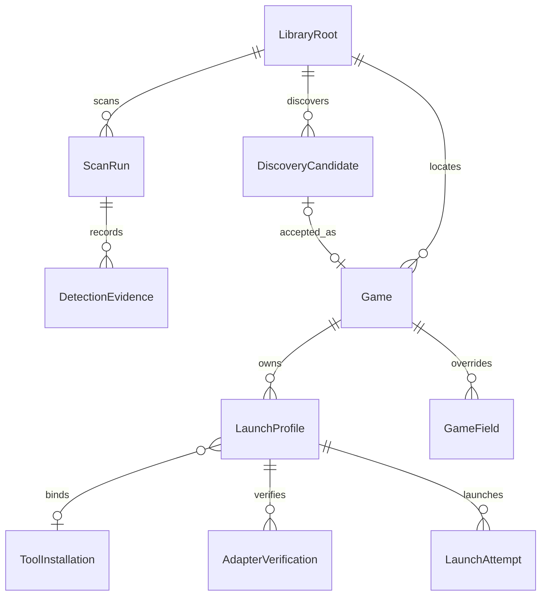

本文件落实 [策划案修正建议](<D:/Official/GameLibrary/策划案修正建议.md>) 中可实施的建议，与 [主策划案](<D:/Official/GameLibrary/开发策划案 v1.md>)、[MCP/CLI 契约](<D:/Official/GameLibrary/MCP与CLI原生接口契约.md>) 一起作为开发规范。修正建议原文件保留不改；其中示例不直接作为实现契约。

## 1. 领域对象、身份与状态

### 1.1 对象边界

| 对象 | 角色与身份 | 生命周期/持久化 |
|---|---|---|
| VolumeObservation | 当前观察的卷、挂载路径、文件系统、在线/只读状态与设备线索 | 卷线索不是可信全局主键；系统采样，支持不确定/换盘 |
| LibraryRoot | 用户授权的扫描根；独立 RootId | 可以在同卷有多个根；根重叠时按规范路径去重归属 |
| ScannedPath | 某次探测见到的目录/文件及属性、原路径、比较键、深度、时间 | 扫描事实快照，不因它改变就创建新游戏身份 |
| DetectionEvidence | detector/rule/version、证据路径、正负/缺失、观察状态 | 随快照保存摘要；不是工具运行能力证明 |
| DiscoveryCandidate | 可审核的发现结果；CandidateId，与安装根或独立文件绑定 | 发现与入库决定分开；重扫可改建议，不能改用户决定 |
| Game（即 LibraryItem） | 本版代表一个已接入的本地安装实例；独立随机 GUID GameId | 同作品两个安装副本是两个 Game；不另建同义 LibraryItem 表 |
| LaunchProfile | Game 的一套入口、参数、工作目录、工具与交接策略 | 一个 Game 可有多个 Profile，仅一个默认；独立 ProfileId/Revision |
| TranslationPolicy/Binding | Required 继承/覆盖和所用工具能力/证据 | 保留现有字段，不复制第二份 LaunchPlan 为另一套真相 |
| ScanRun/Job | 一次可跟踪、可取消/恢复的扫描 | ScanRun 存扫描结果，Job 存执行状态；一对一关联 |
| ActionPlan/OperationReceipt | 计划快照、版本/授权、幂等执行记录 | 不能与文件快照、候选 ID 混用 |

关系图是核心关系摘要；手动创建 Game 可没有来源候选，同安装后续检测记录通过快照关联，不能强制“一次 Game 只能有一次历史检测”。

重叠扫描根：已有 Game 保持其原 RootId 直到明确重绑定；新路径归属最长匹配的已授权根，同长度以稳定 RootId 排序，跨根任务用最终规范路径去重。根规则变化不能仅因归属算法改变而复制卡片或覆盖用户资料。

### 1.2 四种键，明确不同用途

- PhysicalPath：原始真实路径，保留中文/日文/方括号/百分号和合法空格。不得任意删除空格、改名或替换字符来“规范化”。
- ComparisonKey：仅用于当前路径相等、去重与数据库唯一约束。显式处理绝对路径、分隔符、`.`/`..`、Windows 大小写规则和最终允许范围；非法输入返回错误，不尝试造一个合法路径。
- GameId：用户资料与启动配置永久关联的 GUID。**不使用路径+引擎+文件 hash 生成这个 ID**，否则改名、升级或移动就会丢身份。
- MatchFingerprint：用于提出重新关联、相似副本等建议的证据组合。保存策略版本、关键文件摘要、时间与缺失信息；只是一条线索，有碰撞与更新失效的可能。

v1 只支持本地 Windows 盘；UNC/设备命名空间/任意远端路径明确返回 UnsupportedPath，不能隐式递归。根内重解析点默认不跟随；LNK 为单独只读解析步骤，不改变这个默认。长路径用可支持的 .NET/Win32 接口并做端到端测试；不自动修改用户系统长路径策略。

含非法文件名双引号、NUL、ADS 语法或不支持的尾空格/尾点别名时返回 InvalidPath/UnsupportedPath；双引号作为普通 argv 内容可在自有进程桩中测试，不生成 Windows 不允许的文件名当“合法夹具”。路径前缀比较必须按分段边界进行，`F:\Games2` 不属于 `F:\Games`。

### 1.3 身份判定表

| 观察 | 行为 |
|---|---|
| 同已绑定根、同规范路径，文件内容更新 | 同 GameId，更新检测建议；工具/入口指纹变化让相关验证失效 |
| 观察到在线重命名，旧位置不存在，新位置证据一致 | 记录候选重关联计划；按已授权策略绑定新路径，不移动文件 |
| 关机期间旧路径消失，新路径唯一相似 | 提出 relink，用户或有该权限的 agent 明确接受才改变绑定 |
| 旧路径与新副本同时存在 | 两个安装实例；相似标记，不自动合并或忽略 |
| 目录名含 backup/copy/旧版 | 仅 BackupHint，不能自动归类排除；需明确规则/用户确认 |
| 两处都叫 Game.exe，hash/大小相同但游戏资源不同 | 证据不足，不能归并；可请求更强证据或人工选择 |
| 卷离线/权限错误/扫描未完成 | 保留 GameId 与资料，不进入确认 Missing 流程 |
| 同 F 盘符换成别的卷 | RootIdentityChanged；重新绑定前不拿新内容覆盖旧库 |

“重新关联”只修改数据库中的路径绑定。任何界面和 API 都不能把 relink 解释为移动、改名、清理或复制磁盘文件；这些操作不属于 v1。

### 1.4 使用正交状态，不把所有概念塞进一个枚举

CandidateKind：Unknown、Container、GameRoot、FileGame、NestedCandidate、Tool、SupportDirectory。DuplicateHint、BackupHint、BrokenEntry 是独立诊断标记，不能用它们替换根类型。

CandidateReviewState：observed → stabilizing → pendingReview → accepted/deferred/ignored。deferred 可人工重新查看；默认不周期重弹。ignored 只有撤销匹配忽略规则后才能重新建议。一个 accepted 候选不因为路径离线而变回 new。

GameAvailability：unknown、available、suspectedMissing、missing、offline、accessError、rootUnbound。第一次在成功完整分支检查中缺失为 suspectedMissing；卷仍在线且两次成功核对间隔 ≥60 秒仍缺失才 missing。离线覆盖当前展示，但保存缺失证据；恢复在线后重新核对，不继承离线时的失败次数。

GameMembership：active 或 removed。removed 对应库内移除收据/墓碑与忽略记录，不等于磁盘删除。UI 状态由 membership + availability + profile validation 组合计算；数据库不要再存一个会与之冲突的大 UserStatus。

翻译需求只对最终 GameRoot/FileGame/NestedCandidate 生效；Tool/SupportDirectory 不进入翻译库。继承结果保存 InheritedFrom/RuleId/Reason，用户 Auto/Required/NotRequired 覆盖独立持久化，删除显示标签不改变策略。

### 1.5 忽略范围

IgnoreRule.scope 默认 ExactPath；另支持明确选择的 Subtree 和 ConfirmedIdentity。ExactPath 在同根同规范路径持续生效，重命名后可能重新出现；必须在 UI/MCP/CLI 说明这一范围。

ConfirmedIdentity 只能绑定用户确认的 GameId/历史别名与明确证据，不能仅因为指纹相似就全盘抑制所有副本。跨未知路径的模糊命中显示“可能是已忽略条目”，不会静默吞新游戏。用户明确扩大到子树时预览影响；修改或撤销规则均可原生操作。

## 2. 扫描规则、覆盖与检测证据

### 2.1 规则结构和优先级

ScanRule 字段：ruleId、scope、matcher、action、priority、reason、source、enabled、revision。Source 分 SystemMandatory/SystemDefault/User；Action 分 Exclude/Include/LowPriority/HideCandidate。HideCandidate 只抑制候选显示，不能谎称该分支没有扫描。

v1 matcher 仅提供精确路径、分段子树、精确 basename、extension、受限 glob；glob 定义 `*` 为段内任意、`?` 单字符、`**` 跨段；`[`/`]` 默认按字面匹配以适配用户分类目录。不引入任意正则和表达式执行。以后若加入正则需单独长度/超时/重试限制。

顺序：边界与 SystemMandatory 排除不可被 Include 绕过 → 用户启用规则按 priority 降序、相同 priority 按明确排序序号 → SystemDefault → 默认继续扫描。规则唯一匹配结果保存 winningRuleId，其他命中可在 inspect 中查询。SystemDefault 可显式覆盖/关闭；用户新规则需要预览影响。

不能全局按 `Data`、`Game` 或“含工具字样”排除。引擎资源/工具排除需要上下文与证据；已有手动 Game 即使命中隐藏规则，仍保留卡片并显示该规则影响。

### 2.2 覆盖报告 schema

ScanCoverage 至少包含：scanRunId、roots、ruleSetVersion、startedAt、finishedAt、completion（complete/partial/cancelled）、scannedDirectories、observedFileEntries、probeReadFiles、skippedDirectories、skippedFiles、excludedByRule（分规则计数）、accessDenied、pathTooLong、reparsePoints、invalidPaths、ioErrors、offlineRoots、budgetDeferred、unvisitedBranches、resumeToken。

每个异常/排除/延后分支保存路径引用、分类、规则、时间、可重试性与最后成功扫描。大规模报告分页，不要求把每个资源文件永久入库；按目录/规则聚合，必要时只保存受限样本和可复查路径。

没有已知总目录/文件数时 `estimatedCoverage=null`，显示“已枚举 N 目录，M 分支待检查”。不得用 已读/已读 生成虚假的 100%。complete 表示授权范围内所有分支已被检查或按规则明确排除，并不表示所有游戏都被识别成功。

队列默认上限 4,096 个去重待核对分支；超过阈值把细事件折叠为根 dirty 标记。Watcher 回调不做 I/O；处理队列有最大并发和节流，不为了保留每个存档事件无限扩容。

暂停在安全检查点完成，持久化游标和队列摘要；取消停止后续枚举并将未完成分支保留为 partial，不回滚已完成合法资料更新，不触发 Missing 推断。重启续扫重新验证尚未完成的目录；OS 枚举句柄不能直接跨进程保存。

### 2.3 证据与冲突

每条证据记录 observationState=present/absent/unreadable、不等同“读取异常即缺失”；Polarity=positive/negative/contextual。用户目录名仅 contextual，不能覆盖文件证据。

检测器使用版本化固定规则组合，Confidence 为 low/medium/high，Score 仅用于当前规则内推荐。相同事实不重复加分；不得将多条弱证据累加超过强证据阈值。引擎置信度和入口评分分开。

一个引擎满足标识+配对入口/资源组合且无强反证，才 high；单个标识为 medium/low；关键资源不可读为 incomplete 而非直接 negative。没有 System.json 可能是加密、包装或损坏，不用它单独否定全部 RPG Maker 证据。

同根两个 high 引擎不按检测器注册顺序取第一项：返回 EngineConflict，交给边界解析判断是否多个安装根；仍无法消歧则保留多个候选证据、等待审核。检测器顺序变化不得改变同一快照结果。

## 3. 启动与翻译能力契约

### 3.1 职责分开

IToolLocator：只读发现安装。IToolValidator：校验工具、版本、文件指纹。ILaunchAdapter：创建计划，已有接口保留。IVerificationRunner：执行明确授权的隔离样本步骤并收集证据。LaunchExecutor：唯一进程执行器。

不建立同时负责扫描、部署、注入、下载、回滚、模型推理的巨型 IToolAdapter。适配器描述保存每项能力：canLaunch、canRequestInjection、canDeploy、canRollback、mayUseNetwork，各自为 supported/unsupported/unknown 并带证据与验证范围；不能从 canLaunch 推出 canTranslate。

本期不实现通用部署/补丁写入/卸载能力。第三方工具自身可能部署，记录为 externalSideEffect；没有经过验证的官方回滚方法时 canRollback=unknown，不能承诺应用撤销了工具影响。

### 3.2 能力分级

| Capability | 定义 |
|---|---|
| Unknown | 证据不足或关键文件版本变化 |
| Unsupported | 当前工具/模式已确认不支持该操作范围 |
| Guided | 需要第三方界面中的主要人工步骤 |
| SemiAutomatic | 有可重现的自动子流程，但仍有未自动化的外部业务步骤 |
| VerifiedAutomatic | 指定工具指纹、引擎、配置和样本范围中完整自动流程得到验证 |

单纯需要用户授权或点击“批准计划”不会把 Automatic 改成 SemiAutomatic；权限与能力正交。Verification 表示能力证据，不是授权。输出时同时返回 capability、verificationStatus、authorizationStatus、requiredSteps，不用一个状态掩盖差异。

### 3.3 启动观察与翻译成功

LaunchAttempt 的请求状态仍使用 Requested/Delegated/Observed/Failed/Unknown；另外保存 StepExecution 与 RuntimeObservation，不能把“进程结束”覆盖整个尝试的历史事实。

StepExecution：planned → executing → processCreated/executionFailed/unknownOutcome；RuntimeObservation：unobserved、handoffObserved、gameRunning、processExited、observationLost；TranslationObservation：notApplicable、unknown、associated、textConfirmed、failed。

游戏运行证据核对 PID+启动时间+路径；工具重启/提权造成不可观察则 observationLost，不自动提权。先有旧同名进程时不能把它算本次启动。短命启动器退出只意味着它退出，不能推断目标游戏退出。

**翻译完整验收不采用“下列任意一项即可”的条件。** 对需要工具关联的模式，应同时有目标游戏运行证据、正确关联证据，以及隔离样本中文本生效的确认；可独立运行的已部署模式按其经验证流程提供文本生效证据。生产每次启动不一定重新观测文本，应明确区分历史兼容性验证与本次观测，不能自动将历史 textConfirmed 复制为本次实测。

### 3.4 外部工具副作用声明

ToolEffectDeclaration 保存 observedWriteRoots、possibleWriteRoots、unknownEffects、mayModifyGameFiles、mayAccessNetwork、rollbackMethod、evidenceSource、sampleFingerprint。不能把未观察到写入当成保证不会写。

适配器验证仅在用户允许的隔离样本进行，建立前后清单并记录变化。首次在真实安装使用会写游戏目录的翻译流程，应展示已知影响和未知部分；现有明确授权覆盖时可继续执行，否则返回 NeedsAuthorization。授权绑定工具指纹、模式和游戏/路径范围，重大变化后复查；不每次对同一已授权动作重复问。

扫描、资料、审核和配置流程不得触发这些副作用。工具写策略只是启动前校验与用户授权，无法限制独立进程实际能写哪里；若用户要求强制禁止外部程序写任何游戏文件，则只能禁用该流程或另立真实隔离环境方案，不能用一组 AllowedWriteRoots 字段冒充沙箱。

## 4. 配置、数据库、诊断和恢复

### 4.1 配置边界

AppConfig 包含 schemaVersion、dataDirectory、roots、cache/backup 子目录、日志等级、watcher/notifications 开关、开机启动、tool installations 与 adapter settings。本机 D/F 路径是部署初值，不得编译为业务代码常量；路径来自显式部署配置或初次设置，同一数据目录下的设置由 Host 统一持久化。

客户端 bootstrap 只包含如何连接/启动宿主与 dataDirectory；业务配置只在 Host/库中存一份。配置读取、校验、预览、修改、恢复默认均有 CLI/MCP；配置损坏返回 ConfigurationInvalid，不静默用默认根扫描另一块盘。备份同时保存业务配置与资产清单，导入到新机器时重新绑定根和工具。

当前用户数据目录与代码同父目录，但源码、日常 LocalData、测试数据、发布包物理分开且 Git 排除。保持用户 `.obsidian` 原样；不要通过更改用户环境变量来使本机运行。

### 4.2 SQLite 可恢复性

沿用 WAL、foreign_keys、busy_timeout、唯一 Host。schema_version、app_version 和 apiVersion 分别记录。支持事务的 migration 在单事务中执行；不支持事务的特殊维护操作必须单列步骤与恢复日志，不假设所有 SQL 都能同一事务回滚。

迁移前生成经过校验的快照；失败先回滚事务/关闭连接，确认当前库状态，再由维护流程恢复必要备份。禁止迁移异常后直接把旧备份覆盖仍打开的 WAL 数据库。高版本库由旧程序打开时拒绝写入；不自动降级。

损坏数据库不得静默重建空库。Host 进入 RecoveryRequired，仅开放维护所需的 capabilities/diagnostics/backups 操作，不启动扫描和日常变更。检测使用适当的 quick_check/integrity_check 与异常信息；不能将所有 I/O 失败诊断为数据库损坏。

备份 manifest 包含格式/schema/app 版本、创建时间、libraryInstanceId、业务配置、用户图片列表、逐文件大小与 SHA-256。缓存和外部游戏不在备份内；恢复前验证，失败保留现有库。按 MCP/CLI 契约维护恢复控制收据与新 dataEpoch。

### 4.3 可观测性

结构化日志固定字段：timestampUtc、level、component、operationId、requestId、actor、jobId、gameId、profileId、ruleId、resultCode、durationMs。启动步骤补充 PID/启动时间/退出码、工具指纹和已脱敏的计划引用。完整 argv/cwd 若可能包含隐私则不默认写入；参数按声明类型脱敏，而不是只搜 token 字样。

业务审计与诊断日志分开保留。滚动日志建议单文件 10 MiB、最多 10 个；本地业务审计初期保留 90 天，并向用户说明保留期。轮换/删除只在日志目录内，不能影响启动幂等收据的保留规则。

诊断视图/API 至少给出：应用/DB/API 版本、Host 实例、队列长度与溢出次数、最后扫描覆盖、错误类别、适配器能力与过期原因、最近启动步骤、备份校验/恢复状态、缓存大小。用户能问“为什么这个目录没入库”并获得规则/证据/审核状态链路。

必须测量枚举吞吐、扫描阶段耗时、最长目录读取、队列峰值、SQLite 提交延迟、Host 请求延迟、首屏时间、搜索耗时、UI 帧时长、图片缓存命中/解码内存。记录机器、文件系统、样本版本和冷热缓存条件；不只打印“测试完成”。

## 5. 可执行性能与恢复验收

以下为设计门槛，不是本次测得的成绩。针对可控 D 盘夹具/进程桩执行；真实 F 盘只读性能另列观察值，不把硬件未知延迟伪装成稳定 SLA。

| ID | 工作负载/测量方式 | 门槛与证据 |
|---|---|---|
| PERF-01 | 可复现 10,000 目录/100,000 小文件，生成器与清单版本固定 | 流式扫描，记录 wall/CPU/工作集；Host 扫描额外内存目标 ≤256 MiB，禁止一次加载全树；时长建立本机基线 |
| PERF-02 | 可控文件系统桩持续枚举时发取消，至少 20 次 | 主枚举循环停止 P95 ≤2 秒，且没有触发 Missing；真实阻塞系统调用单列异常与迟延，不隐瞒 |
| PERF-03 | 10,000 变更事件/10 秒，含至少 1,000 新文件；主动模拟溢出 | 队列 ≤4,096；折叠 root dirty；最终核对结果等于完整扫描，内存无持续增长 |
| PERF-04 | SQLite 5,000 游戏、标签/简介与缓存封面，冷/热各至少 5 轮 | 启动桌面后首批可操作数据 P95 ≤2 秒；冷图可用占位；单独报告 Host 冷启动耗时 |
| PERF-05 | 5,000 项、200 个固定中英日查询，记录防抖外查询时间 | 查询 P95 ≤200 ms，含结果进入 ViewModel 的端到端 P95 ≤500 ms；防抖 200 ms 单列，不混计 |
| PERF-06 | 125/150/200% DPI，连续滚动 60 秒 | 可见行虚拟化；UI 帧耗时 P95 目标 ≤33 ms，无 >100 ms 应用同步阻塞；图片内存 LRU ≤128 MiB |
| PERF-07 | 两个 CLI/MCP 客户端共 500 次更新+查询，伴随 UI 订阅 | RevisionConflict 明确；唯一写者；无丢更新/重复收据；非扫描小请求 P95 ≤500 ms |
| REC-01 | migration 事务前/中/提交边界注入故障 | 旧库或新库完整可恢复，不能半结构继续运行 |
| REC-02 | 备份恢复暂存、切换、更新 epoch 各边界终止 Host | 维护日志可恢复；原库保留；相同恢复请求重试不再次覆盖 |
| REC-03 | 配置损坏、DB 损坏、缓存损坏分别输入 | 明确区分错误；前两者不重建空库；缓存可重建且不删用户图 |
| REC-04 | 已准备/已创建进程/未写回收据边界终止 Host | 可靠观察或 UnknownOutcome；不自动重复启动 |
| REC-05 | 自包含包在无 SDK 机器、配置到另一路径 | 程序可运行；库/工具重绑定有解释；不要求修改 PATH |

扫描耗时回归：以同机器、相同夹具和缓存条件的已保存基线比较；连续 3 轮中位数恶化 >20% 需解释/修复后再验收。不要先对不同硬件承诺固定全盘秒数。

测试夹具：PE 解析用项目自己的 x86/x64 编译桩及合法头样本；SWF 使用可复现最小有效 FWS/CWS 样本与故意损坏样本；LNK 用 Windows 原生接口在测试目录生成合法文件和循环/失效场景，不拿任意伪字节证明成功路径。固定内容 hash，时间值可控；夹具生成器纳入版本控制，外部商业工具不入仓库。

## 6. 契约治理与 ADR

在功能代码大规模展开前完成简短 ADR：0001-identity-and-path、0002-scan-coverage-and-rules、0003-adapter-capability-and-effects、0004-sqlite-recovery、0005-orthogonal-states、0006-metadata-precedence、0007-native-host-cli-mcp。

每份 ADR 包含决策、理由、被排除方案、不可变约束、迁移影响和验证用例；无需写长篇背景。共享 DTO、数据库 schema、operation catalog、适配器接口由当前接口负责人维护，任务开始登记依赖版本。只有未来明确安排多 agent 时按文件所有权协作；不要为了本规则自动派生 agent。

契约变更先更新 schema/版本/兼容说明和消费方测试，再改生产者；已发布枚举和字段不能无版本静默重命名。新增字段兼容策略由 Contracts 明确，业务请求未知字段仍拒绝；响应客户端允许忽略新增可选字段。

## 7. 修正建议处理记录

| 建议主题 | 处理结果 |
|---|---|
| 对象/路径/身份、候选、离线状态 | 采纳并形式化；沿用 Game 名称，明确它就是安装级 LibraryItem，避免两套同义实体 |
| 使用路径+指纹作为身份键 | 调整：只用于 MatchFingerprint；永久身份仍为 GUID，防止移动/更新导致身份变化 |
| Duplicate/Backup/Missing 都放 CandidateKind/一个状态枚举 | 调整：物理类型、审核状态、可用性、相似提示正交，避免状态爆炸 |
| 扫描规模、覆盖、错误分类、规则可解释 | 采纳，加入确定字段、unknown denominator、规则优先级、队列上限与性能报告 |
| 负向证据与多引擎冲突 | 采纳；不可读不等同缺失，注册顺序不决定结果 |
| CLI 输出与退出码、日志/恢复 | 已提升为完整 CLI/MCP 契约，统一 envelope；不保留第二套 Probe JSON |
| 游戏进程/关联/文本任一即可证明翻译成功 | 不直接采用：分开观测，并按模式组合证据，避免假阳性 |
| 自动/引导/半自动分级 | 采纳 SemiAutomatic，但明确授权不改变技术能力等级 |
| 写根白名单即约束外部工具 | 调整为副作用声明+授权+隔离样本；没有 OS 沙箱就不承诺能限制工具写入 |
| 自动移动建议可确认后执行 | 本版不增加文件整理功能；relink 仅更新数据库绑定，不移动磁盘文件 |
| 数据库/元数据/用户覆盖/UI 规范 | 保留原有约束并补充状态、损坏恢复、诊断、基准与跨接口一致性 |
| .NET 10 可能尚未正式 LTS | 不采用该时间假设；本项目调研时已核验 .NET 10 为正式 LTS。开工仍须核对 SDK 可用性，不静默降级 |
| 只要 SDK 缺失就等待、不做后续工作 | 调整：记录缺失，按用户授权配置开发环境；此时仍可推进 schema/夹具/文档，不能伪报构建通过 |
| 所有路径都可规范化为合法路径、双引号文件名夹具 | 调整：非法/不支持路径明确拒绝，保留合法原名；双引号只用于 argv 内容测试 |
| 完整 argv/cwd 全量写日志 | 调整：按参数类型脱敏、引用计划摘要，防止用户路径/未来私有参数泄露 |
| 新增架构/日志/配置/基准/审查任务 | 采纳，见任务书 T20–T30；原 T00–T19 同步增加具体依赖与交付 |

.NET 生命周期依据：[官方支持策略](https://dotnet.microsoft.com/en-us/platform/support/policy/dotnet-core)。本机路径与原游戏盘事实引用本轮和此前的本地检查；这里不重新声称已做 10 万文件基准、数据库恢复演练或真实工具验证。
